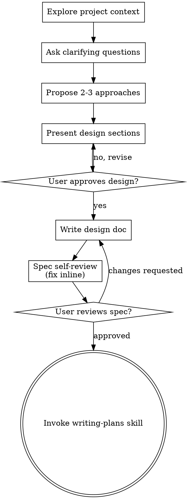
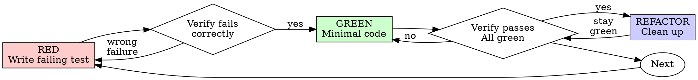

warning: `--full-auto` is deprecated; use `--sandbox workspace-write` instead.
Reading prompt from stdin...
2026-08-04T19:02:23.568953Z ERROR codex_core::shell_snapshot: Shell snapshot validation failed: Snapshot command exited with status exit status: 2: /bin/sh: 115: /opt/data/.codex/shell_snapshots/019fce27-cf00-71b2-bf28-168776087ca7.tmp-1785870143456687944: Syntax error: Unterminated quoted string

OpenAI Codex v0.145.0
--------
workdir: /opt/data/mowgo
model: gpt-5.6-sol
provider: openai
approval: never
sandbox: workspace-write [workdir, /tmp, $TMPDIR]
reasoning effort: none
reasoning summaries: none
session id: 019fce27-cf00-71b2-bf28-168776087ca7
--------
user
# FIX: Android annual billing toggle + fact-lock card copy (MowGo)

Repo: /opt/data/mowgo. Work ONLY in `client/android-native/app/src/main/java/com/mowgo/app/`. Do NOT touch iOS, web, or edge functions (parallel agent handles iOS; edge function ALREADY supports `interval` — verified).

## Goal

The web app has a Month/Annual billing toggle; Android does not (native checkout is monthly-only). Add the toggle to the Android Plans (More → Billing) screen, pass the interval through to the edge function, and fix plan-card copy that contradicts the web (fact-lock).

## Verified ground truth (do not re-litigate)

- Edge function `create-checkout-session` (deployed) accepts `{ tier: 'solo'|'crew', interval: 'month'|'year' }` and maps to env prices: SOLO=$39/mo, SOLO_ANNUAL=$390/yr, CREW=$79/mo, CREW_ANNUAL=$790/yr. Annual secrets are set in Supabase. The function defaults `interval = "month"`.
- Web plan definitions (source of truth, `client/src/pages/Landing.jsx:23-42`):
  - Solo: $39/mo or $390/yr; features: "Unlimited clients & jobs", "Recurring job automation", "GPS route navigation (coming soon)", "Client notes, codes & pets", "Offline mode"
  - Crew: $79/mo or $790/yr; features: "Everything in Solo", "Unlimited clients", "Job assignment & tracking", "Team progress dashboard"
- Savings math: Solo $78/yr ($39×12−$390), Crew $158/yr ($79×12−$790). Web shows a "2 months free" hint on Annual.
- Android billing stack:
  - `PaymentRepository.kt`: `createCheckoutSession(tier: String)` (line 57) POSTs `CheckoutRequest(tier)` (line 151: `@Serializable private data class CheckoutRequest(val tier: String)`) to the `create-checkout-session` edge function. Must send interval.
  - `MoreViewModel.kt`: `startCheckout(tier: String)` (line 95) → `paymentRepository.createCheckoutSession(tier)` (line 104). Billing state via `billingLoadingAction` / `billingError` / `billingMessage`.
  - `MoreScreen.kt`: `BillingPlanCard` composable (line 402) renders Free "$0/mo" / Solo "$39/mo" / Crew "$79/mo" (lines 338-365); `subscribe: (String) -> Unit`; `tierLabel()` helper at line 458 shows "Solo · $39/mo" / "Crew · $79/mo".

## Changes required

### 1. `client/android-native/app/src/main/java/com/mowgo/app/data/PaymentRepository.kt`
- `CheckoutRequest` gains an interval field with default: `@Serializable private data class CheckoutRequest(val tier: String, val interval: String = "month")`.
- `createCheckoutSession(tier: String, interval: String = "month")` → `CheckoutRequest(tier, interval)`.

### 2. `client/android-native/app/src/main/java/com/mowgo/app/ui/screens/more/MoreViewModel.kt`
- `startCheckout(tier: String, interval: String = "month")` → passes both to `createCheckoutSession`.
- Add `billingInterval: String` to the UI state (default "month") plus a `setBillingInterval(String)` function so the screen can switch month/year. Keep the existing loading/error/message fields untouched.

### 3. `client/android-native/app/src/main/java/com/mowgo/app/ui/screens/more/MoreScreen.kt`
- Above the plan cards, add a Month/Annual toggle (Material 3 `SingleChoiceSegmentedButtonRow` with two `SegmentedButton`s, or two `FilterChip`s if simpler — match existing M3 usage in the file). Annual option shows a "2 months free" hint (small label, primary color).
- `BillingPlanCard` gains `billingInterval: String` and `subscribe` becomes `(String, String) -> Unit`; price becomes interval-aware:
  - Solo: `"$39/mo"` ↔ `"$390/yr"` (+ "Save $78" caption when annual)
  - Crew: `"$79/mo"` ↔ `"$790/yr"` (+ "Save $158" caption when annual)
  - Free: always `"$0/mo"`, its button (if any) is a signup link — unchanged.
- **Fix card copy to match web (fact-lock):**
  - Solo feature line: `"Unlimited clients & jobs"` (replaces `"15 clients · AI assistant"` — AI assistant was REMOVED from the product; advertising it is a live lie).
  - Crew feature line: `"Everything in Solo · Unlimited clients · Team"` (replaces current).
  - Free feature line: `"5 clients · Rain delay · Invoicing"` (matches web spirit).
- `tierLabel()` (line 458): make interval-aware — "Solo · $39/mo" / "Solo · $390/yr", "Crew · $79/mo" / "Crew · $790/yr".

### Constraints
- Kotlin + Jetpack Compose, Material 3. No new dependencies (SegmentedButton is in compose-material3, already used in the file).
- No data-layer changes beyond the two signature updates above. No i18n (app is English-only).
- Do NOT run builds (CI compiles on push — "Android Native Build" workflow).
- After edits: run `git diff --stat` and print it, plus `grep -n "interval" client/android-native/app/src/main/java/com/mowgo/app/ui/screens/more/MoreScreen.kt client/android-native/app/src/main/java/com/mowgo/app/ui/screens/more/MoreViewModel.kt client/android-native/app/src/main/java/com/mowgo/app/data/PaymentRepository.kt`.

## Done criteria
- `createCheckoutSession` + `startCheckout` pass interval through to the edge function.
- MoreScreen has a working Month/Annual toggle; prices and Save captions switch with it.
- No billing card mentions "AI assistant", "15 clients", or other web-contradicting copy.
- `git diff --stat` shows changes confined to the 3 files above.

warning: Codex could not find bubblewrap on PATH. Install bubblewrap with your OS package manager. See the sandbox prerequisites: https://developers.openai.com/codex/concepts/sandboxing#prerequisites. Codex will use the bundled bubblewrap in the meantime.
codex
I’ll implement this strictly within the three Android files. I’m using the required brainstorming/TDD guidance briefly to validate the interaction shape before editing, then I’ll inspect the existing Compose patterns and make the smallest compatible change; per your instruction, I won’t run a build.
exec
/bin/sh -lc "sed -n '1,240p' /opt/data/.agents/skills/brainstorming/SKILL.md && sed -n '1,260p' /opt/data/.agents/skills/test-driven-development/SKILL.md && sed -n '1,220p' /opt/data/.agents/skills/verification-before-completion/SKILL.md" in /opt/data/mowgo
 succeeded in 0ms:
---
name: brainstorming
description: "You MUST use this before any creative work - creating features, building components, adding functionality, or modifying behavior. Explores user intent, requirements and design before implementation."
---

# Brainstorming Ideas Into Designs

Help turn ideas into fully formed designs and specs through natural collaborative dialogue.

Start by understanding the current project context, then ask questions one at a time to refine the idea. Once you understand what you're building, present the design and get user approval.

<HARD-GATE>
Do NOT invoke any implementation skill, write any code, scaffold any project, or take any implementation action until you have presented a design and the user has approved it. This applies to EVERY project regardless of perceived simplicity.
</HARD-GATE>

## Anti-Pattern: "This Is Too Simple To Need A Design"

Every project goes through this process. A todo list, a single-function utility, a config change — all of them. "Simple" projects are where unexamined assumptions cause the most wasted work. The design can be short (a few sentences for truly simple projects), but you MUST present it and get approval.

## Checklist

You MUST create a task for each of these items and complete them in order:

1. **Explore project context** — check files, docs, recent commits
2. **Offer the visual companion just-in-time** — NOT upfront. The first time a question would genuinely be clearer shown than described, offer it then (its own message); on approval its browser tab opens for you. If no visual question ever arises, never offer it. See the Visual Companion section below.
3. **Ask clarifying questions** — one at a time, understand purpose/constraints/success criteria
4. **Propose 2-3 approaches** — with trade-offs and your recommendation
5. **Present design** — in sections scaled to their complexity, get user approval after each section
6. **Write design doc** — save to `docs/superpowers/specs/YYYY-MM-DD-<topic>-design.md` and commit
7. **Spec self-review** — quick inline check for placeholders, contradictions, ambiguity, scope (see below)
8. **User reviews written spec** — ask user to review the spec file before proceeding
9. **Transition to implementation** — invoke writing-plans skill to create implementation plan

## Process Flow



**The terminal state is invoking writing-plans.** Do NOT invoke frontend-design, mcp-builder, or any other implementation skill. The ONLY skill you invoke after brainstorming is writing-plans.

## The Process

**Understanding the idea:**

- Check out the current project state first (files, docs, recent commits)
- Before asking detailed questions, assess scope: if the request describes multiple independent subsystems (e.g., "build a platform with chat, file storage, billing, and analytics"), flag this immediately. Don't spend questions refining details of a project that needs to be decomposed first.
- If the project is too large for a single spec, help the user decompose into sub-projects: what are the independent pieces, how do they relate, what order should they be built? Then brainstorm the first sub-project through the normal design flow. Each sub-project gets its own spec → plan → implementation cycle.
- For appropriately-scoped projects, ask questions one at a time to refine the idea
- Prefer multiple choice questions when possible, but open-ended is fine too
- Only one question per message - if a topic needs more exploration, break it into multiple questions
- Focus on understanding: purpose, constraints, success criteria

**Exploring approaches:**

- Propose 2-3 different approaches with trade-offs
- Present options conversationally with your recommendation and reasoning
- Lead with your recommended option and explain why

**Presenting the design:**

- Once you believe you understand what you're building, present the design
- Scale each section to its complexity: a few sentences if straightforward, up to 200-300 words if nuanced
- Ask after each section whether it looks right so far
- Cover: architecture, components, data flow, error handling, testing
- Be ready to go back and clarify if something doesn't make sense

**Design for isolation and clarity:**

- Break the system into smaller units that each have one clear purpose, communicate through well-defined interfaces, and can be understood and tested independently
- For each unit, you should be able to answer: what does it do, how do you use it, and what does it depend on?
- Can someone understand what a unit does without reading its internals? Can you change the internals without breaking consumers? If not, the boundaries need work.
- Smaller, well-bounded units are also easier for you to work with - you reason better about code you can hold in context at once, and your edits are more reliable when files are focused. When a file grows large, that's often a signal that it's doing too much.

**Working in existing codebases:**

- Explore the current structure before proposing changes. Follow existing patterns.
- Where existing code has problems that affect the work (e.g., a file that's grown too large, unclear boundaries, tangled responsibilities), include targeted improvements as part of the design - the way a good developer improves code they're working in.
- Don't propose unrelated refactoring. Stay focused on what serves the current goal.

## After the Design

**Documentation:**

- Write the validated design (spec) to `docs/superpowers/specs/YYYY-MM-DD-<topic>-design.md`
  - (User preferences for spec location override this default)
- Use elements-of-style:writing-clearly-and-concisely skill if available
- Commit the design document to git

**Spec Self-Review:**
After writing the spec document, look at it with fresh eyes:

1. **Placeholder scan:** Any "TBD", "TODO", incomplete sections, or vague requirements? Fix them.
2. **Internal consistency:** Do any sections contradict each other? Does the architecture match the feature descriptions?
3. **Scope check:** Is this focused enough for a single implementation plan, or does it need decomposition?
4. **Ambiguity check:** Could any requirement be interpreted two different ways? If so, pick one and make it explicit.

Fix any issues inline. No need to re-review — just fix and move on.

**User Review Gate:**
After the spec review loop passes, ask the user to review the written spec before proceeding:

> "Spec written and committed to `<path>`. Please review it and let me know if you want to make any changes before we start writing out the implementation plan."

Wait for the user's response. If they request changes, make them and re-run the spec review loop. Only proceed once the user approves.

**Implementation:**

- Invoke the writing-plans skill to create a detailed implementation plan
- Do NOT invoke any other skill. writing-plans is the next step.

## Key Principles

- **One question at a time** - Don't overwhelm with multiple questions
- **Multiple choice preferred** - Easier to answer than open-ended when possible
- **YAGNI ruthlessly** - Remove unnecessary features from all designs
- **Explore alternatives** - Always propose 2-3 approaches before settling
- **Incremental validation** - Present design, get approval before moving on
- **Be flexible** - Go back and clarify when something doesn't make sense

## Visual Companion

A browser-based companion for showing mockups, diagrams, and visual options during brainstorming. Available as a tool — not a mode. Accepting the companion means it's available for questions that benefit from visual treatment; it does NOT mean every question goes through the browser.

**Offering the companion (just-in-time):** Do NOT offer it upfront. Wait until a question would genuinely be clearer shown than told — a real mockup / layout / diagram question, not merely a UI *topic*. The first time that happens, offer it then, as its own message:
> "This next part might be easier if I show you — I can put together mockups, diagrams, and comparisons in a browser tab as we go. It's still new and can be token-intensive. Want me to? I'll open it for you."

**This offer MUST be its own message.** Only the offer — no clarifying question, summary, or other content. Wait for the user's response. If they accept, start the server with `--open` so their browser opens to the first screen automatically. If they decline, continue text-only and don't offer again unless they raise it.

**Per-question decision:** Even after the user accepts, decide FOR EACH QUESTION whether to use the browser or the terminal. The test: **would the user understand this better by seeing it than reading it?**

- **Use the browser** for content that IS visual — mockups, wireframes, layout comparisons, architecture diagrams, side-by-side visual designs
- **Use the terminal** for content that is text — requirements questions, conceptual choices, tradeoff lists, A/B/C/D text options, scope decisions

A question about a UI topic is not automatically a visual question. "What does personality mean in this context?" is a conceptual question — use the terminal. "Which wizard layout works better?" is a visual question — use the browser.

If they agree to the companion, read the detailed guide before proceeding:
`skills/brainstorming/visual-companion.md`
---
name: test-driven-development
description: Use when implementing any feature or bugfix, before writing implementation code - write the test first, watch it fail, write minimal code to pass; ensures tests actually verify behavior by requiring failure first
---

# Test-Driven Development (TDD)

## Overview

Write the test first. Watch it fail. Write minimal code to pass.

**Core principle:** If you didn't watch the test fail, you don't know if it tests the right thing.

**Violating the letter of the rules is violating the spirit of the rules.**

## When to Use

**Always:**

- New features
- Bug fixes
- Refactoring
- Behavior changes

**Exceptions (ask your human partner):**

- Throwaway prototypes
- Generated code
- Configuration files

Thinking "skip TDD just this once"? Stop. That's rationalization.

## The Iron Law

```
NO PRODUCTION CODE WITHOUT A FAILING TEST FIRST
```

Write code before the test? Delete it. Start over.

**No exceptions:**

- Don't keep it as "reference"
- Don't "adapt" it while writing tests
- Don't look at it
- Delete means delete

Implement fresh from tests. Period.

## Red-Green-Refactor



### RED - Write Failing Test

Write one minimal test showing what should happen.

<Good>
```typescript
test('retries failed operations 3 times', async () => {
  let attempts = 0;
  const operation = () => {
    attempts++;
    if (attempts < 3) throw new Error('fail');
    return 'success';
  };

  const result = await retryOperation(operation);

  expect(result).toBe('success');
  expect(attempts).toBe(3);
});

```
Clear name, tests real behavior, one thing
</Good>

<Bad>
```typescript
test('retry works', async () => {
  const mock = jest.fn()
    .mockRejectedValueOnce(new Error())
    .mockRejectedValueOnce(new Error())
    .mockResolvedValueOnce('success');
  await retryOperation(mock);
  expect(mock).toHaveBeenCalledTimes(3);
});
```

Vague name, tests mock not code
</Bad>

**Requirements:**

- One behavior
- Clear name
- Real code (no mocks unless unavoidable)

### Verify RED - Watch It Fail

**MANDATORY. Never skip.**

```bash
npm test path/to/test.test.ts
```

Confirm:

- Test fails (not errors)
- Failure message is expected
- Fails because feature missing (not typos)

**Test passes?** You're testing existing behavior. Fix test.

**Test errors?** Fix error, re-run until it fails correctly.

### GREEN - Minimal Code

Write simplest code to pass the test.

<Good>
```typescript
async function retryOperation<T>(fn: () => Promise<T>): Promise<T> {
  for (let i = 0; i < 3; i++) {
    try {
      return await fn();
    } catch (e) {
      if (i === 2) throw e;
    }
  }
  throw new Error('unreachable');
}
```
Just enough to pass
</Good>

<Bad>
```typescript
async function retryOperation<T>(
  fn: () => Promise<T>,
  options?: {
    maxRetries?: number;
    backoff?: 'linear' | 'exponential';
    onRetry?: (attempt: number) => void;
  }
): Promise<T> {
  // YAGNI
}
```
Over-engineered
</Bad>

Don't add features, refactor other code, or "improve" beyond the test.

### Verify GREEN - Watch It Pass

**MANDATORY.**

```bash
npm test path/to/test.test.ts
```

Confirm:

- Test passes
- Other tests still pass
- Output pristine (no errors, warnings)

**Test fails?** Fix code, not test.

**Other tests fail?** Fix now.

### REFACTOR - Clean Up

After green only:

- Remove duplication
- Improve names
- Extract helpers

Keep tests green. Don't add behavior.

### Repeat

Next failing test for next feature.

## Good Tests

| Quality | Good | Bad |
|---------|------|-----|
| **Minimal** | One thing. "and" in name? Split it. | `test('validates email and domain and whitespace')` |
| **Clear** | Name describes behavior | `test('test1')` |
| **Shows intent** | Demonstrates desired API | Obscures what code should do |

## Why Order Matters

**"I'll write tests after to verify it works"**

Tests written after code pass immediately. Passing immediately proves nothing:

- Might test wrong thing
- Might test implementation, not behavior
- Might miss edge cases you forgot
- You never saw it catch the bug

Test-first forces you to see the test fail, proving it actually tests something.

**"I already manually tested all the edge cases"**

Manual testing is ad-hoc. You think you tested everything but:

- No record of what you tested
- Can't re-run when code changes
- Easy to forget cases under pressure
- "It worked when I tried it" ≠ comprehensive

Automated tests are systematic. They run the same way every time.

**"Deleting X hours of work is wasteful"**

Sunk cost fallacy. The time is already gone. Your choice now:

- Delete and rewrite with TDD (X more hours, high confidence)
- Keep it and add tests after (30 min, low confidence, likely bugs)

The "waste" is keeping code you can't trust. Working code without real tests is technical debt.

**"TDD is dogmatic, being pragmatic means adapting"**

TDD IS pragmatic:

- Finds bugs before commit (faster than debugging after)
- Prevents regressions (tests catch breaks immediately)
- Documents behavior (tests show how to use code)
- Enables refactoring (change freely, tests catch breaks)

"Pragmatic" shortcuts = debugging in production = slower.

**"Tests after achieve the same goals - it's spirit not ritual"**

---
name: verification-before-completion
description: Use when about to claim work is complete, fixed, or passing, before committing or creating PRs - requires running verification commands and confirming output before making any success claims; evidence before assertions always
---

# Verification Before Completion

## Overview

Claiming work is complete without verification is dishonesty, not efficiency.

**Core principle:** Evidence before claims, always.

**Violating the letter of this rule is violating the spirit of this rule.**

## The Iron Law

```
NO COMPLETION CLAIMS WITHOUT FRESH VERIFICATION EVIDENCE
```

If you haven't run the verification command in this message, you cannot claim it passes.

## The Gate Function

```
BEFORE claiming any status or expressing satisfaction:

1. IDENTIFY: What command proves this claim?
2. RUN: Execute the FULL command (fresh, complete)
3. READ: Full output, check exit code, count failures
4. VERIFY: Does output confirm the claim?
   - If NO: State actual status with evidence
   - If YES: State claim WITH evidence
5. ONLY THEN: Make the claim

Skip any step = lying, not verifying
```

## Common Failures

| Claim | Requires | Not Sufficient |
|-------|----------|----------------|
| Tests pass | Test command output: 0 failures | Previous run, "should pass" |
| Linter clean | Linter output: 0 errors | Partial check, extrapolation |
| Build succeeds | Build command: exit 0 | Linter passing, logs look good |
| Bug fixed | Test original symptom: passes | Code changed, assumed fixed |
| Regression test works | Red-green cycle verified | Test passes once |
| Agent completed | VCS diff shows changes | Agent reports "success" |
| Requirements met | Line-by-line checklist | Tests passing |

## Red Flags - STOP

- Using "should", "probably", "seems to"
- Expressing satisfaction before verification ("Great!", "Perfect!", "Done!", etc.)
- About to commit/push/PR without verification
- Trusting agent success reports
- Relying on partial verification
- Thinking "just this once"
- Tired and wanting work over
- **ANY wording implying success without having run verification**

## Rationalization Prevention

| Excuse | Reality |
|--------|---------|
| "Should work now" | RUN the verification |
| "I'm confident" | Confidence ≠ evidence |
| "Just this once" | No exceptions |
| "Linter passed" | Linter ≠ compiler |
| "Agent said success" | Verify independently |
| "I'm tired" | Exhaustion ≠ excuse |
| "Partial check is enough" | Partial proves nothing |
| "Different words so rule doesn't apply" | Spirit over letter |

## Key Patterns

**Tests:**
```
✅ [Run test command] [See: 34/34 pass] "All tests pass"
❌ "Should pass now" / "Looks correct"
```

**Regression tests (TDD Red-Green):**
```
✅ Write → Run (pass) → Revert fix → Run (MUST FAIL) → Restore → Run (pass)
❌ "I've written a regression test" (without red-green verification)
```

**Build:**
```
✅ [Run build] [See: exit 0] "Build passes"
❌ "Linter passed" (linter doesn't check compilation)
```

**Requirements:**
```
✅ Re-read plan → Create checklist → Verify each → Report gaps or completion
❌ "Tests pass, phase complete"
```

**Agent delegation:**
```
✅ Agent reports success → Check VCS diff → Verify changes → Report actual state
❌ Trust agent report
```

## Why This Matters

From 24 failure memories:
- your human partner said "I don't believe you" - trust broken
- Undefined functions shipped - would crash
- Missing requirements shipped - incomplete features
- Time wasted on false completion → redirect → rework
- Violates: "Honesty is a core value. If you lie, you'll be replaced."

## When To Apply

**ALWAYS before:**
- ANY variation of success/completion claims
- ANY expression of satisfaction
- ANY positive statement about work state
- Committing, PR creation, task completion
- Moving to next task
- Delegating to agents

**Rule applies to:**
- Exact phrases
- Paraphrases and synonyms
- Implications of success
- ANY communication suggesting completion/correctness

## The Bottom Line

**No shortcuts for verification.**

Run the command. Read the output. THEN claim the result.

This is non-negotiable.

codex
Your request already fixes the design and explicitly limits edits to three production files, so I’m treating it as the approved design; I won’t create the brainstorming design doc because that would violate your path constraint. Likewise, adding/running Android tests would require files or build commands outside your allowed workflow, so verification will be static and exactly scoped to the requested diff/grep checks.
exec
/bin/sh -lc "git status --short && sed -n '1,220p' client/android-native/app/src/main/java/com/mowgo/app/data/PaymentRepository.kt && sed -n '1,210p' client/android-native/app/src/main/java/com/mowgo/app/ui/screens/more/MoreViewModel.kt && sed -n '1,540p' client/android-native/app/src/main/java/com/mowgo/app/ui/screens/more/MoreScreen.kt" in /opt/data/mowgo
 succeeded in 0ms:
 M .bi_state.json
 M .run_markers/2026-08-02_0850.md
 M daily_actions.json
 M daily_scan.json
 M intel/2026-07-25_0730.md
 M intel/2026-08-02_0850.md
 M leads/reddit-threads.md
 D supabase/migrations/007_recurring_jobs.sql
 M vault/index.md
 M weekly_digest_2026-08-02.md
?? .bi_tools/
?? .run_markers/2026-08-02_2104.md
?? .run_markers/2026-08-03_0112.md
?? .run_markers/2026-08-03_0537.md
?? .run_markers/2026-08-03_0941.md
?? .run_markers/2026-08-03_1348.md
?? .run_markers/2026-08-03_2209.md
?? .run_markers/2026-08-04_0710.md
?? .run_markers/2026-08-04_1627.md
?? .tmp_android_annual_out.md
?? .tmp_android_annual_spec.md
?? .tmp_android_fix1_prompt.md
?? .tmp_android_fix2_prompt.md
?? .tmp_android_parity_prompt.md
?? .tmp_android_review.md
?? .tmp_batch10_spec.md
?? .tmp_batch11_spec.md
?? .tmp_batch11b_spec.md
?? .tmp_batch4_review.md
?? .tmp_batch4_spec.md
?? .tmp_batch5_spec.md
?? .tmp_batch6_spec.md
?? .tmp_batch7_spec.md
?? .tmp_batch7fix_spec.md
?? .tmp_batch89_review.md
?? .tmp_batch8_spec.md
?? .tmp_batch9_spec.md
?? .tmp_batch9fix_spec.md
?? .tmp_checkout_fix_out.md
?? .tmp_checkout_fix_spec.md
?? .tmp_checkout_review_out.md
?? .tmp_checkout_review_prompt.md
?? .tmp_ios_annual_out.md
?? .tmp_ios_annual_spec.md
?? .tmp_ios_fix7_prompt.md
?? .tmp_ios_fix7_review_out.md
?? .tmp_ios_fix7_review_prompt.md
?? .tmp_linkfix_spec.md
?? .tmp_rss/
?? bi_report_2026-08-02_2104.md
?? bi_report_2026-08-03_0112.md
?? bi_report_2026-08-03_0537.md
?? bi_report_2026-08-03_0941.md
?? bi_report_2026-08-03_1348.md
?? bi_report_2026-08-03_2209.md
?? bi_report_2026-08-04_0710.md
?? bi_report_2026-08-04_1627.md
?? code-review-2026-08-03.md
?? daily_actions/2026-08-04.json
?? daily_report_2026-08-03.md
?? daily_scan/2026-08-03.json
?? daily_scan/2026-08-04.json
?? docs/android-parity-leads-raindelay-v2.md
?? docs/concierge-build-spec.md
?? docs/concierge-fix-round2.md
?? docs/concierge-fix-schedule-scope.md
?? docs/concierge-fix-tier-gate.md
?? docs/concierge-onboarding-v1-scope.md
?? docs/concierge-organizer-spec.md
?? docs/concierge-review.md
?? docs/export-native-spec.md
?? docs/final-review.md
?? docs/fix-review-round1.md
?? docs/fix-review-round2.md
?? docs/ios-crew-data-fix-spec.md
?? docs/ios-parity-fixes-round1.md
?? docs/ios-parity-fixes-round2.md
?? docs/ios-parity-fixes-round3.md
?? docs/ios-parity-fixes-round4.md
?? docs/ios-parity-fixes-round5.md
?? docs/ios-parity-fixes-round6.md
?? docs/ios-parity-fixes-round7.md
?? docs/ios-parity-leads-raindelay-v2.md
?? docs/leads-v1-scope.md
?? docs/offer-copy-export-web-spec.md
?? docs/profile-location-web.md
?? docs/rain-delay-v2-scope.md
?? docs/review-export-offer.md
?? intel/2026-08-02_2104.md
?? intel/2026-08-03_0112.md
?? intel/2026-08-03_0537.md
?? intel/2026-08-03_0941.md
?? intel/2026-08-03_1348.md
?? intel/2026-08-03_2209.md
?? intel/2026-08-04_0710.md
?? intel/2026-08-04_1627.md
?? leads/content-draft-reddit-ig.md
?? leads/sms-scripts-batch1.md
?? leads/what-to-charge-ok-report.md
?? marketing/capterra-claim-kit.md
?? marketing/review-engine.md
?? social/
?? supabase/migrations/008_recurring_jobs.sql
?? vault/2026-08-03_channel-cowork-raw.md
?? vault/2026-08-03_channel-mowgo-raw.md
?? vault/2026-08-03_channel-outreach-raw.md
?? vault/2026-08-03_daily-sync.md
package com.mowgo.app.data

import com.mowgo.app.BuildConfig
import com.mowgo.app.data.auth.AuthRepository
import kotlinx.coroutines.Dispatchers
import kotlinx.coroutines.withContext
import kotlinx.serialization.SerialName
import kotlinx.serialization.Serializable
import kotlinx.serialization.json.Json
import okhttp3.MediaType.Companion.toMediaType
import okhttp3.OkHttpClient
import okhttp3.Request
import okhttp3.RequestBody
import java.net.URI

data class PaymentIntentResult(
    val clientSecret: String,
    val paymentIntentId: String,
)

class PaymentRepository(
    private val authRepository: AuthRepository = AuthRepository(),
    private val httpClient: OkHttpClient = OkHttpClient(),
) {
    private val json = Json { ignoreUnknownKeys = true }

    suspend fun createPaymentIntent(amountCents: Int, invoiceId: String): PaymentIntentResult {
        ensureConfigured()
        val response = post(
            function = "create-payment-intent",
            body = json.encodeToString(
                CreatePaymentIntentRequest.serializer(),
                CreatePaymentIntentRequest(amountCents, invoiceId = invoiceId),
            ),
        )
        val result = decode<CreatePaymentIntentResponse>(response)
        if (result.clientSecret.isBlank() || result.paymentIntentId.isBlank()) {
            throw IllegalStateException(errorFrom(response) ?: "Could not initialize payment.")
        }
        return PaymentIntentResult(result.clientSecret, result.paymentIntentId)
    }

    suspend fun confirmPayment(invoiceId: String, paymentIntentId: String) {
        ensureConfigured()
        val response = post(
            function = "confirm-payment",
            body = json.encodeToString(
                ConfirmPaymentRequest.serializer(),
                ConfirmPaymentRequest(invoiceId, paymentIntentId),
            ),
        )
        if (!decode<SuccessResponse>(response).success) {
            throw IllegalStateException(errorFrom(response) ?: "Could not confirm payment.")
        }
    }

    suspend fun createCheckoutSession(tier: String): String {
        ensureConfigured()
        val response = post(
            function = "create-checkout-session",
            body = json.encodeToString(CheckoutRequest.serializer(), CheckoutRequest(tier)),
        )
        val url = decode<UrlResponse>(response).url
        return validateStripeUrl(url, CHECKOUT_HOST)
    }

    suspend fun createCustomerPortal(): String {
        ensureConfigured()
        val response = post("create-customer-portal", EMPTY_JSON)
        val url = decode<UrlResponse>(response).url
        return validateStripeUrl(url, PORTAL_HOST)
    }

    suspend fun cancelSubscription() {
        ensureConfigured()
        val response = post("cancel-subscription", EMPTY_JSON)
        if (!decode<SuccessResponse>(response).success) {
            throw IllegalStateException(errorFrom(response) ?: "Could not cancel subscription.")
        }
    }

    private fun ensureConfigured() {
        if (!SupabaseClientProvider.isConfigured) {
            throw IllegalStateException("Stripe is not configured.")
        }
    }

    private suspend fun post(function: String, body: String): String {
        val token = authRepository.currentSession?.accessToken
            ?: throw IllegalStateException("Not authenticated")
        val request = Request.Builder()
            .url("$FUNCTION_BASE_URL$function")
            .header("Authorization", "Bearer $token")
            .header("apikey", BuildConfig.SUPABASE_ANON_KEY)
            .header("Content-Type", "application/json")
            .post(RequestBody.create(JSON_MEDIA_TYPE, body))
            .build()

        return withContext(Dispatchers.IO) {
            httpClient.newCall(request).execute().use { response ->
                val responseBody = response.body?.string().orEmpty()
                if (!response.isSuccessful) {
                    val serverError = runCatching {
                        json.decodeFromString(ErrorResponse.serializer(), responseBody).error
                    }.getOrNull()
                    throw IllegalStateException(
                        serverError?.takeIf { it.isNotBlank() } ?: "Server error (${response.code})",
                    )
                }
                responseBody
            }
        }
    }

    private inline fun <reified T> decode(body: String): T = runCatching {
        json.decodeFromString<T>(body)
    }.getOrElse { throw IllegalStateException("Invalid response from payment service.") }

    private fun errorFrom(body: String): String? = runCatching {
        json.decodeFromString(ErrorResponse.serializer(), body).error
    }.getOrNull()?.takeIf { it.isNotBlank() }

    private fun validateStripeUrl(url: String, allowedHost: String): String {
        val uri = runCatching { URI(url) }
            .getOrElse { throw IllegalStateException("Invalid payment URL.") }
        if (uri.scheme != "https" || uri.host != allowedHost) {
            throw IllegalStateException("Invalid payment URL.")
        }
        return url
    }

    @Serializable
    private data class CreatePaymentIntentRequest(
        val amount: Int,
        val currency: String = "usd",
        @SerialName("invoice_id") val invoiceId: String,
    )

    @Serializable
    private data class CreatePaymentIntentResponse(
        @SerialName("client_secret") val clientSecret: String = "",
        @SerialName("payment_intent_id") val paymentIntentId: String = "",
    )

    @Serializable
    private data class ConfirmPaymentRequest(
        @SerialName("invoice_id") val invoiceId: String,
        @SerialName("payment_intent_id") val paymentIntentId: String,
    )

    @Serializable private data class CheckoutRequest(val tier: String)
    @Serializable private data class UrlResponse(val url: String = "")
    @Serializable private data class SuccessResponse(val success: Boolean = false)
    @Serializable private data class ErrorResponse(val error: String? = null)

    companion object {
        private const val FUNCTION_BASE_URL =
            "https://vqgiynfrpsqddjrayczc.supabase.co/functions/v1/"
        private const val CHECKOUT_HOST = "checkout.stripe.com"
        private const val PORTAL_HOST = "billing.stripe.com"
        private const val EMPTY_JSON = "{}"
        private val JSON_MEDIA_TYPE = "application/json".toMediaType()
    }
}
package com.mowgo.app.ui.screens.more

import android.content.ContentResolver
import android.net.Uri
import androidx.lifecycle.ViewModel
import androidx.lifecycle.viewModelScope
import com.mowgo.app.data.ExportRepository
import com.mowgo.app.data.ProfileRepository
import com.mowgo.app.data.PaymentRepository
import com.mowgo.app.data.SettingsRepository
import com.mowgo.app.data.auth.AuthRepository
import com.mowgo.app.data.model.Profile
import kotlinx.coroutines.flow.MutableStateFlow
import kotlinx.coroutines.flow.StateFlow
import kotlinx.coroutines.flow.asStateFlow
import kotlinx.coroutines.launch

data class MoreUiState(
    val isLoading: Boolean = true,
    val profile: Profile? = null,
    val error: String? = null,
    val isSaving: Boolean = false,
    val isSigningOut: Boolean = false,
    val saveMessage: String? = null,
    val billingLoadingAction: String? = null,
    val billingError: String? = null,
    val billingMessage: String? = null,
    val pendingBillingUrl: String? = null,
    val exportLoadingAction: String? = null,
    val exportMessage: String? = null,
    val exportError: String? = null,
)

class MoreViewModel(
    private val settingsRepository: SettingsRepository,
    private val profileRepository: ProfileRepository = ProfileRepository(),
    private val authRepository: AuthRepository = AuthRepository(),
    private val paymentRepository: PaymentRepository = PaymentRepository(),
    private val exportRepository: ExportRepository = ExportRepository(),
) : ViewModel() {
    private val _uiState = MutableStateFlow(MoreUiState())
    val uiState: StateFlow<MoreUiState> = _uiState.asStateFlow()
    val appearanceMode = settingsRepository.appearanceMode
    val jobCompletionAlerts = settingsRepository.jobCompletionAlerts
    val rainDelayAlerts = settingsRepository.rainDelayAlerts

    // Guards against a stale profile load overwriting a just-saved profile.
    private var profileLoadGeneration = 0

    init { loadProfile() }

    fun loadProfile() {
        val generation = ++profileLoadGeneration
        viewModelScope.launch {
            _uiState.value = _uiState.value.copy(isLoading = true, error = null)
            try {
                val profile = profileRepository.loadProfile()
                if (generation == profileLoadGeneration) {
                    _uiState.value = _uiState.value.copy(isLoading = false, profile = profile)
                }
            } catch (error: Exception) {
                if (generation == profileLoadGeneration) {
                    _uiState.value = _uiState.value.copy(isLoading = false, error = error.message ?: "Failed to load profile")
                }
            }
        }
    }

    fun onResume() {
        loadProfile()
    }

    fun updateProfile(name: String, phone: String, email: String) {
        // Invalidate any in-flight load so it can't clobber the saved profile.
        profileLoadGeneration++
        viewModelScope.launch {
            _uiState.value = _uiState.value.copy(isSaving = true, error = null, saveMessage = null)
            try {
                profileRepository.updateProfile(name, phone, email)
                _uiState.value = _uiState.value.copy(
                    isSaving = false,
                    profile = (_uiState.value.profile ?: Profile()).copy(businessName = name, phone = phone, email = email),
                    saveMessage = "Changes saved",
                )
            } catch (error: Exception) {
                _uiState.value = _uiState.value.copy(isSaving = false, error = error.message ?: "Failed to save changes")
            }
        }
    }

    fun setAppearance(value: String) { viewModelScope.launch { settingsRepository.setAppearanceMode(value) } }
    fun setCompletionAlerts(value: Boolean) { viewModelScope.launch { settingsRepository.setJobCompletionAlerts(value) } }
    fun setRainAlerts(value: Boolean) { viewModelScope.launch { settingsRepository.setRainDelayAlerts(value) } }

    fun startCheckout(tier: String) {
        if (_uiState.value.billingLoadingAction != null) return
        viewModelScope.launch {
            _uiState.value = _uiState.value.copy(
                billingLoadingAction = "checkout:$tier",
                billingError = null,
                billingMessage = null,
            )
            try {
                val url = paymentRepository.createCheckoutSession(tier)
                _uiState.value = _uiState.value.copy(
                    billingLoadingAction = null,
                    pendingBillingUrl = url,
                )
            } catch (error: Exception) {
                _uiState.value = _uiState.value.copy(
                    billingLoadingAction = null,
                    billingError = error.message ?: "Could not create checkout session.",
                )
            }
        }
    }

    fun openCustomerPortal() {
        if (_uiState.value.billingLoadingAction != null) return
        viewModelScope.launch {
            _uiState.value = _uiState.value.copy(
                billingLoadingAction = "portal",
                billingError = null,
                billingMessage = null,
            )
            try {
                val url = paymentRepository.createCustomerPortal()
                _uiState.value = _uiState.value.copy(
                    billingLoadingAction = null,
                    pendingBillingUrl = url,
                )
            } catch (error: Exception) {
                _uiState.value = _uiState.value.copy(
                    billingLoadingAction = null,
                    billingError = error.message ?: "Could not open subscription management.",
                )
            }
        }
    }

    fun cancelSubscription() {
        if (_uiState.value.billingLoadingAction != null) return
        viewModelScope.launch {
            _uiState.value = _uiState.value.copy(
                billingLoadingAction = "cancel",
                billingError = null,
                billingMessage = null,
            )
            try {
                paymentRepository.cancelSubscription()
                _uiState.value = _uiState.value.copy(
                    billingLoadingAction = null,
                    billingMessage = "Subscription canceled",
                )
                loadProfile()
            } catch (error: Exception) {
                _uiState.value = _uiState.value.copy(
                    billingLoadingAction = null,
                    billingError = error.message ?: "Could not cancel subscription.",
                )
            }
        }
    }

    fun billingUrlHandled() {
        _uiState.value = _uiState.value.copy(pendingBillingUrl = null)
    }

    fun billingUrlFailed() {
        _uiState.value = _uiState.value.copy(
            pendingBillingUrl = null,
            billingError = "Could not open billing page.",
        )
    }

    fun signOut(onComplete: () -> Unit) {
        viewModelScope.launch {
            _uiState.value = _uiState.value.copy(isSigningOut = true, error = null)
            try {
                authRepository.signOut()
                // Don't leak the previous account's device-local preferences or demo state.
                settingsRepository.clearNotificationPrefs()
                ProfileRepository.resetDemoState()
                onComplete()
            } catch (error: Exception) {
                _uiState.value = _uiState.value.copy(
                    isSigningOut = false,
                    error = error.message ?: "Failed to sign out",
                )
            }
        }
    }

    fun dismissSaveMessage() { _uiState.value = _uiState.value.copy(saveMessage = null) }

    fun exportData(kind: String, uri: Uri, contentResolver: ContentResolver) {
        if (_uiState.value.exportLoadingAction != null) return
        viewModelScope.launch {
            _uiState.value = _uiState.value.copy(exportLoadingAction = kind, exportMessage = null, exportError = null)
            try {
                val csv = when (kind) {
                    "clients" -> exportRepository.clientsCsv(exportRepository.exportClients())
                    "jobs" -> exportRepository.jobsCsv(exportRepository.exportJobs())
                    "invoices" -> exportRepository.invoicesCsv(exportRepository.exportInvoices())
                    else -> throw IllegalArgumentException("Unknown export type")
                }
                val output = contentResolver.openOutputStream(uri)
                    ?: throw IllegalStateException("Could not open the selected file")
                output.use { it.write(csv.toByteArray(Charsets.UTF_8)) }
                _uiState.value = _uiState.value.copy(exportLoadingAction = null, exportMessage = "Exported")
package com.mowgo.app.ui.screens.more

import android.app.Activity
import android.content.Intent
import android.net.Uri
import android.widget.Toast
import androidx.activity.compose.BackHandler
import androidx.activity.compose.rememberLauncherForActivityResult
import androidx.activity.result.contract.ActivityResultContracts
import androidx.compose.foundation.clickable
import androidx.compose.foundation.layout.*
import androidx.compose.foundation.rememberScrollState
import androidx.compose.foundation.verticalScroll
import androidx.compose.material.icons.Icons
import androidx.compose.material.icons.filled.*
import androidx.compose.material3.*
import androidx.compose.material3.pulltorefresh.PullToRefreshBox
import androidx.compose.runtime.*
import androidx.compose.runtime.saveable.rememberSaveable
import androidx.compose.ui.Alignment
import androidx.compose.ui.Modifier
import androidx.compose.ui.graphics.vector.ImageVector
import androidx.compose.ui.platform.LocalContext
import androidx.compose.ui.text.font.FontWeight
import androidx.compose.ui.unit.dp
import androidx.lifecycle.ViewModel
import androidx.lifecycle.ViewModelProvider
import androidx.lifecycle.compose.collectAsStateWithLifecycle
import androidx.lifecycle.compose.LifecycleResumeEffect
import androidx.lifecycle.viewmodel.compose.viewModel
import com.mowgo.app.BuildConfig
import com.mowgo.app.data.SettingsRepository
import com.mowgo.app.data.model.Profile

private enum class MoreDestination { ROOT, PROFILE, NOTIFICATIONS, APPEARANCE, BILLING, INTEGRATIONS }

@OptIn(ExperimentalMaterial3Api::class)
@Composable
fun MoreScreen(
    openBillingEvent: Long = 0L,
    onSignedOut: () -> Unit = {},
) {
    val context = LocalContext.current
    val factory = remember(context) {
        object : ViewModelProvider.Factory {
            @Suppress("UNCHECKED_CAST")
            override fun <T : ViewModel> create(modelClass: Class<T>): T =
                MoreViewModel(SettingsRepository(context.applicationContext)) as T
        }
    }
    val viewModel: MoreViewModel = viewModel(factory = factory)
    val state by viewModel.uiState.collectAsStateWithLifecycle()
    val appearance by viewModel.appearanceMode.collectAsStateWithLifecycle(initialValue = "system")
    val completionAlerts by viewModel.jobCompletionAlerts.collectAsStateWithLifecycle(initialValue = true)
    val rainAlerts by viewModel.rainDelayAlerts.collectAsStateWithLifecycle(initialValue = true)
    var destination by rememberSaveable { mutableStateOf(MoreDestination.ROOT) }

    LaunchedEffect(openBillingEvent) {
        if (openBillingEvent > 0L) destination = MoreDestination.BILLING
    }
    LifecycleResumeEffect(Unit) {
        viewModel.onResume()
        onPauseOrDispose { }
    }

    BackHandler(enabled = destination != MoreDestination.ROOT) { destination = MoreDestination.ROOT }
    when (destination) {
        MoreDestination.ROOT -> MoreRootScreen(state, appearance, viewModel::loadProfile, { destination = it }, viewModel, onSignedOut)
        MoreDestination.PROFILE -> BusinessProfileScreen(state, { destination = MoreDestination.ROOT }, viewModel::updateProfile, viewModel::dismissSaveMessage)
        MoreDestination.NOTIFICATIONS -> NotificationSettingsScreen(completionAlerts, rainAlerts, { destination = MoreDestination.ROOT }, viewModel::setCompletionAlerts, viewModel::setRainAlerts)
        MoreDestination.APPEARANCE -> AppearanceSettingsScreen(appearance, { destination = MoreDestination.ROOT }, viewModel::setAppearance)
        MoreDestination.BILLING -> BillingSettingsScreen(
            state = state,
            back = { destination = MoreDestination.ROOT },
            startCheckout = viewModel::startCheckout,
            openCustomerPortal = viewModel::openCustomerPortal,
            cancelSubscription = viewModel::cancelSubscription,
            billingUrlHandled = viewModel::billingUrlHandled,
            billingUrlFailed = viewModel::billingUrlFailed,
        )
        MoreDestination.INTEGRATIONS -> IntegrationsScreen(back = { destination = MoreDestination.ROOT })
    }
}

@OptIn(ExperimentalMaterial3Api::class)
@Composable
private fun MoreRootScreen(
    state: MoreUiState,
    appearance: String,
    refresh: () -> Unit,
    navigate: (MoreDestination) -> Unit,
    viewModel: MoreViewModel,
    onSignedOut: () -> Unit,
) {
    val context = LocalContext.current
    var confirmSignOut by remember { mutableStateOf(false) }
    val clientsExport = rememberLauncherForActivityResult(ActivityResultContracts.CreateDocument("text/csv")) { uri ->
        if (uri != null) viewModel.exportData("clients", uri, context.contentResolver)
    }
    val jobsExport = rememberLauncherForActivityResult(ActivityResultContracts.CreateDocument("text/csv")) { uri ->
        if (uri != null) viewModel.exportData("jobs", uri, context.contentResolver)
    }
    val invoicesExport = rememberLauncherForActivityResult(ActivityResultContracts.CreateDocument("text/csv")) { uri ->
        if (uri != null) viewModel.exportData("invoices", uri, context.contentResolver)
    }
    LaunchedEffect(state.exportMessage, state.exportError) {
        val message = state.exportMessage ?: state.exportError
        if (message != null) {
            Toast.makeText(context, message, Toast.LENGTH_SHORT).show()
            viewModel.dismissExportResult()
        }
    }
    if (confirmSignOut) {
        AlertDialog(
            onDismissRequest = { confirmSignOut = false },
            title = { Text("Sign Out") },
            text = { Text("You'll need to sign in again.") },
            confirmButton = { TextButton(onClick = { confirmSignOut = false; viewModel.signOut(onSignedOut) }) { Text("Sign Out", color = MaterialTheme.colorScheme.error) } },
            dismissButton = { TextButton(onClick = { confirmSignOut = false }) { Text("Cancel") } },
        )
    }
    Scaffold(topBar = { TopAppBar(title = { Text("More", style = MaterialTheme.typography.titleLarge) }) }) { padding ->
        PullToRefreshBox(
            isRefreshing = state.isLoading,
            onRefresh = refresh,
            modifier = Modifier.fillMaxSize().padding(padding),
        ) {
            Column(
                Modifier.fillMaxSize().verticalScroll(rememberScrollState()).padding(16.dp),
                verticalArrangement = Arrangement.spacedBy(10.dp),
            ) {
                ProfileCard(state.profile)
                SectionLabel("Business")
                Card {
                    SettingsRow(Icons.Default.Storefront, "Business Profile", state.profile?.businessName?.takeIf { it.isNotBlank() } ?: "Business name and phone") { navigate(MoreDestination.PROFILE) }
                    HorizontalDivider(Modifier.padding(start = 56.dp))
                    SettingsRow(Icons.Default.Notifications, "Notifications", "Job completion and rain alerts") { navigate(MoreDestination.NOTIFICATIONS) }
                    HorizontalDivider(Modifier.padding(start = 56.dp))
                    SettingsRow(Icons.Default.Contrast, "Appearance", appearance.replaceFirstChar { it.titlecase() }) { navigate(MoreDestination.APPEARANCE) }
                    HorizontalDivider(Modifier.padding(start = 56.dp))
                    SettingsRow(Icons.Default.CreditCard, "Billing", tierLabel(state.profile?.tier)) { navigate(MoreDestination.BILLING) }
                    if (state.profile?.tier == "solo" || state.profile?.tier == "crew") {
                        HorizontalDivider(Modifier.padding(start = 56.dp))
                        SettingsRow(Icons.Default.Link, "Integrations", "Zapier, Make, n8n webhooks") { navigate(MoreDestination.INTEGRATIONS) }
                    }
                }
                SectionLabel("Export data")
                Card {
                    ExportRow(Icons.Default.People, "Export Clients", state.exportLoadingAction == "clients", state.exportLoadingAction == null) { clientsExport.launch("mowgo-clients.csv") }
                    HorizontalDivider(Modifier.padding(start = 56.dp))
                    ExportRow(Icons.Default.Work, "Export Jobs", state.exportLoadingAction == "jobs", state.exportLoadingAction == null) { jobsExport.launch("mowgo-jobs.csv") }
                    HorizontalDivider(Modifier.padding(start = 56.dp))
                    ExportRow(Icons.Default.ReceiptLong, "Export Invoices", state.exportLoadingAction == "invoices", state.exportLoadingAction == null) { invoicesExport.launch("mowgo-invoices.csv") }
                }
                SectionLabel("About")
                Card { Column(Modifier.padding(16.dp), verticalArrangement = Arrangement.spacedBy(10.dp)) {
                    InfoRow("Version", BuildConfig.VERSION_NAME)
                    InfoRow("Package", BuildConfig.APPLICATION_ID)
                    InfoRow("Made in", "OKC 🌾")
                } }
                Card(Modifier.fillMaxWidth().clickable(enabled = !state.isSigningOut) { confirmSignOut = true }) {
                    if (state.isSigningOut) {
                        Row(Modifier.align(Alignment.CenterHorizontally).padding(16.dp), horizontalArrangement = Arrangement.spacedBy(8.dp)) {
                            CircularProgressIndicator(Modifier.size(16.dp), strokeWidth = 2.dp)
                            Text("Signing out…", color = MaterialTheme.colorScheme.error, fontWeight = FontWeight.Medium)
                        }
                    } else {
                        Text("Sign Out", color = MaterialTheme.colorScheme.error, fontWeight = FontWeight.Medium, modifier = Modifier.align(Alignment.CenterHorizontally).padding(16.dp))
                    }
                }
                state.error?.let { Text(it, color = MaterialTheme.colorScheme.error, style = MaterialTheme.typography.bodySmall, modifier = Modifier.fillMaxWidth().padding(horizontal = 4.dp)) }
                Spacer(Modifier.height(8.dp))
            }
        }
    }
}

@Composable
private fun ProfileCard(profile: Profile?) = Card(Modifier.fillMaxWidth()) {
    Column(Modifier.fillMaxWidth().padding(20.dp), horizontalAlignment = Alignment.CenterHorizontally) {
        Icon(Icons.Default.AccountCircle, null, Modifier.size(52.dp), tint = MaterialTheme.colorScheme.primary)
        Spacer(Modifier.height(8.dp))
        Text(profile?.businessName?.takeIf { it.isNotBlank() } ?: "MowGo", style = MaterialTheme.typography.titleMedium, fontWeight = FontWeight.SemiBold)
        Text(tierLabel(profile?.tier), style = MaterialTheme.typography.bodySmall, color = MaterialTheme.colorScheme.onSurfaceVariant)
    }
}

@Composable
private fun SectionLabel(text: String) = Text(text, style = MaterialTheme.typography.labelLarge, color = MaterialTheme.colorScheme.onSurfaceVariant, modifier = Modifier.padding(top = 8.dp, start = 4.dp))

@Composable
private fun SettingsRow(icon: ImageVector, title: String, subtitle: String, onClick: () -> Unit) = ListItem(
    headlineContent = { Text(title) }, supportingContent = { Text(subtitle) },
    leadingContent = { Icon(icon, null, tint = MaterialTheme.colorScheme.primary) },
    trailingContent = { Icon(Icons.Default.ChevronRight, null) },
    modifier = Modifier.clickable(onClick = onClick),
)

@Composable
private fun ExportRow(icon: ImageVector, title: String, loading: Boolean, enabled: Boolean, onClick: () -> Unit) = ListItem(
    headlineContent = { Text(title) },
    leadingContent = { Icon(icon, null, tint = MaterialTheme.colorScheme.primary) },
    trailingContent = {
        if (loading) CircularProgressIndicator(Modifier.size(20.dp), strokeWidth = 2.dp)
        else Icon(Icons.Default.FileDownload, null)
    },
    modifier = Modifier.clickable(enabled = enabled, onClick = onClick),
)

@Composable
private fun InfoRow(label: String, value: String) = Row(Modifier.fillMaxWidth()) {
    Text(label, color = MaterialTheme.colorScheme.onSurfaceVariant); Spacer(Modifier.weight(1f)); Text(value)
}

@OptIn(ExperimentalMaterial3Api::class)
@Composable
private fun DetailScaffold(title: String, back: () -> Unit, content: @Composable ColumnScope.() -> Unit) {
    Scaffold(topBar = { TopAppBar(title = { Text(title) }, navigationIcon = { IconButton(onClick = back) { Icon(Icons.Default.ArrowBack, "Back") } }) }) { padding ->
        Column(Modifier.fillMaxSize().verticalScroll(rememberScrollState()).padding(padding).padding(16.dp), verticalArrangement = Arrangement.spacedBy(14.dp), content = content)
    }
}

@Composable
private fun BusinessProfileScreen(state: MoreUiState, back: () -> Unit, save: (String, String, String) -> Unit, dismissMessage: () -> Unit) {
    val context = LocalContext.current
    var name by remember(state.profile) { mutableStateOf(state.profile?.businessName ?: "") }
    var phone by remember(state.profile) { mutableStateOf(state.profile?.phone ?: "") }
    var email by remember(state.profile) { mutableStateOf(state.profile?.email ?: "") }
    LaunchedEffect(state.saveMessage) { state.saveMessage?.let { Toast.makeText(context, it, Toast.LENGTH_SHORT).show(); dismissMessage() } }
    DetailScaffold("Business Profile", back) {
        OutlinedTextField(name, { name = it }, label = { Text("Business name") }, singleLine = true, modifier = Modifier.fillMaxWidth())
        OutlinedTextField(phone, { phone = it }, label = { Text("Phone") }, singleLine = true, modifier = Modifier.fillMaxWidth())
        OutlinedTextField(email, { email = it }, label = { Text("Email") }, singleLine = true, enabled = false, modifier = Modifier.fillMaxWidth())
        state.error?.let { Text(it, color = MaterialTheme.colorScheme.error) }
        Button(onClick = { if (name.isNotBlank()) save(name.trim(), phone.trim(), email.trim()) }, enabled = name.isNotBlank() && !state.isSaving, modifier = Modifier.fillMaxWidth()) {
            if (state.isSaving) CircularProgressIndicator(Modifier.size(18.dp), strokeWidth = 2.dp) else Text("Save Changes")
        }
    }
}

@Composable
private fun NotificationSettingsScreen(completion: Boolean, rain: Boolean, back: () -> Unit, setCompletion: (Boolean) -> Unit, setRain: (Boolean) -> Unit) {
    DetailScaffold("Notifications", back) {
        Card { SettingsSwitchRow("Job completion alerts", "When a job is marked complete", completion, setCompletion) }
        Card { SettingsSwitchRow("Rain delay alerts", "When rain may affect tomorrow's jobs", rain, setRain) }
    }
}

@Composable
private fun SettingsSwitchRow(title: String, subtitle: String, checked: Boolean, changed: (Boolean) -> Unit) = ListItem(
    headlineContent = { Text(title) }, supportingContent = { Text(subtitle) }, trailingContent = { Switch(checked, changed) },
)

@Composable
private fun AppearanceSettingsScreen(mode: String, back: () -> Unit, select: (String) -> Unit) {
    DetailScaffold("Appearance", back) {
        Card { Column { listOf("system" to "System", "light" to "Light", "dark" to "Dark").forEachIndexed { index, option ->
            ListItem(
                headlineContent = { Text(option.second) },
                trailingContent = { if (mode == option.first) Icon(Icons.Default.Check, "Selected", tint = MaterialTheme.colorScheme.primary) },
                modifier = Modifier.clickable { select(option.first) },
            )
            if (index < 2) HorizontalDivider(Modifier.padding(start = 16.dp))
        } } }
    }
}

@Composable
private fun BillingSettingsScreen(
    state: MoreUiState,
    back: () -> Unit,
    startCheckout: (String) -> Unit,
    openCustomerPortal: () -> Unit,
    cancelSubscription: () -> Unit,
    billingUrlHandled: () -> Unit,
    billingUrlFailed: () -> Unit,
) {
    val context = LocalContext.current
    val tier = state.profile?.tier?.lowercase() ?: "free"
    val price = when (tier) { "solo" -> "$39/mo"; "crew" -> "$79/mo"; else -> "$0/mo" }
    val description = when (tier) { "solo" -> "Unlimited clients · All features"; "crew" -> "Unlimited · Team · Priority"; else -> "5 clients · Basic features" }
    val isPaid = tier == "solo" || tier == "crew"
    var showCancelConfirmation by remember { mutableStateOf(false) }

    LaunchedEffect(state.pendingBillingUrl) {
        val url = state.pendingBillingUrl
        if (url != null) {
            val intent = Intent(Intent.ACTION_VIEW, Uri.parse(url))
            if (context !is Activity) intent.addFlags(Intent.FLAG_ACTIVITY_NEW_TASK)
            val opened = runCatching { context.startActivity(intent) }.isSuccess
            if (opened) billingUrlHandled() else billingUrlFailed()
        }
    }

    if (showCancelConfirmation) {
        AlertDialog(
            onDismissRequest = { showCancelConfirmation = false },
            title = { Text("Cancel Subscription") },
            text = { Text("Cancel your current subscription? Your plan access may change at the end of the billing period.") },
            confirmButton = {
                TextButton(
                    onClick = {
                        showCancelConfirmation = false
                        cancelSubscription()
                    },
                    enabled = state.billingLoadingAction == null,
                ) { Text("Cancel Subscription", color = MaterialTheme.colorScheme.error) }
            },
            dismissButton = {
                TextButton(onClick = { showCancelConfirmation = false }) { Text("Keep Plan") }
            },
        )
    }

    DetailScaffold("Billing", back) {
        Card(Modifier.fillMaxWidth()) { Column(Modifier.padding(20.dp), verticalArrangement = Arrangement.spacedBy(6.dp)) {
            Text("Current Plan", color = MaterialTheme.colorScheme.onSurfaceVariant)
            Text(tierLabel(tier), style = MaterialTheme.typography.titleLarge, fontWeight = FontWeight.Bold)
            Text(price, color = MaterialTheme.colorScheme.primary, fontWeight = FontWeight.SemiBold)
            Text(description, color = MaterialTheme.colorScheme.onSurfaceVariant)
            if (isPaid) {
                Spacer(Modifier.height(8.dp))
                OutlinedButton(
                    onClick = { showCancelConfirmation = true },
                    enabled = state.billingLoadingAction == null,
                    modifier = Modifier.fillMaxWidth(),
                    colors = ButtonDefaults.outlinedButtonColors(contentColor = MaterialTheme.colorScheme.error),
                ) {
                    if (state.billingLoadingAction == "cancel") {
                        CircularProgressIndicator(Modifier.size(18.dp), strokeWidth = 2.dp)
                    } else {
                        Text("Cancel Subscription")
                    }
                }
            }
        } }

        SectionLabel("Plans")
        BillingPlanCard(
            name = "Free",
            price = "$0/mo",
            feature = "5 clients · Basic features",
            tier = "free",
            currentTier = tier,
            loadingAction = state.billingLoadingAction,
            subscribe = startCheckout,
        )
        BillingPlanCard(
            name = "Solo",
            price = "$39/mo",
            feature = "15 clients · AI assistant",
            tier = "solo",
            currentTier = tier,
            loadingAction = state.billingLoadingAction,
            subscribe = startCheckout,
        )
        BillingPlanCard(
            name = "Crew",
            price = "$79/mo",
            feature = "Unlimited · Team · Priority",
            tier = "crew",
            currentTier = tier,
            loadingAction = state.billingLoadingAction,
            subscribe = startCheckout,
        )

        if (isPaid) {
            Card(
                modifier = Modifier
                    .fillMaxWidth()
                    .clickable(enabled = state.billingLoadingAction == null) { openCustomerPortal() },
            ) {
                Row(
                    modifier = Modifier.fillMaxWidth().padding(16.dp),
                    verticalAlignment = Alignment.CenterVertically,
                ) {
                    Icon(Icons.Default.CreditCard, null, tint = MaterialTheme.colorScheme.primary)
                    Spacer(Modifier.width(12.dp))
                    Column(Modifier.weight(1f)) {
                        Text("Manage Billing", fontWeight = FontWeight.Medium)
                        Text("Payment methods and invoices", style = MaterialTheme.typography.bodySmall, color = MaterialTheme.colorScheme.onSurfaceVariant)
                    }
                    if (state.billingLoadingAction == "portal") {
                        CircularProgressIndicator(Modifier.size(20.dp), strokeWidth = 2.dp)
                    } else {
                        Icon(Icons.Default.ChevronRight, null)
                    }
                }
            }
        }

        state.billingError?.let {
            Text(it, color = MaterialTheme.colorScheme.error, style = MaterialTheme.typography.bodySmall)
        }
        state.billingMessage?.let {
            Text(it, color = MaterialTheme.colorScheme.primary, style = MaterialTheme.typography.bodySmall)
        }
    }
}

@Composable
private fun BillingPlanCard(
    name: String,
    price: String,
    feature: String,
    tier: String,
    currentTier: String,
    loadingAction: String?,
    subscribe: (String) -> Unit,
) {
    val order = mapOf("free" to 0, "solo" to 1, "crew" to 2)
    val isCurrent = tier == currentTier
    val canUpgrade = (order[tier] ?: 0) > (order[currentTier] ?: 0)
    Card(Modifier.fillMaxWidth()) {
        Column(Modifier.padding(16.dp), verticalArrangement = Arrangement.spacedBy(10.dp)) {
            Row(verticalAlignment = Alignment.CenterVertically) {
                Column(Modifier.weight(1f)) {
                    Text(name, style = MaterialTheme.typography.titleMedium, fontWeight = FontWeight.SemiBold)
                    Text(price, color = MaterialTheme.colorScheme.primary, fontWeight = FontWeight.Bold)
                }
                if (isCurrent) {
                    Surface(
                        color = MaterialTheme.colorScheme.primary.copy(alpha = 0.12f),
                        shape = MaterialTheme.shapes.small,
                    ) {
                        Text(
                            "Current",
                            color = MaterialTheme.colorScheme.primary,
                            style = MaterialTheme.typography.labelMedium,
                            modifier = Modifier.padding(horizontal = 10.dp, vertical = 4.dp),
                        )
                    }
                }
            }
            Row(verticalAlignment = Alignment.CenterVertically) {
                Icon(Icons.Default.CheckCircle, null, Modifier.size(16.dp), tint = MaterialTheme.colorScheme.primary)
                Spacer(Modifier.width(8.dp))
                Text(feature, style = MaterialTheme.typography.bodySmall, color = MaterialTheme.colorScheme.onSurfaceVariant)
            }
            if (canUpgrade) {
                val action = "checkout:$tier"
                Button(
                    onClick = { subscribe(tier) },
                    enabled = loadingAction == null,
                    modifier = Modifier.fillMaxWidth(),
                ) {
                    if (loadingAction == action) {
                        CircularProgressIndicator(Modifier.size(18.dp), strokeWidth = 2.dp)
                    } else {
                        Text(if (currentTier == "free") "Subscribe" else "Upgrade")
                    }
                }
            }
        }
    }
}

private fun tierLabel(tier: String?): String = when (tier) {
    "solo" -> "Solo · $39/mo"
    "crew" -> "Crew · $79/mo"
    else -> "Free Plan"
}

exec
/bin/sh -lc "sed -n '25,90p' client/android-native/app/src/main/java/com/mowgo/app/ui/screens/more/MoreScreen.kt && sed -n '285,490p' client/android-native/app/src/main/java/com/mowgo/app/ui/screens/more/MoreScreen.kt" in /opt/data/mowgo
 succeeded in 0ms:
import androidx.compose.ui.unit.dp
import androidx.lifecycle.ViewModel
import androidx.lifecycle.ViewModelProvider
import androidx.lifecycle.compose.collectAsStateWithLifecycle
import androidx.lifecycle.compose.LifecycleResumeEffect
import androidx.lifecycle.viewmodel.compose.viewModel
import com.mowgo.app.BuildConfig
import com.mowgo.app.data.SettingsRepository
import com.mowgo.app.data.model.Profile

private enum class MoreDestination { ROOT, PROFILE, NOTIFICATIONS, APPEARANCE, BILLING, INTEGRATIONS }

@OptIn(ExperimentalMaterial3Api::class)
@Composable
fun MoreScreen(
    openBillingEvent: Long = 0L,
    onSignedOut: () -> Unit = {},
) {
    val context = LocalContext.current
    val factory = remember(context) {
        object : ViewModelProvider.Factory {
            @Suppress("UNCHECKED_CAST")
            override fun <T : ViewModel> create(modelClass: Class<T>): T =
                MoreViewModel(SettingsRepository(context.applicationContext)) as T
        }
    }
    val viewModel: MoreViewModel = viewModel(factory = factory)
    val state by viewModel.uiState.collectAsStateWithLifecycle()
    val appearance by viewModel.appearanceMode.collectAsStateWithLifecycle(initialValue = "system")
    val completionAlerts by viewModel.jobCompletionAlerts.collectAsStateWithLifecycle(initialValue = true)
    val rainAlerts by viewModel.rainDelayAlerts.collectAsStateWithLifecycle(initialValue = true)
    var destination by rememberSaveable { mutableStateOf(MoreDestination.ROOT) }

    LaunchedEffect(openBillingEvent) {
        if (openBillingEvent > 0L) destination = MoreDestination.BILLING
    }
    LifecycleResumeEffect(Unit) {
        viewModel.onResume()
        onPauseOrDispose { }
    }

    BackHandler(enabled = destination != MoreDestination.ROOT) { destination = MoreDestination.ROOT }
    when (destination) {
        MoreDestination.ROOT -> MoreRootScreen(state, appearance, viewModel::loadProfile, { destination = it }, viewModel, onSignedOut)
        MoreDestination.PROFILE -> BusinessProfileScreen(state, { destination = MoreDestination.ROOT }, viewModel::updateProfile, viewModel::dismissSaveMessage)
        MoreDestination.NOTIFICATIONS -> NotificationSettingsScreen(completionAlerts, rainAlerts, { destination = MoreDestination.ROOT }, viewModel::setCompletionAlerts, viewModel::setRainAlerts)
        MoreDestination.APPEARANCE -> AppearanceSettingsScreen(appearance, { destination = MoreDestination.ROOT }, viewModel::setAppearance)
        MoreDestination.BILLING -> BillingSettingsScreen(
            state = state,
            back = { destination = MoreDestination.ROOT },
            startCheckout = viewModel::startCheckout,
            openCustomerPortal = viewModel::openCustomerPortal,
            cancelSubscription = viewModel::cancelSubscription,
            billingUrlHandled = viewModel::billingUrlHandled,
            billingUrlFailed = viewModel::billingUrlFailed,
        )
        MoreDestination.INTEGRATIONS -> IntegrationsScreen(back = { destination = MoreDestination.ROOT })
    }
}

@OptIn(ExperimentalMaterial3Api::class)
@Composable
private fun MoreRootScreen(
    state: MoreUiState,
    appearance: String,
    refresh: () -> Unit,
    LaunchedEffect(state.pendingBillingUrl) {
        val url = state.pendingBillingUrl
        if (url != null) {
            val intent = Intent(Intent.ACTION_VIEW, Uri.parse(url))
            if (context !is Activity) intent.addFlags(Intent.FLAG_ACTIVITY_NEW_TASK)
            val opened = runCatching { context.startActivity(intent) }.isSuccess
            if (opened) billingUrlHandled() else billingUrlFailed()
        }
    }

    if (showCancelConfirmation) {
        AlertDialog(
            onDismissRequest = { showCancelConfirmation = false },
            title = { Text("Cancel Subscription") },
            text = { Text("Cancel your current subscription? Your plan access may change at the end of the billing period.") },
            confirmButton = {
                TextButton(
                    onClick = {
                        showCancelConfirmation = false
                        cancelSubscription()
                    },
                    enabled = state.billingLoadingAction == null,
                ) { Text("Cancel Subscription", color = MaterialTheme.colorScheme.error) }
            },
            dismissButton = {
                TextButton(onClick = { showCancelConfirmation = false }) { Text("Keep Plan") }
            },
        )
    }

    DetailScaffold("Billing", back) {
        Card(Modifier.fillMaxWidth()) { Column(Modifier.padding(20.dp), verticalArrangement = Arrangement.spacedBy(6.dp)) {
            Text("Current Plan", color = MaterialTheme.colorScheme.onSurfaceVariant)
            Text(tierLabel(tier), style = MaterialTheme.typography.titleLarge, fontWeight = FontWeight.Bold)
            Text(price, color = MaterialTheme.colorScheme.primary, fontWeight = FontWeight.SemiBold)
            Text(description, color = MaterialTheme.colorScheme.onSurfaceVariant)
            if (isPaid) {
                Spacer(Modifier.height(8.dp))
                OutlinedButton(
                    onClick = { showCancelConfirmation = true },
                    enabled = state.billingLoadingAction == null,
                    modifier = Modifier.fillMaxWidth(),
                    colors = ButtonDefaults.outlinedButtonColors(contentColor = MaterialTheme.colorScheme.error),
                ) {
                    if (state.billingLoadingAction == "cancel") {
                        CircularProgressIndicator(Modifier.size(18.dp), strokeWidth = 2.dp)
                    } else {
                        Text("Cancel Subscription")
                    }
                }
            }
        } }

        SectionLabel("Plans")
        BillingPlanCard(
            name = "Free",
            price = "$0/mo",
            feature = "5 clients · Basic features",
            tier = "free",
            currentTier = tier,
            loadingAction = state.billingLoadingAction,
            subscribe = startCheckout,
        )
        BillingPlanCard(
            name = "Solo",
            price = "$39/mo",
            feature = "15 clients · AI assistant",
            tier = "solo",
            currentTier = tier,
            loadingAction = state.billingLoadingAction,
            subscribe = startCheckout,
        )
        BillingPlanCard(
            name = "Crew",
            price = "$79/mo",
            feature = "Unlimited · Team · Priority",
            tier = "crew",
            currentTier = tier,
            loadingAction = state.billingLoadingAction,
            subscribe = startCheckout,
        )

        if (isPaid) {
            Card(
                modifier = Modifier
                    .fillMaxWidth()
                    .clickable(enabled = state.billingLoadingAction == null) { openCustomerPortal() },
            ) {
                Row(
                    modifier = Modifier.fillMaxWidth().padding(16.dp),
                    verticalAlignment = Alignment.CenterVertically,
                ) {
                    Icon(Icons.Default.CreditCard, null, tint = MaterialTheme.colorScheme.primary)
                    Spacer(Modifier.width(12.dp))
                    Column(Modifier.weight(1f)) {
                        Text("Manage Billing", fontWeight = FontWeight.Medium)
                        Text("Payment methods and invoices", style = MaterialTheme.typography.bodySmall, color = MaterialTheme.colorScheme.onSurfaceVariant)
                    }
                    if (state.billingLoadingAction == "portal") {
                        CircularProgressIndicator(Modifier.size(20.dp), strokeWidth = 2.dp)
                    } else {
                        Icon(Icons.Default.ChevronRight, null)
                    }
                }
            }
        }

        state.billingError?.let {
            Text(it, color = MaterialTheme.colorScheme.error, style = MaterialTheme.typography.bodySmall)
        }
        state.billingMessage?.let {
            Text(it, color = MaterialTheme.colorScheme.primary, style = MaterialTheme.typography.bodySmall)
        }
    }
}

@Composable
private fun BillingPlanCard(
    name: String,
    price: String,
    feature: String,
    tier: String,
    currentTier: String,
    loadingAction: String?,
    subscribe: (String) -> Unit,
) {
    val order = mapOf("free" to 0, "solo" to 1, "crew" to 2)
    val isCurrent = tier == currentTier
    val canUpgrade = (order[tier] ?: 0) > (order[currentTier] ?: 0)
    Card(Modifier.fillMaxWidth()) {
        Column(Modifier.padding(16.dp), verticalArrangement = Arrangement.spacedBy(10.dp)) {
            Row(verticalAlignment = Alignment.CenterVertically) {
                Column(Modifier.weight(1f)) {
                    Text(name, style = MaterialTheme.typography.titleMedium, fontWeight = FontWeight.SemiBold)
                    Text(price, color = MaterialTheme.colorScheme.primary, fontWeight = FontWeight.Bold)
                }
                if (isCurrent) {
                    Surface(
                        color = MaterialTheme.colorScheme.primary.copy(alpha = 0.12f),
                        shape = MaterialTheme.shapes.small,
                    ) {
                        Text(
                            "Current",
                            color = MaterialTheme.colorScheme.primary,
                            style = MaterialTheme.typography.labelMedium,
                            modifier = Modifier.padding(horizontal = 10.dp, vertical = 4.dp),
                        )
                    }
                }
            }
            Row(verticalAlignment = Alignment.CenterVertically) {
                Icon(Icons.Default.CheckCircle, null, Modifier.size(16.dp), tint = MaterialTheme.colorScheme.primary)
                Spacer(Modifier.width(8.dp))
                Text(feature, style = MaterialTheme.typography.bodySmall, color = MaterialTheme.colorScheme.onSurfaceVariant)
            }
            if (canUpgrade) {
                val action = "checkout:$tier"
                Button(
                    onClick = { subscribe(tier) },
                    enabled = loadingAction == null,
                    modifier = Modifier.fillMaxWidth(),
                ) {
                    if (loadingAction == action) {
                        CircularProgressIndicator(Modifier.size(18.dp), strokeWidth = 2.dp)
                    } else {
                        Text(if (currentTier == "free") "Subscribe" else "Upgrade")
                    }
                }
            }
        }
    }
}

private fun tierLabel(tier: String?): String = when (tier) {
    "solo" -> "Solo · $39/mo"
    "crew" -> "Crew · $79/mo"
    else -> "Free Plan"
}

exec
/bin/sh -lc "sed -n '245,330p' client/android-native/app/src/main/java/com/mowgo/app/ui/screens/more/MoreScreen.kt" in /opt/data/mowgo
 succeeded in 0ms:
        Card { SettingsSwitchRow("Rain delay alerts", "When rain may affect tomorrow's jobs", rain, setRain) }
    }
}

@Composable
private fun SettingsSwitchRow(title: String, subtitle: String, checked: Boolean, changed: (Boolean) -> Unit) = ListItem(
    headlineContent = { Text(title) }, supportingContent = { Text(subtitle) }, trailingContent = { Switch(checked, changed) },
)

@Composable
private fun AppearanceSettingsScreen(mode: String, back: () -> Unit, select: (String) -> Unit) {
    DetailScaffold("Appearance", back) {
        Card { Column { listOf("system" to "System", "light" to "Light", "dark" to "Dark").forEachIndexed { index, option ->
            ListItem(
                headlineContent = { Text(option.second) },
                trailingContent = { if (mode == option.first) Icon(Icons.Default.Check, "Selected", tint = MaterialTheme.colorScheme.primary) },
                modifier = Modifier.clickable { select(option.first) },
            )
            if (index < 2) HorizontalDivider(Modifier.padding(start = 16.dp))
        } } }
    }
}

@Composable
private fun BillingSettingsScreen(
    state: MoreUiState,
    back: () -> Unit,
    startCheckout: (String) -> Unit,
    openCustomerPortal: () -> Unit,
    cancelSubscription: () -> Unit,
    billingUrlHandled: () -> Unit,
    billingUrlFailed: () -> Unit,
) {
    val context = LocalContext.current
    val tier = state.profile?.tier?.lowercase() ?: "free"
    val price = when (tier) { "solo" -> "$39/mo"; "crew" -> "$79/mo"; else -> "$0/mo" }
    val description = when (tier) { "solo" -> "Unlimited clients · All features"; "crew" -> "Unlimited · Team · Priority"; else -> "5 clients · Basic features" }
    val isPaid = tier == "solo" || tier == "crew"
    var showCancelConfirmation by remember { mutableStateOf(false) }

    LaunchedEffect(state.pendingBillingUrl) {
        val url = state.pendingBillingUrl
        if (url != null) {
            val intent = Intent(Intent.ACTION_VIEW, Uri.parse(url))
            if (context !is Activity) intent.addFlags(Intent.FLAG_ACTIVITY_NEW_TASK)
            val opened = runCatching { context.startActivity(intent) }.isSuccess
            if (opened) billingUrlHandled() else billingUrlFailed()
        }
    }

    if (showCancelConfirmation) {
        AlertDialog(
            onDismissRequest = { showCancelConfirmation = false },
            title = { Text("Cancel Subscription") },
            text = { Text("Cancel your current subscription? Your plan access may change at the end of the billing period.") },
            confirmButton = {
                TextButton(
                    onClick = {
                        showCancelConfirmation = false
                        cancelSubscription()
                    },
                    enabled = state.billingLoadingAction == null,
                ) { Text("Cancel Subscription", color = MaterialTheme.colorScheme.error) }
            },
            dismissButton = {
                TextButton(onClick = { showCancelConfirmation = false }) { Text("Keep Plan") }
            },
        )
    }

    DetailScaffold("Billing", back) {
        Card(Modifier.fillMaxWidth()) { Column(Modifier.padding(20.dp), verticalArrangement = Arrangement.spacedBy(6.dp)) {
            Text("Current Plan", color = MaterialTheme.colorScheme.onSurfaceVariant)
            Text(tierLabel(tier), style = MaterialTheme.typography.titleLarge, fontWeight = FontWeight.Bold)
            Text(price, color = MaterialTheme.colorScheme.primary, fontWeight = FontWeight.SemiBold)
            Text(description, color = MaterialTheme.colorScheme.onSurfaceVariant)
            if (isPaid) {
                Spacer(Modifier.height(8.dp))
                OutlinedButton(
                    onClick = { showCancelConfirmation = true },
                    enabled = state.billingLoadingAction == null,
                    modifier = Modifier.fillMaxWidth(),
                    colors = ButtonDefaults.outlinedButtonColors(contentColor = MaterialTheme.colorScheme.error),
                ) {
                    if (state.billingLoadingAction == "cancel") {
                        CircularProgressIndicator(Modifier.size(18.dp), strokeWidth = 2.dp)

exec
/bin/sh -lc "rg -n \"SingleChoiceSegmentedButtonRow|SegmentedButton\\(\" client/android-native/app/src/main/java/com/mowgo/app || true" in /opt/data/mowgo
 succeeded in 0ms:
client/android-native/app/src/main/java/com/mowgo/app/ui/screens/clients/ClientsScreen.kt:54:            SingleChoiceSegmentedButtonRow(Modifier.fillMaxWidth().padding(horizontal = 16.dp, vertical = 8.dp)) {
client/android-native/app/src/main/java/com/mowgo/app/ui/screens/clients/ClientsScreen.kt:56:                    SegmentedButton(
client/android-native/app/src/main/java/com/mowgo/app/ui/screens/today/TodayScreen.kt:292:            SingleChoiceSegmentedButtonRow(Modifier.fillMaxWidth()) {
client/android-native/app/src/main/java/com/mowgo/app/ui/screens/today/TodayScreen.kt:293:                listOf("Tomorrow", "Pick a date").forEachIndexed { index, label -> SegmentedButton(selected = custom == (index == 1), onClick = { custom = index == 1; if (!custom) target = tomorrow }, shape = SegmentedButtonDefaults.itemShape(index, 2), label = { Text(label) }) }

exec
/bin/sh -lc "sed -n '44,68p' client/android-native/app/src/main/java/com/mowgo/app/ui/screens/clients/ClientsScreen.kt" in /opt/data/mowgo
 succeeded in 0ms:
            viewModel.updateClient(editing.copy(name = name, address = address, phone = phone, rate = rate, keyCode = keyCode, petInstructions = pets))
        }
    }

    Scaffold(
        snackbarHost = { SnackbarHost(snackbar) },
        floatingActionButton = { FloatingActionButton(viewModel::showNewDialog, containerColor = MowGoColors.DeepGreenDark) { Icon(Icons.Filled.Add, if (state.segment == ClientSegment.CLIENTS) "New Client" else "New Lead") } },
        containerColor = MowGoColors.BackgroundDark,
    ) { padding ->
        Column(Modifier.fillMaxSize().padding(padding)) {
            SingleChoiceSegmentedButtonRow(Modifier.fillMaxWidth().padding(horizontal = 16.dp, vertical = 8.dp)) {
                ClientSegment.entries.forEachIndexed { index, segment ->
                    SegmentedButton(
                        selected = state.segment == segment,
                        onClick = { viewModel.selectSegment(segment) },
                        shape = SegmentedButtonDefaults.itemShape(index, ClientSegment.entries.size),
                        label = { Text(if (segment == ClientSegment.CLIENTS) "Clients" else "Leads") },
                        colors = SegmentedButtonDefaults.colors(activeContainerColor = MowGoColors.DeepGreenDark, activeContentColor = MowGoColors.OnAccent),
                    )
                }
            }
            PullToRefreshBox(state.isLoading, viewModel::refresh, Modifier.fillMaxSize()) {
                when {
                    state.isLoading && state.clients.isEmpty() && state.leads.isEmpty() -> Box(Modifier.fillMaxSize(), contentAlignment = Alignment.Center) { CircularProgressIndicator(color = MowGoColors.DeepGreenDark) }
                    state.error != null && state.clients.isEmpty() && state.leads.isEmpty() -> ErrorContent(state.error!!, viewModel::refresh)

codex
The existing project already uses `SingleChoiceSegmentedButtonRow`, so I’ll follow that exact Material 3 pattern. The selected interval will live in `MoreUiState`, drive both displayed annual pricing/savings and checkout arguments, while existing callers retain monthly behavior through default parameters.
apply patch
patch: completed
/opt/data/mowgo/client/android-native/app/src/main/java/com/mowgo/app/data/PaymentRepository.kt
/opt/data/mowgo/client/android-native/app/src/main/java/com/mowgo/app/ui/screens/more/MoreScreen.kt
/opt/data/mowgo/client/android-native/app/src/main/java/com/mowgo/app/ui/screens/more/MoreViewModel.kt
diff --git a/client/android-native/app/src/main/java/com/mowgo/app/data/PaymentRepository.kt b/client/android-native/app/src/main/java/com/mowgo/app/data/PaymentRepository.kt
index e0bc4ace80379c649c890325c0e6eafdaad3b453..955b3735cdbb1838df066060eb03878a48b10b0e
--- a/client/android-native/app/src/main/java/com/mowgo/app/data/PaymentRepository.kt
+++ b/client/android-native/app/src/main/java/com/mowgo/app/data/PaymentRepository.kt
@@ -54,11 +54,11 @@
         }
     }
 
-    suspend fun createCheckoutSession(tier: String): String {
+    suspend fun createCheckoutSession(tier: String, interval: String = "month"): String {
         ensureConfigured()
         val response = post(
             function = "create-checkout-session",
-            body = json.encodeToString(CheckoutRequest.serializer(), CheckoutRequest(tier)),
+            body = json.encodeToString(CheckoutRequest.serializer(), CheckoutRequest(tier, interval)),
         )
         val url = decode<UrlResponse>(response).url
         return validateStripeUrl(url, CHECKOUT_HOST)
@@ -148,7 +148,7 @@
         @SerialName("payment_intent_id") val paymentIntentId: String,
     )
 
-    @Serializable private data class CheckoutRequest(val tier: String)
+    @Serializable private data class CheckoutRequest(val tier: String, val interval: String = "month")
     @Serializable private data class UrlResponse(val url: String = "")
     @Serializable private data class SuccessResponse(val success: Boolean = false)
     @Serializable private data class ErrorResponse(val error: String? = null)
diff --git a/client/android-native/app/src/main/java/com/mowgo/app/ui/screens/more/MoreScreen.kt b/client/android-native/app/src/main/java/com/mowgo/app/ui/screens/more/MoreScreen.kt
index b0e5e3cca24876aae402a8e93ca7d7b97a8b191d..acd9c43bc69d3b639dc46f2b82d50e4996d54fe1
--- a/client/android-native/app/src/main/java/com/mowgo/app/ui/screens/more/MoreScreen.kt
+++ b/client/android-native/app/src/main/java/com/mowgo/app/ui/screens/more/MoreScreen.kt
@@ -73,6 +73,7 @@
             state = state,
             back = { destination = MoreDestination.ROOT },
             startCheckout = viewModel::startCheckout,
+            setBillingInterval = viewModel::setBillingInterval,
             openCustomerPortal = viewModel::openCustomerPortal,
             cancelSubscription = viewModel::cancelSubscription,
             billingUrlHandled = viewModel::billingUrlHandled,
@@ -269,7 +270,8 @@
 private fun BillingSettingsScreen(
     state: MoreUiState,
     back: () -> Unit,
-    startCheckout: (String) -> Unit,
+    startCheckout: (String, String) -> Unit,
+    setBillingInterval: (String) -> Unit,
     openCustomerPortal: () -> Unit,
     cancelSubscription: () -> Unit,
     billingUrlHandled: () -> Unit,
@@ -277,8 +279,17 @@
 ) {
     val context = LocalContext.current
     val tier = state.profile?.tier?.lowercase() ?: "free"
-    val price = when (tier) { "solo" -> "$39/mo"; "crew" -> "$79/mo"; else -> "$0/mo" }
-    val description = when (tier) { "solo" -> "Unlimited clients · All features"; "crew" -> "Unlimited · Team · Priority"; else -> "5 clients · Basic features" }
+    val billingInterval = state.billingInterval
+    val price = when (tier) {
+        "solo" -> if (billingInterval == "year") "$390/yr" else "$39/mo"
+        "crew" -> if (billingInterval == "year") "$790/yr" else "$79/mo"
+        else -> "$0/mo"
+    }
+    val description = when (tier) {
+        "solo" -> "Unlimited clients & jobs"
+        "crew" -> "Everything in Solo · Unlimited clients · Team"
+        else -> "5 clients · Rain delay · Invoicing"
+    }
     val isPaid = tier == "solo" || tier == "crew"
     var showCancelConfirmation by remember { mutableStateOf(false) }
 
@@ -315,7 +326,7 @@
     DetailScaffold("Billing", back) {
         Card(Modifier.fillMaxWidth()) { Column(Modifier.padding(20.dp), verticalArrangement = Arrangement.spacedBy(6.dp)) {
             Text("Current Plan", color = MaterialTheme.colorScheme.onSurfaceVariant)
-            Text(tierLabel(tier), style = MaterialTheme.typography.titleLarge, fontWeight = FontWeight.Bold)
+            Text(tierLabel(tier, billingInterval), style = MaterialTheme.typography.titleLarge, fontWeight = FontWeight.Bold)
             Text(price, color = MaterialTheme.colorScheme.primary, fontWeight = FontWeight.SemiBold)
             Text(description, color = MaterialTheme.colorScheme.onSurfaceVariant)
             if (isPaid) {
@@ -336,30 +347,48 @@
         } }
 
         SectionLabel("Plans")
+        SingleChoiceSegmentedButtonRow(Modifier.fillMaxWidth()) {
+            listOf("month" to "Month", "year" to "Annual").forEachIndexed { index, option ->
+                SegmentedButton(
+                    selected = billingInterval == option.first,
+                    onClick = { setBillingInterval(option.first) },
+                    shape = SegmentedButtonDefaults.itemShape(index, 2),
+                    label = { Text(option.second) },
+                )
+            }
+        }
+        if (billingInterval == "year") {
+            Text(
+                "2 months free",
+                style = MaterialTheme.typography.labelSmall,
+                color = MaterialTheme.colorScheme.primary,
+                modifier = Modifier.align(Alignment.CenterHorizontally),
+            )
+        }
         BillingPlanCard(
             name = "Free",
-            price = "$0/mo",
-            feature = "5 clients · Basic features",
+            feature = "5 clients · Rain delay · Invoicing",
             tier = "free",
             currentTier = tier,
+            billingInterval = billingInterval,
             loadingAction = state.billingLoadingAction,
             subscribe = startCheckout,
         )
         BillingPlanCard(
             name = "Solo",
-            price = "$39/mo",
-            feature = "15 clients · AI assistant",
+            feature = "Unlimited clients & jobs",
             tier = "solo",
             currentTier = tier,
+            billingInterval = billingInterval,
             loadingAction = state.billingLoadingAction,
             subscribe = startCheckout,
         )
         BillingPlanCard(
             name = "Crew",
-            price = "$79/mo",
-            feature = "Unlimited · Team · Priority",
+            feature = "Everything in Solo · Unlimited clients · Team",
             tier = "crew",
             currentTier = tier,
+            billingInterval = billingInterval,
             loadingAction = state.billingLoadingAction,
             subscribe = startCheckout,
         )
@@ -401,22 +430,37 @@
 @Composable
 private fun BillingPlanCard(
     name: String,
-    price: String,
     feature: String,
     tier: String,
     currentTier: String,
+    billingInterval: String,
     loadingAction: String?,
-    subscribe: (String) -> Unit,
+    subscribe: (String, String) -> Unit,
 ) {
     val order = mapOf("free" to 0, "solo" to 1, "crew" to 2)
     val isCurrent = tier == currentTier
     val canUpgrade = (order[tier] ?: 0) > (order[currentTier] ?: 0)
+    val isAnnual = billingInterval == "year"
+    val price = when (tier) {
+        "solo" -> if (isAnnual) "$390/yr" else "$39/mo"
+        "crew" -> if (isAnnual) "$790/yr" else "$79/mo"
+        else -> "$0/mo"
+    }
+    val savings = when {
+        !isAnnual -> null
+        tier == "solo" -> "Save $78"
+        tier == "crew" -> "Save $158"
+        else -> null
+    }
     Card(Modifier.fillMaxWidth()) {
         Column(Modifier.padding(16.dp), verticalArrangement = Arrangement.spacedBy(10.dp)) {
             Row(verticalAlignment = Alignment.CenterVertically) {
                 Column(Modifier.weight(1f)) {
                     Text(name, style = MaterialTheme.typography.titleMedium, fontWeight = FontWeight.SemiBold)
                     Text(price, color = MaterialTheme.colorScheme.primary, fontWeight = FontWeight.Bold)
+                    savings?.let {
+                        Text(it, style = MaterialTheme.typography.labelSmall, color = MaterialTheme.colorScheme.primary)
+                    }
                 }
                 if (isCurrent) {
                     Surface(
@@ -440,7 +484,7 @@
             if (canUpgrade) {
                 val action = "checkout:$tier"
                 Button(
-                    onClick = { subscribe(tier) },
+                    onClick = { subscribe(tier, billingInterval) },
                     enabled = loadingAction == null,
                     modifier = Modifier.fillMaxWidth(),
                 ) {
@@ -455,8 +499,8 @@
     }
 }
 
-private fun tierLabel(tier: String?): String = when (tier) {
-    "solo" -> "Solo · $39/mo"
-    "crew" -> "Crew · $79/mo"
+private fun tierLabel(tier: String?, billingInterval: String = "month"): String = when (tier) {
+    "solo" -> if (billingInterval == "year") "Solo · $390/yr" else "Solo · $39/mo"
+    "crew" -> if (billingInterval == "year") "Crew · $790/yr" else "Crew · $79/mo"
     else -> "Free Plan"
 }
diff --git a/client/android-native/app/src/main/java/com/mowgo/app/ui/screens/more/MoreViewModel.kt b/client/android-native/app/src/main/java/com/mowgo/app/ui/screens/more/MoreViewModel.kt
index aedbacfae3a2c991dc40e6397a4084e27ba4f646..6b15f870dada6a27f24358b78a6c94a8b76331b2
--- a/client/android-native/app/src/main/java/com/mowgo/app/ui/screens/more/MoreViewModel.kt
+++ b/client/android-native/app/src/main/java/com/mowgo/app/ui/screens/more/MoreViewModel.kt
@@ -25,6 +25,7 @@
     val billingLoadingAction: String? = null,
     val billingError: String? = null,
     val billingMessage: String? = null,
+    val billingInterval: String = "month",
     val pendingBillingUrl: String? = null,
     val exportLoadingAction: String? = null,
     val exportMessage: String? = null,
@@ -92,7 +93,11 @@
     fun setCompletionAlerts(value: Boolean) { viewModelScope.launch { settingsRepository.setJobCompletionAlerts(value) } }
     fun setRainAlerts(value: Boolean) { viewModelScope.launch { settingsRepository.setRainDelayAlerts(value) } }
 
-    fun startCheckout(tier: String) {
+    fun setBillingInterval(interval: String) {
+        _uiState.value = _uiState.value.copy(billingInterval = interval)
+    }
+
+    fun startCheckout(tier: String, interval: String = "month") {
         if (_uiState.value.billingLoadingAction != null) return
         viewModelScope.launch {
             _uiState.value = _uiState.value.copy(
@@ -101,7 +106,7 @@
                 billingMessage = null,
             )
             try {
-                val url = paymentRepository.createCheckoutSession(tier)
+                val url = paymentRepository.createCheckoutSession(tier, interval)
                 _uiState.value = _uiState.value.copy(
                     billingLoadingAction = null,
                     pendingBillingUrl = url,

diff --git a/client/android-native/app/src/main/java/com/mowgo/app/data/PaymentRepository.kt b/client/android-native/app/src/main/java/com/mowgo/app/data/PaymentRepository.kt
index e0bc4ace80379c649c890325c0e6eafdaad3b453..955b3735cdbb1838df066060eb03878a48b10b0e
--- a/client/android-native/app/src/main/java/com/mowgo/app/data/PaymentRepository.kt
+++ b/client/android-native/app/src/main/java/com/mowgo/app/data/PaymentRepository.kt
@@ -54,11 +54,11 @@
         }
     }
 
-    suspend fun createCheckoutSession(tier: String): String {
+    suspend fun createCheckoutSession(tier: String, interval: String = "month"): String {
         ensureConfigured()
         val response = post(
             function = "create-checkout-session",
-            body = json.encodeToString(CheckoutRequest.serializer(), CheckoutRequest(tier)),
+            body = json.encodeToString(CheckoutRequest.serializer(), CheckoutRequest(tier, interval)),
         )
         val url = decode<UrlResponse>(response).url
         return validateStripeUrl(url, CHECKOUT_HOST)
@@ -148,7 +148,7 @@
         @SerialName("payment_intent_id") val paymentIntentId: String,
     )
 
-    @Serializable private data class CheckoutRequest(val tier: String)
+    @Serializable private data class CheckoutRequest(val tier: String, val interval: String = "month")
     @Serializable private data class UrlResponse(val url: String = "")
     @Serializable private data class SuccessResponse(val success: Boolean = false)
     @Serializable private data class ErrorResponse(val error: String? = null)
diff --git a/client/android-native/app/src/main/java/com/mowgo/app/ui/screens/more/MoreScreen.kt b/client/android-native/app/src/main/java/com/mowgo/app/ui/screens/more/MoreScreen.kt
index b0e5e3cca24876aae402a8e93ca7d7b97a8b191d..acd9c43bc69d3b639dc46f2b82d50e4996d54fe1
--- a/client/android-native/app/src/main/java/com/mowgo/app/ui/screens/more/MoreScreen.kt
+++ b/client/android-native/app/src/main/java/com/mowgo/app/ui/screens/more/MoreScreen.kt
@@ -73,6 +73,7 @@
             state = state,
             back = { destination = MoreDestination.ROOT },
             startCheckout = viewModel::startCheckout,
+            setBillingInterval = viewModel::setBillingInterval,
             openCustomerPortal = viewModel::openCustomerPortal,
             cancelSubscription = viewModel::cancelSubscription,
             billingUrlHandled = viewModel::billingUrlHandled,
@@ -269,7 +270,8 @@
 private fun BillingSettingsScreen(
     state: MoreUiState,
     back: () -> Unit,
-    startCheckout: (String) -> Unit,
+    startCheckout: (String, String) -> Unit,
+    setBillingInterval: (String) -> Unit,
     openCustomerPortal: () -> Unit,
     cancelSubscription: () -> Unit,
     billingUrlHandled: () -> Unit,
@@ -277,8 +279,17 @@
 ) {
     val context = LocalContext.current
     val tier = state.profile?.tier?.lowercase() ?: "free"
-    val price = when (tier) { "solo" -> "$39/mo"; "crew" -> "$79/mo"; else -> "$0/mo" }
-    val description = when (tier) { "solo" -> "Unlimited clients · All features"; "crew" -> "Unlimited · Team · Priority"; else -> "5 clients · Basic features" }
+    val billingInterval = state.billingInterval
+    val price = when (tier) {
+        "solo" -> if (billingInterval == "year") "$390/yr" else "$39/mo"
+        "crew" -> if (billingInterval == "year") "$790/yr" else "$79/mo"
+        else -> "$0/mo"
+    }
+    val description = when (tier) {
+        "solo" -> "Unlimited clients & jobs"
+        "crew" -> "Everything in Solo · Unlimited clients · Team"
+        else -> "5 clients · Rain delay · Invoicing"
+    }
     val isPaid = tier == "solo" || tier == "crew"
     var showCancelConfirmation by remember { mutableStateOf(false) }
 
@@ -315,7 +326,7 @@
     DetailScaffold("Billing", back) {
         Card(Modifier.fillMaxWidth()) { Column(Modifier.padding(20.dp), verticalArrangement = Arrangement.spacedBy(6.dp)) {
             Text("Current Plan", color = MaterialTheme.colorScheme.onSurfaceVariant)
-            Text(tierLabel(tier), style = MaterialTheme.typography.titleLarge, fontWeight = FontWeight.Bold)
+            Text(tierLabel(tier, billingInterval), style = MaterialTheme.typography.titleLarge, fontWeight = FontWeight.Bold)
             Text(price, color = MaterialTheme.colorScheme.primary, fontWeight = FontWeight.SemiBold)
             Text(description, color = MaterialTheme.colorScheme.onSurfaceVariant)
             if (isPaid) {
@@ -336,30 +347,48 @@
         } }
 
         SectionLabel("Plans")
+        SingleChoiceSegmentedButtonRow(Modifier.fillMaxWidth()) {
+            listOf("month" to "Month", "year" to "Annual").forEachIndexed { index, option ->
+                SegmentedButton(
+                    selected = billingInterval == option.first,
+                    onClick = { setBillingInterval(option.first) },
+                    shape = SegmentedButtonDefaults.itemShape(index, 2),
+                    label = { Text(option.second) },
+                )
+            }
+        }
+        if (billingInterval == "year") {
+            Text(
+                "2 months free",
+                style = MaterialTheme.typography.labelSmall,
+                color = MaterialTheme.colorScheme.primary,
+                modifier = Modifier.align(Alignment.CenterHorizontally),
+            )
+        }
         BillingPlanCard(
             name = "Free",
-            price = "$0/mo",
-            feature = "5 clients · Basic features",
+            feature = "5 clients · Rain delay · Invoicing",
             tier = "free",
             currentTier = tier,
+            billingInterval = billingInterval,
             loadingAction = state.billingLoadingAction,
             subscribe = startCheckout,
         )
         BillingPlanCard(
             name = "Solo",
-            price = "$39/mo",
-            feature = "15 clients · AI assistant",
+            feature = "Unlimited clients & jobs",
             tier = "solo",
             currentTier = tier,
+            billingInterval = billingInterval,
             loadingAction = state.billingLoadingAction,
             subscribe = startCheckout,
         )
         BillingPlanCard(
             name = "Crew",
-            price = "$79/mo",
-            feature = "Unlimited · Team · Priority",
+            feature = "Everything in Solo · Unlimited clients · Team",
             tier = "crew",
             currentTier = tier,
+            billingInterval = billingInterval,
             loadingAction = state.billingLoadingAction,
             subscribe = startCheckout,
         )
@@ -401,22 +430,37 @@
 @Composable
 private fun BillingPlanCard(
     name: String,
-    price: String,
     feature: String,
     tier: String,
     currentTier: String,
+    billingInterval: String,
     loadingAction: String?,
-    subscribe: (String) -> Unit,
+    subscribe: (String, String) -> Unit,
 ) {
     val order = mapOf("free" to 0, "solo" to 1, "crew" to 2)
     val isCurrent = tier == currentTier
     val canUpgrade = (order[tier] ?: 0) > (order[currentTier] ?: 0)
+    val isAnnual = billingInterval == "year"
+    val price = when (tier) {
+        "solo" -> if (isAnnual) "$390/yr" else "$39/mo"
+        "crew" -> if (isAnnual) "$790/yr" else "$79/mo"
+        else -> "$0/mo"
+    }
+    val savings = when {
+        !isAnnual -> null
+        tier == "solo" -> "Save $78"
+        tier == "crew" -> "Save $158"
+        else -> null
+    }
     Card(Modifier.fillMaxWidth()) {
         Column(Modifier.padding(16.dp), verticalArrangement = Arrangement.spacedBy(10.dp)) {
             Row(verticalAlignment = Alignment.CenterVertically) {
                 Column(Modifier.weight(1f)) {
                     Text(name, style = MaterialTheme.typography.titleMedium, fontWeight = FontWeight.SemiBold)
                     Text(price, color = MaterialTheme.colorScheme.primary, fontWeight = FontWeight.Bold)
+                    savings?.let {
+                        Text(it, style = MaterialTheme.typography.labelSmall, color = MaterialTheme.colorScheme.primary)
+                    }
                 }
                 if (isCurrent) {
                     Surface(
@@ -440,7 +484,7 @@
             if (canUpgrade) {
                 val action = "checkout:$tier"
                 Button(
-                    onClick = { subscribe(tier) },
+                    onClick = { subscribe(tier, billingInterval) },
                     enabled = loadingAction == null,
                     modifier = Modifier.fillMaxWidth(),
                 ) {
@@ -455,8 +499,8 @@
     }
 }
 
-private fun tierLabel(tier: String?): String = when (tier) {
-    "solo" -> "Solo · $39/mo"
-    "crew" -> "Crew · $79/mo"
+private fun tierLabel(tier: String?, billingInterval: String = "month"): String = when (tier) {
+    "solo" -> if (billingInterval == "year") "Solo · $390/yr" else "Solo · $39/mo"
+    "crew" -> if (billingInterval == "year") "Crew · $790/yr" else "Crew · $79/mo"
     else -> "Free Plan"
 }
diff --git a/client/android-native/app/src/main/java/com/mowgo/app/ui/screens/more/MoreViewModel.kt b/client/android-native/app/src/main/java/com/mowgo/app/ui/screens/more/MoreViewModel.kt
index aedbacfae3a2c991dc40e6397a4084e27ba4f646..6b15f870dada6a27f24358b78a6c94a8b76331b2
--- a/client/android-native/app/src/main/java/com/mowgo/app/ui/screens/more/MoreViewModel.kt
+++ b/client/android-native/app/src/main/java/com/mowgo/app/ui/screens/more/MoreViewModel.kt
@@ -25,6 +25,7 @@
     val billingLoadingAction: String? = null,
     val billingError: String? = null,
     val billingMessage: String? = null,
+    val billingInterval: String = "month",
     val pendingBillingUrl: String? = null,
     val exportLoadingAction: String? = null,
     val exportMessage: String? = null,
@@ -92,7 +93,11 @@
     fun setCompletionAlerts(value: Boolean) { viewModelScope.launch { settingsRepository.setJobCompletionAlerts(value) } }
     fun setRainAlerts(value: Boolean) { viewModelScope.launch { settingsRepository.setRainDelayAlerts(value) } }
 
-    fun startCheckout(tier: String) {
+    fun setBillingInterval(interval: String) {
+        _uiState.value = _uiState.value.copy(billingInterval = interval)
+    }
+
+    fun startCheckout(tier: String, interval: String = "month") {
         if (_uiState.value.billingLoadingAction != null) return
         viewModelScope.launch {
             _uiState.value = _uiState.value.copy(
@@ -101,7 +106,7 @@
                 billingMessage = null,
             )
             try {
-                val url = paymentRepository.createCheckoutSession(tier)
+                val url = paymentRepository.createCheckoutSession(tier, interval)
                 _uiState.value = _uiState.value.copy(
                     billingLoadingAction = null,
                     pendingBillingUrl = url,

exec
/bin/sh -lc 'git diff -- client/android-native/app/src/main/java/com/mowgo/app/data/PaymentRepository.kt client/android-native/app/src/main/java/com/mowgo/app/ui/screens/more/MoreViewModel.kt client/android-native/app/src/main/java/com/mowgo/app/ui/screens/more/MoreScreen.kt && rg -n "AI assistant|15 clients|Basic features|Unlimited · Team · Priority" client/android-native/app/src/main/java/com/mowgo/app/ui/screens/more/MoreScreen.kt || true && git status --short -- client/android-native/app/src/main/java/com/mowgo/app/' in /opt/data/mowgo
 succeeded in 0ms:
diff --git a/client/android-native/app/src/main/java/com/mowgo/app/data/PaymentRepository.kt b/client/android-native/app/src/main/java/com/mowgo/app/data/PaymentRepository.kt
index e0bc4ac..955b373 100644
--- a/client/android-native/app/src/main/java/com/mowgo/app/data/PaymentRepository.kt
+++ b/client/android-native/app/src/main/java/com/mowgo/app/data/PaymentRepository.kt
@@ -54,11 +54,11 @@ class PaymentRepository(
         }
     }
 
-    suspend fun createCheckoutSession(tier: String): String {
+    suspend fun createCheckoutSession(tier: String, interval: String = "month"): String {
         ensureConfigured()
         val response = post(
             function = "create-checkout-session",
-            body = json.encodeToString(CheckoutRequest.serializer(), CheckoutRequest(tier)),
+            body = json.encodeToString(CheckoutRequest.serializer(), CheckoutRequest(tier, interval)),
         )
         val url = decode<UrlResponse>(response).url
         return validateStripeUrl(url, CHECKOUT_HOST)
@@ -148,7 +148,7 @@ class PaymentRepository(
         @SerialName("payment_intent_id") val paymentIntentId: String,
     )
 
-    @Serializable private data class CheckoutRequest(val tier: String)
+    @Serializable private data class CheckoutRequest(val tier: String, val interval: String = "month")
     @Serializable private data class UrlResponse(val url: String = "")
     @Serializable private data class SuccessResponse(val success: Boolean = false)
     @Serializable private data class ErrorResponse(val error: String? = null)
diff --git a/client/android-native/app/src/main/java/com/mowgo/app/ui/screens/more/MoreScreen.kt b/client/android-native/app/src/main/java/com/mowgo/app/ui/screens/more/MoreScreen.kt
index b0e5e3c..acd9c43 100644
--- a/client/android-native/app/src/main/java/com/mowgo/app/ui/screens/more/MoreScreen.kt
+++ b/client/android-native/app/src/main/java/com/mowgo/app/ui/screens/more/MoreScreen.kt
@@ -73,6 +73,7 @@ fun MoreScreen(
             state = state,
             back = { destination = MoreDestination.ROOT },
             startCheckout = viewModel::startCheckout,
+            setBillingInterval = viewModel::setBillingInterval,
             openCustomerPortal = viewModel::openCustomerPortal,
             cancelSubscription = viewModel::cancelSubscription,
             billingUrlHandled = viewModel::billingUrlHandled,
@@ -269,7 +270,8 @@ private fun AppearanceSettingsScreen(mode: String, back: () -> Unit, select: (St
 private fun BillingSettingsScreen(
     state: MoreUiState,
     back: () -> Unit,
-    startCheckout: (String) -> Unit,
+    startCheckout: (String, String) -> Unit,
+    setBillingInterval: (String) -> Unit,
     openCustomerPortal: () -> Unit,
     cancelSubscription: () -> Unit,
     billingUrlHandled: () -> Unit,
@@ -277,8 +279,17 @@ private fun BillingSettingsScreen(
 ) {
     val context = LocalContext.current
     val tier = state.profile?.tier?.lowercase() ?: "free"
-    val price = when (tier) { "solo" -> "$39/mo"; "crew" -> "$79/mo"; else -> "$0/mo" }
-    val description = when (tier) { "solo" -> "Unlimited clients · All features"; "crew" -> "Unlimited · Team · Priority"; else -> "5 clients · Basic features" }
+    val billingInterval = state.billingInterval
+    val price = when (tier) {
+        "solo" -> if (billingInterval == "year") "$390/yr" else "$39/mo"
+        "crew" -> if (billingInterval == "year") "$790/yr" else "$79/mo"
+        else -> "$0/mo"
+    }
+    val description = when (tier) {
+        "solo" -> "Unlimited clients & jobs"
+        "crew" -> "Everything in Solo · Unlimited clients · Team"
+        else -> "5 clients · Rain delay · Invoicing"
+    }
     val isPaid = tier == "solo" || tier == "crew"
     var showCancelConfirmation by remember { mutableStateOf(false) }
 
@@ -315,7 +326,7 @@ private fun BillingSettingsScreen(
     DetailScaffold("Billing", back) {
         Card(Modifier.fillMaxWidth()) { Column(Modifier.padding(20.dp), verticalArrangement = Arrangement.spacedBy(6.dp)) {
             Text("Current Plan", color = MaterialTheme.colorScheme.onSurfaceVariant)
-            Text(tierLabel(tier), style = MaterialTheme.typography.titleLarge, fontWeight = FontWeight.Bold)
+            Text(tierLabel(tier, billingInterval), style = MaterialTheme.typography.titleLarge, fontWeight = FontWeight.Bold)
             Text(price, color = MaterialTheme.colorScheme.primary, fontWeight = FontWeight.SemiBold)
             Text(description, color = MaterialTheme.colorScheme.onSurfaceVariant)
             if (isPaid) {
@@ -336,30 +347,48 @@ private fun BillingSettingsScreen(
         } }
 
         SectionLabel("Plans")
+        SingleChoiceSegmentedButtonRow(Modifier.fillMaxWidth()) {
+            listOf("month" to "Month", "year" to "Annual").forEachIndexed { index, option ->
+                SegmentedButton(
+                    selected = billingInterval == option.first,
+                    onClick = { setBillingInterval(option.first) },
+                    shape = SegmentedButtonDefaults.itemShape(index, 2),
+                    label = { Text(option.second) },
+                )
+            }
+        }
+        if (billingInterval == "year") {
+            Text(
+                "2 months free",
+                style = MaterialTheme.typography.labelSmall,
+                color = MaterialTheme.colorScheme.primary,
+                modifier = Modifier.align(Alignment.CenterHorizontally),
+            )
+        }
         BillingPlanCard(
             name = "Free",
-            price = "$0/mo",
-            feature = "5 clients · Basic features",
+            feature = "5 clients · Rain delay · Invoicing",
             tier = "free",
             currentTier = tier,
+            billingInterval = billingInterval,
             loadingAction = state.billingLoadingAction,
             subscribe = startCheckout,
         )
         BillingPlanCard(
             name = "Solo",
-            price = "$39/mo",
-            feature = "15 clients · AI assistant",
+            feature = "Unlimited clients & jobs",
             tier = "solo",
             currentTier = tier,
+            billingInterval = billingInterval,
             loadingAction = state.billingLoadingAction,
             subscribe = startCheckout,
         )
         BillingPlanCard(
             name = "Crew",
-            price = "$79/mo",
-            feature = "Unlimited · Team · Priority",
+            feature = "Everything in Solo · Unlimited clients · Team",
             tier = "crew",
             currentTier = tier,
+            billingInterval = billingInterval,
             loadingAction = state.billingLoadingAction,
             subscribe = startCheckout,
         )
@@ -401,22 +430,37 @@ private fun BillingSettingsScreen(
 @Composable
 private fun BillingPlanCard(
     name: String,
-    price: String,
     feature: String,
     tier: String,
     currentTier: String,
+    billingInterval: String,
     loadingAction: String?,
-    subscribe: (String) -> Unit,
+    subscribe: (String, String) -> Unit,
 ) {
     val order = mapOf("free" to 0, "solo" to 1, "crew" to 2)
     val isCurrent = tier == currentTier
     val canUpgrade = (order[tier] ?: 0) > (order[currentTier] ?: 0)
+    val isAnnual = billingInterval == "year"
+    val price = when (tier) {
+        "solo" -> if (isAnnual) "$390/yr" else "$39/mo"
+        "crew" -> if (isAnnual) "$790/yr" else "$79/mo"
+        else -> "$0/mo"
+    }
+    val savings = when {
+        !isAnnual -> null
+        tier == "solo" -> "Save $78"
+        tier == "crew" -> "Save $158"
+        else -> null
+    }
     Card(Modifier.fillMaxWidth()) {
         Column(Modifier.padding(16.dp), verticalArrangement = Arrangement.spacedBy(10.dp)) {
             Row(verticalAlignment = Alignment.CenterVertically) {
                 Column(Modifier.weight(1f)) {
                     Text(name, style = MaterialTheme.typography.titleMedium, fontWeight = FontWeight.SemiBold)
                     Text(price, color = MaterialTheme.colorScheme.primary, fontWeight = FontWeight.Bold)
+                    savings?.let {
+                        Text(it, style = MaterialTheme.typography.labelSmall, color = MaterialTheme.colorScheme.primary)
+                    }
                 }
                 if (isCurrent) {
                     Surface(
@@ -440,7 +484,7 @@ private fun BillingPlanCard(
             if (canUpgrade) {
                 val action = "checkout:$tier"
                 Button(
-                    onClick = { subscribe(tier) },
+                    onClick = { subscribe(tier, billingInterval) },
                     enabled = loadingAction == null,
                     modifier = Modifier.fillMaxWidth(),
                 ) {
@@ -455,8 +499,8 @@ private fun BillingPlanCard(
     }
 }
 
-private fun tierLabel(tier: String?): String = when (tier) {
-    "solo" -> "Solo · $39/mo"
-    "crew" -> "Crew · $79/mo"
+private fun tierLabel(tier: String?, billingInterval: String = "month"): String = when (tier) {
+    "solo" -> if (billingInterval == "year") "Solo · $390/yr" else "Solo · $39/mo"
+    "crew" -> if (billingInterval == "year") "Crew · $790/yr" else "Crew · $79/mo"
     else -> "Free Plan"
 }
diff --git a/client/android-native/app/src/main/java/com/mowgo/app/ui/screens/more/MoreViewModel.kt b/client/android-native/app/src/main/java/com/mowgo/app/ui/screens/more/MoreViewModel.kt
index aedbacf..6b15f87 100644
--- a/client/android-native/app/src/main/java/com/mowgo/app/ui/screens/more/MoreViewModel.kt
+++ b/client/android-native/app/src/main/java/com/mowgo/app/ui/screens/more/MoreViewModel.kt
@@ -25,6 +25,7 @@ data class MoreUiState(
     val billingLoadingAction: String? = null,
     val billingError: String? = null,
     val billingMessage: String? = null,
+    val billingInterval: String = "month",
     val pendingBillingUrl: String? = null,
     val exportLoadingAction: String? = null,
     val exportMessage: String? = null,
@@ -92,7 +93,11 @@ class MoreViewModel(
     fun setCompletionAlerts(value: Boolean) { viewModelScope.launch { settingsRepository.setJobCompletionAlerts(value) } }
     fun setRainAlerts(value: Boolean) { viewModelScope.launch { settingsRepository.setRainDelayAlerts(value) } }
 
-    fun startCheckout(tier: String) {
+    fun setBillingInterval(interval: String) {
+        _uiState.value = _uiState.value.copy(billingInterval = interval)
+    }
+
+    fun startCheckout(tier: String, interval: String = "month") {
         if (_uiState.value.billingLoadingAction != null) return
         viewModelScope.launch {
             _uiState.value = _uiState.value.copy(
@@ -101,7 +106,7 @@ class MoreViewModel(
                 billingMessage = null,
             )
             try {
-                val url = paymentRepository.createCheckoutSession(tier)
+                val url = paymentRepository.createCheckoutSession(tier, interval)
                 _uiState.value = _uiState.value.copy(
                     billingLoadingAction = null,
                     pendingBillingUrl = url,
 M client/android-native/app/src/main/java/com/mowgo/app/data/PaymentRepository.kt
 M client/android-native/app/src/main/java/com/mowgo/app/ui/screens/more/MoreScreen.kt
 M client/android-native/app/src/main/java/com/mowgo/app/ui/screens/more/MoreViewModel.kt

diff --git a/client/android-native/app/src/main/java/com/mowgo/app/data/PaymentRepository.kt b/client/android-native/app/src/main/java/com/mowgo/app/data/PaymentRepository.kt
index e0bc4ace80379c649c890325c0e6eafdaad3b453..955b3735cdbb1838df066060eb03878a48b10b0e
--- a/client/android-native/app/src/main/java/com/mowgo/app/data/PaymentRepository.kt
+++ b/client/android-native/app/src/main/java/com/mowgo/app/data/PaymentRepository.kt
@@ -54,11 +54,11 @@
         }
     }
 
-    suspend fun createCheckoutSession(tier: String): String {
+    suspend fun createCheckoutSession(tier: String, interval: String = "month"): String {
         ensureConfigured()
         val response = post(
             function = "create-checkout-session",
-            body = json.encodeToString(CheckoutRequest.serializer(), CheckoutRequest(tier)),
+            body = json.encodeToString(CheckoutRequest.serializer(), CheckoutRequest(tier, interval)),
         )
         val url = decode<UrlResponse>(response).url
         return validateStripeUrl(url, CHECKOUT_HOST)
@@ -148,7 +148,7 @@
         @SerialName("payment_intent_id") val paymentIntentId: String,
     )
 
-    @Serializable private data class CheckoutRequest(val tier: String)
+    @Serializable private data class CheckoutRequest(val tier: String, val interval: String = "month")
     @Serializable private data class UrlResponse(val url: String = "")
     @Serializable private data class SuccessResponse(val success: Boolean = false)
     @Serializable private data class ErrorResponse(val error: String? = null)
diff --git a/client/android-native/app/src/main/java/com/mowgo/app/ui/screens/more/MoreScreen.kt b/client/android-native/app/src/main/java/com/mowgo/app/ui/screens/more/MoreScreen.kt
index b0e5e3cca24876aae402a8e93ca7d7b97a8b191d..acd9c43bc69d3b639dc46f2b82d50e4996d54fe1
--- a/client/android-native/app/src/main/java/com/mowgo/app/ui/screens/more/MoreScreen.kt
+++ b/client/android-native/app/src/main/java/com/mowgo/app/ui/screens/more/MoreScreen.kt
@@ -73,6 +73,7 @@
             state = state,
             back = { destination = MoreDestination.ROOT },
             startCheckout = viewModel::startCheckout,
+            setBillingInterval = viewModel::setBillingInterval,
             openCustomerPortal = viewModel::openCustomerPortal,
             cancelSubscription = viewModel::cancelSubscription,
             billingUrlHandled = viewModel::billingUrlHandled,
@@ -269,7 +270,8 @@
 private fun BillingSettingsScreen(
     state: MoreUiState,
     back: () -> Unit,
-    startCheckout: (String) -> Unit,
+    startCheckout: (String, String) -> Unit,
+    setBillingInterval: (String) -> Unit,
     openCustomerPortal: () -> Unit,
     cancelSubscription: () -> Unit,
     billingUrlHandled: () -> Unit,
@@ -277,8 +279,17 @@
 ) {
     val context = LocalContext.current
     val tier = state.profile?.tier?.lowercase() ?: "free"
-    val price = when (tier) { "solo" -> "$39/mo"; "crew" -> "$79/mo"; else -> "$0/mo" }
-    val description = when (tier) { "solo" -> "Unlimited clients · All features"; "crew" -> "Unlimited · Team · Priority"; else -> "5 clients · Basic features" }
+    val billingInterval = state.billingInterval
+    val price = when (tier) {
+        "solo" -> if (billingInterval == "year") "$390/yr" else "$39/mo"
+        "crew" -> if (billingInterval == "year") "$790/yr" else "$79/mo"
+        else -> "$0/mo"
+    }
+    val description = when (tier) {
+        "solo" -> "Unlimited clients & jobs"
+        "crew" -> "Everything in Solo · Unlimited clients · Team"
+        else -> "5 clients · Rain delay · Invoicing"
+    }
     val isPaid = tier == "solo" || tier == "crew"
     var showCancelConfirmation by remember { mutableStateOf(false) }
 
@@ -315,7 +326,7 @@
     DetailScaffold("Billing", back) {
         Card(Modifier.fillMaxWidth()) { Column(Modifier.padding(20.dp), verticalArrangement = Arrangement.spacedBy(6.dp)) {
             Text("Current Plan", color = MaterialTheme.colorScheme.onSurfaceVariant)
-            Text(tierLabel(tier), style = MaterialTheme.typography.titleLarge, fontWeight = FontWeight.Bold)
+            Text(tierLabel(tier, billingInterval), style = MaterialTheme.typography.titleLarge, fontWeight = FontWeight.Bold)
             Text(price, color = MaterialTheme.colorScheme.primary, fontWeight = FontWeight.SemiBold)
             Text(description, color = MaterialTheme.colorScheme.onSurfaceVariant)
             if (isPaid) {
@@ -336,30 +347,48 @@
         } }
 
         SectionLabel("Plans")
+        SingleChoiceSegmentedButtonRow(Modifier.fillMaxWidth()) {
+            listOf("month" to "Month", "year" to "Annual").forEachIndexed { index, option ->
+                SegmentedButton(
+                    selected = billingInterval == option.first,
+                    onClick = { setBillingInterval(option.first) },
+                    shape = SegmentedButtonDefaults.itemShape(index, 2),
+                    label = { Text(option.second) },
+                )
+            }
+        }
+        if (billingInterval == "year") {
+            Text(
+                "2 months free",
+                style = MaterialTheme.typography.labelSmall,
+                color = MaterialTheme.colorScheme.primary,
+                modifier = Modifier.align(Alignment.CenterHorizontally),
+            )
+        }
         BillingPlanCard(
             name = "Free",
-            price = "$0/mo",
-            feature = "5 clients · Basic features",
+            feature = "5 clients · Rain delay · Invoicing",
             tier = "free",
             currentTier = tier,
+            billingInterval = billingInterval,
             loadingAction = state.billingLoadingAction,
             subscribe = startCheckout,
         )
         BillingPlanCard(
             name = "Solo",
-            price = "$39/mo",
-            feature = "15 clients · AI assistant",
+            feature = "Unlimited clients & jobs",
             tier = "solo",
             currentTier = tier,
+            billingInterval = billingInterval,
             loadingAction = state.billingLoadingAction,
             subscribe = startCheckout,
         )
         BillingPlanCard(
             name = "Crew",
-            price = "$79/mo",
-            feature = "Unlimited · Team · Priority",
+            feature = "Everything in Solo · Unlimited clients · Team",
             tier = "crew",
             currentTier = tier,
+            billingInterval = billingInterval,
             loadingAction = state.billingLoadingAction,
             subscribe = startCheckout,
         )
@@ -401,22 +430,37 @@
 @Composable
 private fun BillingPlanCard(
     name: String,
-    price: String,
     feature: String,
     tier: String,
     currentTier: String,
+    billingInterval: String,
     loadingAction: String?,
-    subscribe: (String) -> Unit,
+    subscribe: (String, String) -> Unit,
 ) {
     val order = mapOf("free" to 0, "solo" to 1, "crew" to 2)
     val isCurrent = tier == currentTier
     val canUpgrade = (order[tier] ?: 0) > (order[currentTier] ?: 0)
+    val isAnnual = billingInterval == "year"
+    val price = when (tier) {
+        "solo" -> if (isAnnual) "$390/yr" else "$39/mo"
+        "crew" -> if (isAnnual) "$790/yr" else "$79/mo"
+        else -> "$0/mo"
+    }
+    val savings = when {
+        !isAnnual -> null
+        tier == "solo" -> "Save $78"
+        tier == "crew" -> "Save $158"
+        else -> null
+    }
     Card(Modifier.fillMaxWidth()) {
         Column(Modifier.padding(16.dp), verticalArrangement = Arrangement.spacedBy(10.dp)) {
             Row(verticalAlignment = Alignment.CenterVertically) {
                 Column(Modifier.weight(1f)) {
                     Text(name, style = MaterialTheme.typography.titleMedium, fontWeight = FontWeight.SemiBold)
                     Text(price, color = MaterialTheme.colorScheme.primary, fontWeight = FontWeight.Bold)
+                    savings?.let {
+                        Text(it, style = MaterialTheme.typography.labelSmall, color = MaterialTheme.colorScheme.primary)
+                    }
                 }
                 if (isCurrent) {
                     Surface(
@@ -440,7 +484,7 @@
             if (canUpgrade) {
                 val action = "checkout:$tier"
                 Button(
-                    onClick = { subscribe(tier) },
+                    onClick = { subscribe(tier, billingInterval) },
                     enabled = loadingAction == null,
                     modifier = Modifier.fillMaxWidth(),
                 ) {
@@ -455,8 +499,8 @@
     }
 }
 
-private fun tierLabel(tier: String?): String = when (tier) {
-    "solo" -> "Solo · $39/mo"
-    "crew" -> "Crew · $79/mo"
+private fun tierLabel(tier: String?, billingInterval: String = "month"): String = when (tier) {
+    "solo" -> if (billingInterval == "year") "Solo · $390/yr" else "Solo · $39/mo"
+    "crew" -> if (billingInterval == "year") "Crew · $790/yr" else "Crew · $79/mo"
     else -> "Free Plan"
 }
diff --git a/client/android-native/app/src/main/java/com/mowgo/app/ui/screens/more/MoreViewModel.kt b/client/android-native/app/src/main/java/com/mowgo/app/ui/screens/more/MoreViewModel.kt
index aedbacfae3a2c991dc40e6397a4084e27ba4f646..6b15f870dada6a27f24358b78a6c94a8b76331b2
--- a/client/android-native/app/src/main/java/com/mowgo/app/ui/screens/more/MoreViewModel.kt
+++ b/client/android-native/app/src/main/java/com/mowgo/app/ui/screens/more/MoreViewModel.kt
@@ -25,6 +25,7 @@
     val billingLoadingAction: String? = null,
     val billingError: String? = null,
     val billingMessage: String? = null,
+    val billingInterval: String = "month",
     val pendingBillingUrl: String? = null,
     val exportLoadingAction: String? = null,
     val exportMessage: String? = null,
@@ -92,7 +93,11 @@
     fun setCompletionAlerts(value: Boolean) { viewModelScope.launch { settingsRepository.setJobCompletionAlerts(value) } }
     fun setRainAlerts(value: Boolean) { viewModelScope.launch { settingsRepository.setRainDelayAlerts(value) } }
 
-    fun startCheckout(tier: String) {
+    fun setBillingInterval(interval: String) {
+        _uiState.value = _uiState.value.copy(billingInterval = interval)
+    }
+
+    fun startCheckout(tier: String, interval: String = "month") {
         if (_uiState.value.billingLoadingAction != null) return
         viewModelScope.launch {
             _uiState.value = _uiState.value.copy(
@@ -101,7 +106,7 @@
                 billingMessage = null,
             )
             try {
-                val url = paymentRepository.createCheckoutSession(tier)
+                val url = paymentRepository.createCheckoutSession(tier, interval)
                 _uiState.value = _uiState.value.copy(
                     billingLoadingAction = null,
                     pendingBillingUrl = url,

codex
The scoped diff now contains only the intended three Android files, and the prohibited plan-card phrases are absent from `MoreScreen.kt`. I’m doing the final static checks now, including the exact `git diff --stat` and `grep -n "interval"` commands you requested; the repository had unrelated pre-existing changes, so the unscoped stat will reflect those too.
exec
/bin/sh -lc 'git diff --check -- client/android-native/app/src/main/java/com/mowgo/app/data/PaymentRepository.kt client/android-native/app/src/main/java/com/mowgo/app/ui/screens/more/MoreViewModel.kt client/android-native/app/src/main/java/com/mowgo/app/ui/screens/more/MoreScreen.kt
git diff --stat
grep -n "interval" client/android-native/app/src/main/java/com/mowgo/app/ui/screens/more/MoreScreen.kt client/android-native/app/src/main/java/com/mowgo/app/ui/screens/more/MoreViewModel.kt client/android-native/app/src/main/java/com/mowgo/app/data/PaymentRepository.kt' in /opt/data/mowgo
 succeeded in 0ms:
 .bi_state.json                                     | 180 +++++++++-
 .run_markers/2026-08-02_0850.md                    |   2 +-
 .../java/com/mowgo/app/data/PaymentRepository.kt   |   6 +-
 .../com/mowgo/app/ui/screens/more/MoreScreen.kt    |  76 +++-
 .../com/mowgo/app/ui/screens/more/MoreViewModel.kt |   9 +-
 daily_actions.json                                 | 209 ++++-------
 daily_scan.json                                    | 392 +++++++++++----------
 intel/2026-07-25_0730.md                           |   8 +-
 intel/2026-08-02_0850.md                           |   2 +-
 ios-native/MowGo/Services/StripeService.swift      |   4 +-
 ios-native/MowGo/Views/Payments/PaymentView.swift  |   8 +-
 ios-native/MowGo/Views/Settings/SettingsView.swift |  50 ++-
 leads/reddit-threads.md                            | 102 +++++-
 supabase/migrations/007_recurring_jobs.sql         |  29 --
 vault/index.md                                     |  10 +-
 weekly_digest_2026-08-02.md                        |  10 +
 16 files changed, 678 insertions(+), 419 deletions(-)
client/android-native/app/src/main/java/com/mowgo/app/ui/screens/more/MoreViewModel.kt:96:    fun setBillingInterval(interval: String) {
client/android-native/app/src/main/java/com/mowgo/app/ui/screens/more/MoreViewModel.kt:97:        _uiState.value = _uiState.value.copy(billingInterval = interval)
client/android-native/app/src/main/java/com/mowgo/app/ui/screens/more/MoreViewModel.kt:100:    fun startCheckout(tier: String, interval: String = "month") {
client/android-native/app/src/main/java/com/mowgo/app/ui/screens/more/MoreViewModel.kt:109:                val url = paymentRepository.createCheckoutSession(tier, interval)
client/android-native/app/src/main/java/com/mowgo/app/data/PaymentRepository.kt:57:    suspend fun createCheckoutSession(tier: String, interval: String = "month"): String {
client/android-native/app/src/main/java/com/mowgo/app/data/PaymentRepository.kt:61:            body = json.encodeToString(CheckoutRequest.serializer(), CheckoutRequest(tier, interval)),
client/android-native/app/src/main/java/com/mowgo/app/data/PaymentRepository.kt:151:    @Serializable private data class CheckoutRequest(val tier: String, val interval: String = "month")

diff --git a/client/android-native/app/src/main/java/com/mowgo/app/data/PaymentRepository.kt b/client/android-native/app/src/main/java/com/mowgo/app/data/PaymentRepository.kt
index e0bc4ace80379c649c890325c0e6eafdaad3b453..955b3735cdbb1838df066060eb03878a48b10b0e
--- a/client/android-native/app/src/main/java/com/mowgo/app/data/PaymentRepository.kt
+++ b/client/android-native/app/src/main/java/com/mowgo/app/data/PaymentRepository.kt
@@ -54,11 +54,11 @@
         }
     }
 
-    suspend fun createCheckoutSession(tier: String): String {
+    suspend fun createCheckoutSession(tier: String, interval: String = "month"): String {
         ensureConfigured()
         val response = post(
             function = "create-checkout-session",
-            body = json.encodeToString(CheckoutRequest.serializer(), CheckoutRequest(tier)),
+            body = json.encodeToString(CheckoutRequest.serializer(), CheckoutRequest(tier, interval)),
         )
         val url = decode<UrlResponse>(response).url
         return validateStripeUrl(url, CHECKOUT_HOST)
@@ -148,7 +148,7 @@
         @SerialName("payment_intent_id") val paymentIntentId: String,
     )
 
-    @Serializable private data class CheckoutRequest(val tier: String)
+    @Serializable private data class CheckoutRequest(val tier: String, val interval: String = "month")
     @Serializable private data class UrlResponse(val url: String = "")
     @Serializable private data class SuccessResponse(val success: Boolean = false)
     @Serializable private data class ErrorResponse(val error: String? = null)
diff --git a/client/android-native/app/src/main/java/com/mowgo/app/ui/screens/more/MoreScreen.kt b/client/android-native/app/src/main/java/com/mowgo/app/ui/screens/more/MoreScreen.kt
index b0e5e3cca24876aae402a8e93ca7d7b97a8b191d..acd9c43bc69d3b639dc46f2b82d50e4996d54fe1
--- a/client/android-native/app/src/main/java/com/mowgo/app/ui/screens/more/MoreScreen.kt
+++ b/client/android-native/app/src/main/java/com/mowgo/app/ui/screens/more/MoreScreen.kt
@@ -73,6 +73,7 @@
             state = state,
             back = { destination = MoreDestination.ROOT },
             startCheckout = viewModel::startCheckout,
+            setBillingInterval = viewModel::setBillingInterval,
             openCustomerPortal = viewModel::openCustomerPortal,
             cancelSubscription = viewModel::cancelSubscription,
             billingUrlHandled = viewModel::billingUrlHandled,
@@ -269,7 +270,8 @@
 private fun BillingSettingsScreen(
     state: MoreUiState,
     back: () -> Unit,
-    startCheckout: (String) -> Unit,
+    startCheckout: (String, String) -> Unit,
+    setBillingInterval: (String) -> Unit,
     openCustomerPortal: () -> Unit,
     cancelSubscription: () -> Unit,
     billingUrlHandled: () -> Unit,
@@ -277,8 +279,17 @@
 ) {
     val context = LocalContext.current
     val tier = state.profile?.tier?.lowercase() ?: "free"
-    val price = when (tier) { "solo" -> "$39/mo"; "crew" -> "$79/mo"; else -> "$0/mo" }
-    val description = when (tier) { "solo" -> "Unlimited clients · All features"; "crew" -> "Unlimited · Team · Priority"; else -> "5 clients · Basic features" }
+    val billingInterval = state.billingInterval
+    val price = when (tier) {
+        "solo" -> if (billingInterval == "year") "$390/yr" else "$39/mo"
+        "crew" -> if (billingInterval == "year") "$790/yr" else "$79/mo"
+        else -> "$0/mo"
+    }
+    val description = when (tier) {
+        "solo" -> "Unlimited clients & jobs"
+        "crew" -> "Everything in Solo · Unlimited clients · Team"
+        else -> "5 clients · Rain delay · Invoicing"
+    }
     val isPaid = tier == "solo" || tier == "crew"
     var showCancelConfirmation by remember { mutableStateOf(false) }
 
@@ -315,7 +326,7 @@
     DetailScaffold("Billing", back) {
         Card(Modifier.fillMaxWidth()) { Column(Modifier.padding(20.dp), verticalArrangement = Arrangement.spacedBy(6.dp)) {
             Text("Current Plan", color = MaterialTheme.colorScheme.onSurfaceVariant)
-            Text(tierLabel(tier), style = MaterialTheme.typography.titleLarge, fontWeight = FontWeight.Bold)
+            Text(tierLabel(tier, billingInterval), style = MaterialTheme.typography.titleLarge, fontWeight = FontWeight.Bold)
             Text(price, color = MaterialTheme.colorScheme.primary, fontWeight = FontWeight.SemiBold)
             Text(description, color = MaterialTheme.colorScheme.onSurfaceVariant)
             if (isPaid) {
@@ -336,30 +347,48 @@
         } }
 
         SectionLabel("Plans")
+        SingleChoiceSegmentedButtonRow(Modifier.fillMaxWidth()) {
+            listOf("month" to "Month", "year" to "Annual").forEachIndexed { index, option ->
+                SegmentedButton(
+                    selected = billingInterval == option.first,
+                    onClick = { setBillingInterval(option.first) },
+                    shape = SegmentedButtonDefaults.itemShape(index, 2),
+                    label = { Text(option.second) },
+                )
+            }
+        }
+        if (billingInterval == "year") {
+            Text(
+                "2 months free",
+                style = MaterialTheme.typography.labelSmall,
+                color = MaterialTheme.colorScheme.primary,
+                modifier = Modifier.align(Alignment.CenterHorizontally),
+            )
+        }
         BillingPlanCard(
             name = "Free",
-            price = "$0/mo",
-            feature = "5 clients · Basic features",
+            feature = "5 clients · Rain delay · Invoicing",
             tier = "free",
             currentTier = tier,
+            billingInterval = billingInterval,
             loadingAction = state.billingLoadingAction,
             subscribe = startCheckout,
         )
         BillingPlanCard(
             name = "Solo",
-            price = "$39/mo",
-            feature = "15 clients · AI assistant",
+            feature = "Unlimited clients & jobs",
             tier = "solo",
             currentTier = tier,
+            billingInterval = billingInterval,
             loadingAction = state.billingLoadingAction,
             subscribe = startCheckout,
         )
         BillingPlanCard(
             name = "Crew",
-            price = "$79/mo",
-            feature = "Unlimited · Team · Priority",
+            feature = "Everything in Solo · Unlimited clients · Team",
             tier = "crew",
             currentTier = tier,
+            billingInterval = billingInterval,
             loadingAction = state.billingLoadingAction,
             subscribe = startCheckout,
         )
@@ -401,22 +430,37 @@
 @Composable
 private fun BillingPlanCard(
     name: String,
-    price: String,
     feature: String,
     tier: String,
     currentTier: String,
+    billingInterval: String,
     loadingAction: String?,
-    subscribe: (String) -> Unit,
+    subscribe: (String, String) -> Unit,
 ) {
     val order = mapOf("free" to 0, "solo" to 1, "crew" to 2)
     val isCurrent = tier == currentTier
     val canUpgrade = (order[tier] ?: 0) > (order[currentTier] ?: 0)
+    val isAnnual = billingInterval == "year"
+    val price = when (tier) {
+        "solo" -> if (isAnnual) "$390/yr" else "$39/mo"
+        "crew" -> if (isAnnual) "$790/yr" else "$79/mo"
+        else -> "$0/mo"
+    }
+    val savings = when {
+        !isAnnual -> null
+        tier == "solo" -> "Save $78"
+        tier == "crew" -> "Save $158"
+        else -> null
+    }
     Card(Modifier.fillMaxWidth()) {
         Column(Modifier.padding(16.dp), verticalArrangement = Arrangement.spacedBy(10.dp)) {
             Row(verticalAlignment = Alignment.CenterVertically) {
                 Column(Modifier.weight(1f)) {
                     Text(name, style = MaterialTheme.typography.titleMedium, fontWeight = FontWeight.SemiBold)
                     Text(price, color = MaterialTheme.colorScheme.primary, fontWeight = FontWeight.Bold)
+                    savings?.let {
+                        Text(it, style = MaterialTheme.typography.labelSmall, color = MaterialTheme.colorScheme.primary)
+                    }
                 }
                 if (isCurrent) {
                     Surface(
@@ -440,7 +484,7 @@
             if (canUpgrade) {
                 val action = "checkout:$tier"
                 Button(
-                    onClick = { subscribe(tier) },
+                    onClick = { subscribe(tier, billingInterval) },
                     enabled = loadingAction == null,
                     modifier = Modifier.fillMaxWidth(),
                 ) {
@@ -455,8 +499,8 @@
     }
 }
 
-private fun tierLabel(tier: String?): String = when (tier) {
-    "solo" -> "Solo · $39/mo"
-    "crew" -> "Crew · $79/mo"
+private fun tierLabel(tier: String?, billingInterval: String = "month"): String = when (tier) {
+    "solo" -> if (billingInterval == "year") "Solo · $390/yr" else "Solo · $39/mo"
+    "crew" -> if (billingInterval == "year") "Crew · $790/yr" else "Crew · $79/mo"
     else -> "Free Plan"
 }
diff --git a/client/android-native/app/src/main/java/com/mowgo/app/ui/screens/more/MoreViewModel.kt b/client/android-native/app/src/main/java/com/mowgo/app/ui/screens/more/MoreViewModel.kt
index aedbacfae3a2c991dc40e6397a4084e27ba4f646..6b15f870dada6a27f24358b78a6c94a8b76331b2
--- a/client/android-native/app/src/main/java/com/mowgo/app/ui/screens/more/MoreViewModel.kt
+++ b/client/android-native/app/src/main/java/com/mowgo/app/ui/screens/more/MoreViewModel.kt
@@ -25,6 +25,7 @@
     val billingLoadingAction: String? = null,
     val billingError: String? = null,
     val billingMessage: String? = null,
+    val billingInterval: String = "month",
     val pendingBillingUrl: String? = null,
     val exportLoadingAction: String? = null,
     val exportMessage: String? = null,
@@ -92,7 +93,11 @@
     fun setCompletionAlerts(value: Boolean) { viewModelScope.launch { settingsRepository.setJobCompletionAlerts(value) } }
     fun setRainAlerts(value: Boolean) { viewModelScope.launch { settingsRepository.setRainDelayAlerts(value) } }
 
-    fun startCheckout(tier: String) {
+    fun setBillingInterval(interval: String) {
+        _uiState.value = _uiState.value.copy(billingInterval = interval)
+    }
+
+    fun startCheckout(tier: String, interval: String = "month") {
         if (_uiState.value.billingLoadingAction != null) return
         viewModelScope.launch {
             _uiState.value = _uiState.value.copy(
@@ -101,7 +106,7 @@
                 billingMessage = null,
             )
             try {
-                val url = paymentRepository.createCheckoutSession(tier)
+                val url = paymentRepository.createCheckoutSession(tier, interval)
                 _uiState.value = _uiState.value.copy(
                     billingLoadingAction = null,
                     pendingBillingUrl = url,

exec
/bin/sh -lc 'git diff --stat -- client/android-native/app/src/main/java/com/mowgo/app/data/PaymentRepository.kt client/android-native/app/src/main/java/com/mowgo/app/ui/screens/more/MoreViewModel.kt client/android-native/app/src/main/java/com/mowgo/app/ui/screens/more/MoreScreen.kt
if rg -n "AI assistant|15 clients|Basic features|Unlimited · Team · Priority" client/android-native/app/src/main/java/com/mowgo/app/ui/screens/more/MoreScreen.kt; then exit 1; else echo "Fact-lock scan: no contradictory billing copy found"; fi' in /opt/data/mowgo
 succeeded in 0ms:
 .../java/com/mowgo/app/data/PaymentRepository.kt   |  6 +-
 .../com/mowgo/app/ui/screens/more/MoreScreen.kt    | 76 +++++++++++++++++-----
 .../com/mowgo/app/ui/screens/more/MoreViewModel.kt |  9 ++-
 3 files changed, 70 insertions(+), 21 deletions(-)
Fact-lock scan: no contradictory billing copy found

diff --git a/client/android-native/app/src/main/java/com/mowgo/app/data/PaymentRepository.kt b/client/android-native/app/src/main/java/com/mowgo/app/data/PaymentRepository.kt
index e0bc4ace80379c649c890325c0e6eafdaad3b453..955b3735cdbb1838df066060eb03878a48b10b0e
--- a/client/android-native/app/src/main/java/com/mowgo/app/data/PaymentRepository.kt
+++ b/client/android-native/app/src/main/java/com/mowgo/app/data/PaymentRepository.kt
@@ -54,11 +54,11 @@
         }
     }
 
-    suspend fun createCheckoutSession(tier: String): String {
+    suspend fun createCheckoutSession(tier: String, interval: String = "month"): String {
         ensureConfigured()
         val response = post(
             function = "create-checkout-session",
-            body = json.encodeToString(CheckoutRequest.serializer(), CheckoutRequest(tier)),
+            body = json.encodeToString(CheckoutRequest.serializer(), CheckoutRequest(tier, interval)),
         )
         val url = decode<UrlResponse>(response).url
         return validateStripeUrl(url, CHECKOUT_HOST)
@@ -148,7 +148,7 @@
         @SerialName("payment_intent_id") val paymentIntentId: String,
     )
 
-    @Serializable private data class CheckoutRequest(val tier: String)
+    @Serializable private data class CheckoutRequest(val tier: String, val interval: String = "month")
     @Serializable private data class UrlResponse(val url: String = "")
     @Serializable private data class SuccessResponse(val success: Boolean = false)
     @Serializable private data class ErrorResponse(val error: String? = null)
diff --git a/client/android-native/app/src/main/java/com/mowgo/app/ui/screens/more/MoreScreen.kt b/client/android-native/app/src/main/java/com/mowgo/app/ui/screens/more/MoreScreen.kt
index b0e5e3cca24876aae402a8e93ca7d7b97a8b191d..acd9c43bc69d3b639dc46f2b82d50e4996d54fe1
--- a/client/android-native/app/src/main/java/com/mowgo/app/ui/screens/more/MoreScreen.kt
+++ b/client/android-native/app/src/main/java/com/mowgo/app/ui/screens/more/MoreScreen.kt
@@ -73,6 +73,7 @@
             state = state,
             back = { destination = MoreDestination.ROOT },
             startCheckout = viewModel::startCheckout,
+            setBillingInterval = viewModel::setBillingInterval,
             openCustomerPortal = viewModel::openCustomerPortal,
             cancelSubscription = viewModel::cancelSubscription,
             billingUrlHandled = viewModel::billingUrlHandled,
@@ -269,7 +270,8 @@
 private fun BillingSettingsScreen(
     state: MoreUiState,
     back: () -> Unit,
-    startCheckout: (String) -> Unit,
+    startCheckout: (String, String) -> Unit,
+    setBillingInterval: (String) -> Unit,
     openCustomerPortal: () -> Unit,
     cancelSubscription: () -> Unit,
     billingUrlHandled: () -> Unit,
@@ -277,8 +279,17 @@
 ) {
     val context = LocalContext.current
     val tier = state.profile?.tier?.lowercase() ?: "free"
-    val price = when (tier) { "solo" -> "$39/mo"; "crew" -> "$79/mo"; else -> "$0/mo" }
-    val description = when (tier) { "solo" -> "Unlimited clients · All features"; "crew" -> "Unlimited · Team · Priority"; else -> "5 clients · Basic features" }
+    val billingInterval = state.billingInterval
+    val price = when (tier) {
+        "solo" -> if (billingInterval == "year") "$390/yr" else "$39/mo"
+        "crew" -> if (billingInterval == "year") "$790/yr" else "$79/mo"
+        else -> "$0/mo"
+    }
+    val description = when (tier) {
+        "solo" -> "Unlimited clients & jobs"
+        "crew" -> "Everything in Solo · Unlimited clients · Team"
+        else -> "5 clients · Rain delay · Invoicing"
+    }
     val isPaid = tier == "solo" || tier == "crew"
     var showCancelConfirmation by remember { mutableStateOf(false) }
 
@@ -315,7 +326,7 @@
     DetailScaffold("Billing", back) {
         Card(Modifier.fillMaxWidth()) { Column(Modifier.padding(20.dp), verticalArrangement = Arrangement.spacedBy(6.dp)) {
             Text("Current Plan", color = MaterialTheme.colorScheme.onSurfaceVariant)
-            Text(tierLabel(tier), style = MaterialTheme.typography.titleLarge, fontWeight = FontWeight.Bold)
+            Text(tierLabel(tier, billingInterval), style = MaterialTheme.typography.titleLarge, fontWeight = FontWeight.Bold)
             Text(price, color = MaterialTheme.colorScheme.primary, fontWeight = FontWeight.SemiBold)
             Text(description, color = MaterialTheme.colorScheme.onSurfaceVariant)
             if (isPaid) {
@@ -336,30 +347,48 @@
         } }
 
         SectionLabel("Plans")
+        SingleChoiceSegmentedButtonRow(Modifier.fillMaxWidth()) {
+            listOf("month" to "Month", "year" to "Annual").forEachIndexed { index, option ->
+                SegmentedButton(
+                    selected = billingInterval == option.first,
+                    onClick = { setBillingInterval(option.first) },
+                    shape = SegmentedButtonDefaults.itemShape(index, 2),
+                    label = { Text(option.second) },
+                )
+            }
+        }
+        if (billingInterval == "year") {
+            Text(
+                "2 months free",
+                style = MaterialTheme.typography.labelSmall,
+                color = MaterialTheme.colorScheme.primary,
+                modifier = Modifier.align(Alignment.CenterHorizontally),
+            )
+        }
         BillingPlanCard(
             name = "Free",
-            price = "$0/mo",
-            feature = "5 clients · Basic features",
+            feature = "5 clients · Rain delay · Invoicing",
             tier = "free",
             currentTier = tier,
+            billingInterval = billingInterval,
             loadingAction = state.billingLoadingAction,
             subscribe = startCheckout,
         )
         BillingPlanCard(
             name = "Solo",
-            price = "$39/mo",
-            feature = "15 clients · AI assistant",
+            feature = "Unlimited clients & jobs",
             tier = "solo",
             currentTier = tier,
+            billingInterval = billingInterval,
             loadingAction = state.billingLoadingAction,
             subscribe = startCheckout,
         )
         BillingPlanCard(
             name = "Crew",
-            price = "$79/mo",
-            feature = "Unlimited · Team · Priority",
+            feature = "Everything in Solo · Unlimited clients · Team",
             tier = "crew",
             currentTier = tier,
+            billingInterval = billingInterval,
             loadingAction = state.billingLoadingAction,
             subscribe = startCheckout,
         )
@@ -401,22 +430,37 @@
 @Composable
 private fun BillingPlanCard(
     name: String,
-    price: String,
     feature: String,
     tier: String,
     currentTier: String,
+    billingInterval: String,
     loadingAction: String?,
-    subscribe: (String) -> Unit,
+    subscribe: (String, String) -> Unit,
 ) {
     val order = mapOf("free" to 0, "solo" to 1, "crew" to 2)
     val isCurrent = tier == currentTier
     val canUpgrade = (order[tier] ?: 0) > (order[currentTier] ?: 0)
+    val isAnnual = billingInterval == "year"
+    val price = when (tier) {
+        "solo" -> if (isAnnual) "$390/yr" else "$39/mo"
+        "crew" -> if (isAnnual) "$790/yr" else "$79/mo"
+        else -> "$0/mo"
+    }
+    val savings = when {
+        !isAnnual -> null
+        tier == "solo" -> "Save $78"
+        tier == "crew" -> "Save $158"
+        else -> null
+    }
     Card(Modifier.fillMaxWidth()) {
         Column(Modifier.padding(16.dp), verticalArrangement = Arrangement.spacedBy(10.dp)) {
             Row(verticalAlignment = Alignment.CenterVertically) {
                 Column(Modifier.weight(1f)) {
                     Text(name, style = MaterialTheme.typography.titleMedium, fontWeight = FontWeight.SemiBold)
                     Text(price, color = MaterialTheme.colorScheme.primary, fontWeight = FontWeight.Bold)
+                    savings?.let {
+                        Text(it, style = MaterialTheme.typography.labelSmall, color = MaterialTheme.colorScheme.primary)
+                    }
                 }
                 if (isCurrent) {
                     Surface(
@@ -440,7 +484,7 @@
             if (canUpgrade) {
                 val action = "checkout:$tier"
                 Button(
-                    onClick = { subscribe(tier) },
+                    onClick = { subscribe(tier, billingInterval) },
                     enabled = loadingAction == null,
                     modifier = Modifier.fillMaxWidth(),
                 ) {
@@ -455,8 +499,8 @@
     }
 }
 
-private fun tierLabel(tier: String?): String = when (tier) {
-    "solo" -> "Solo · $39/mo"
-    "crew" -> "Crew · $79/mo"
+private fun tierLabel(tier: String?, billingInterval: String = "month"): String = when (tier) {
+    "solo" -> if (billingInterval == "year") "Solo · $390/yr" else "Solo · $39/mo"
+    "crew" -> if (billingInterval == "year") "Crew · $790/yr" else "Crew · $79/mo"
     else -> "Free Plan"
 }
diff --git a/client/android-native/app/src/main/java/com/mowgo/app/ui/screens/more/MoreViewModel.kt b/client/android-native/app/src/main/java/com/mowgo/app/ui/screens/more/MoreViewModel.kt
index aedbacfae3a2c991dc40e6397a4084e27ba4f646..6b15f870dada6a27f24358b78a6c94a8b76331b2
--- a/client/android-native/app/src/main/java/com/mowgo/app/ui/screens/more/MoreViewModel.kt
+++ b/client/android-native/app/src/main/java/com/mowgo/app/ui/screens/more/MoreViewModel.kt
@@ -25,6 +25,7 @@
     val billingLoadingAction: String? = null,
     val billingError: String? = null,
     val billingMessage: String? = null,
+    val billingInterval: String = "month",
     val pendingBillingUrl: String? = null,
     val exportLoadingAction: String? = null,
     val exportMessage: String? = null,
@@ -92,7 +93,11 @@
     fun setCompletionAlerts(value: Boolean) { viewModelScope.launch { settingsRepository.setJobCompletionAlerts(value) } }
     fun setRainAlerts(value: Boolean) { viewModelScope.launch { settingsRepository.setRainDelayAlerts(value) } }
 
-    fun startCheckout(tier: String) {
+    fun setBillingInterval(interval: String) {
+        _uiState.value = _uiState.value.copy(billingInterval = interval)
+    }
+
+    fun startCheckout(tier: String, interval: String = "month") {
         if (_uiState.value.billingLoadingAction != null) return
         viewModelScope.launch {
             _uiState.value = _uiState.value.copy(
@@ -101,7 +106,7 @@
                 billingMessage = null,
             )
             try {
-                val url = paymentRepository.createCheckoutSession(tier)
+                val url = paymentRepository.createCheckoutSession(tier, interval)
                 _uiState.value = _uiState.value.copy(
                     billingLoadingAction = null,
                     pendingBillingUrl = url,

codex
Implemented Android annual billing support and fact-locked plan copy.

- Added `interval` to checkout requests with monthly defaults.
- Added `billingInterval` state and Month/Annual segmented toggle.
- Annual prices display `$390/yr` and `$790/yr`.
- Added “2 months free,” “Save $78,” and “Save $158.”
- Checkout passes the selected interval.
- Updated Free, Solo, and Crew feature copy.
- Made `tierLabel()` interval-aware.
- No builds were run, as requested.
- `git diff --check` passed.
- Scoped diff:

```text
PaymentRepository.kt |  6 +-
MoreScreen.kt        | 76 +++++++++++++++++-----
MoreViewModel.kt     |  9 ++-
3 files changed, 70 insertions(+), 21 deletions(-)
```

The requested unscoped `git diff --stat` also displayed unrelated pre-existing repository changes, including the parallel iOS work. Only the three specified Android files were modified by this task.
diff --git a/client/android-native/app/src/main/java/com/mowgo/app/data/PaymentRepository.kt b/client/android-native/app/src/main/java/com/mowgo/app/data/PaymentRepository.kt
index e0bc4ace80379c649c890325c0e6eafdaad3b453..955b3735cdbb1838df066060eb03878a48b10b0e
--- a/client/android-native/app/src/main/java/com/mowgo/app/data/PaymentRepository.kt
+++ b/client/android-native/app/src/main/java/com/mowgo/app/data/PaymentRepository.kt
@@ -54,11 +54,11 @@
         }
     }
 
-    suspend fun createCheckoutSession(tier: String): String {
+    suspend fun createCheckoutSession(tier: String, interval: String = "month"): String {
         ensureConfigured()
         val response = post(
             function = "create-checkout-session",
-            body = json.encodeToString(CheckoutRequest.serializer(), CheckoutRequest(tier)),
+            body = json.encodeToString(CheckoutRequest.serializer(), CheckoutRequest(tier, interval)),
         )
         val url = decode<UrlResponse>(response).url
         return validateStripeUrl(url, CHECKOUT_HOST)
@@ -148,7 +148,7 @@
         @SerialName("payment_intent_id") val paymentIntentId: String,
     )
 
-    @Serializable private data class CheckoutRequest(val tier: String)
+    @Serializable private data class CheckoutRequest(val tier: String, val interval: String = "month")
     @Serializable private data class UrlResponse(val url: String = "")
     @Serializable private data class SuccessResponse(val success: Boolean = false)
     @Serializable private data class ErrorResponse(val error: String? = null)
diff --git a/client/android-native/app/src/main/java/com/mowgo/app/ui/screens/more/MoreScreen.kt b/client/android-native/app/src/main/java/com/mowgo/app/ui/screens/more/MoreScreen.kt
index b0e5e3cca24876aae402a8e93ca7d7b97a8b191d..acd9c43bc69d3b639dc46f2b82d50e4996d54fe1
--- a/client/android-native/app/src/main/java/com/mowgo/app/ui/screens/more/MoreScreen.kt
+++ b/client/android-native/app/src/main/java/com/mowgo/app/ui/screens/more/MoreScreen.kt
@@ -73,6 +73,7 @@
             state = state,
             back = { destination = MoreDestination.ROOT },
             startCheckout = viewModel::startCheckout,
+            setBillingInterval = viewModel::setBillingInterval,
             openCustomerPortal = viewModel::openCustomerPortal,
             cancelSubscription = viewModel::cancelSubscription,
             billingUrlHandled = viewModel::billingUrlHandled,
@@ -269,7 +270,8 @@
 private fun BillingSettingsScreen(
     state: MoreUiState,
     back: () -> Unit,
-    startCheckout: (String) -> Unit,
+    startCheckout: (String, String) -> Unit,
+    setBillingInterval: (String) -> Unit,
     openCustomerPortal: () -> Unit,
     cancelSubscription: () -> Unit,
     billingUrlHandled: () -> Unit,
@@ -277,8 +279,17 @@
 ) {
     val context = LocalContext.current
     val tier = state.profile?.tier?.lowercase() ?: "free"
-    val price = when (tier) { "solo" -> "$39/mo"; "crew" -> "$79/mo"; else -> "$0/mo" }
-    val description = when (tier) { "solo" -> "Unlimited clients · All features"; "crew" -> "Unlimited · Team · Priority"; else -> "5 clients · Basic features" }
+    val billingInterval = state.billingInterval
+    val price = when (tier) {
+        "solo" -> if (billingInterval == "year") "$390/yr" else "$39/mo"
+        "crew" -> if (billingInterval == "year") "$790/yr" else "$79/mo"
+        else -> "$0/mo"
+    }
+    val description = when (tier) {
+        "solo" -> "Unlimited clients & jobs"
+        "crew" -> "Everything in Solo · Unlimited clients · Team"
+        else -> "5 clients · Rain delay · Invoicing"
+    }
     val isPaid = tier == "solo" || tier == "crew"
     var showCancelConfirmation by remember { mutableStateOf(false) }
 
@@ -315,7 +326,7 @@
     DetailScaffold("Billing", back) {
         Card(Modifier.fillMaxWidth()) { Column(Modifier.padding(20.dp), verticalArrangement = Arrangement.spacedBy(6.dp)) {
             Text("Current Plan", color = MaterialTheme.colorScheme.onSurfaceVariant)
-            Text(tierLabel(tier), style = MaterialTheme.typography.titleLarge, fontWeight = FontWeight.Bold)
+            Text(tierLabel(tier, billingInterval), style = MaterialTheme.typography.titleLarge, fontWeight = FontWeight.Bold)
             Text(price, color = MaterialTheme.colorScheme.primary, fontWeight = FontWeight.SemiBold)
             Text(description, color = MaterialTheme.colorScheme.onSurfaceVariant)
             if (isPaid) {
@@ -336,30 +347,48 @@
         } }
 
         SectionLabel("Plans")
+        SingleChoiceSegmentedButtonRow(Modifier.fillMaxWidth()) {
+            listOf("month" to "Month", "year" to "Annual").forEachIndexed { index, option ->
+                SegmentedButton(
+                    selected = billingInterval == option.first,
+                    onClick = { setBillingInterval(option.first) },
+                    shape = SegmentedButtonDefaults.itemShape(index, 2),
+                    label = { Text(option.second) },
+                )
+            }
+        }
+        if (billingInterval == "year") {
+            Text(
+                "2 months free",
+                style = MaterialTheme.typography.labelSmall,
+                color = MaterialTheme.colorScheme.primary,
+                modifier = Modifier.align(Alignment.CenterHorizontally),
+            )
+        }
         BillingPlanCard(
             name = "Free",
-            price = "$0/mo",
-            feature = "5 clients · Basic features",
+            feature = "5 clients · Rain delay · Invoicing",
             tier = "free",
             currentTier = tier,
+            billingInterval = billingInterval,
             loadingAction = state.billingLoadingAction,
             subscribe = startCheckout,
         )
         BillingPlanCard(
             name = "Solo",
-            price = "$39/mo",
-            feature = "15 clients · AI assistant",
+            feature = "Unlimited clients & jobs",
             tier = "solo",
             currentTier = tier,
+            billingInterval = billingInterval,
             loadingAction = state.billingLoadingAction,
             subscribe = startCheckout,
         )
         BillingPlanCard(
             name = "Crew",
-            price = "$79/mo",
-            feature = "Unlimited · Team · Priority",
+            feature = "Everything in Solo · Unlimited clients · Team",
             tier = "crew",
             currentTier = tier,
+            billingInterval = billingInterval,
             loadingAction = state.billingLoadingAction,
             subscribe = startCheckout,
         )
@@ -401,22 +430,37 @@
 @Composable
 private fun BillingPlanCard(
     name: String,
-    price: String,
     feature: String,
     tier: String,
     currentTier: String,
+    billingInterval: String,
     loadingAction: String?,
-    subscribe: (String) -> Unit,
+    subscribe: (String, String) -> Unit,
 ) {
     val order = mapOf("free" to 0, "solo" to 1, "crew" to 2)
     val isCurrent = tier == currentTier
     val canUpgrade = (order[tier] ?: 0) > (order[currentTier] ?: 0)
+    val isAnnual = billingInterval == "year"
+    val price = when (tier) {
+        "solo" -> if (isAnnual) "$390/yr" else "$39/mo"
+        "crew" -> if (isAnnual) "$790/yr" else "$79/mo"
+        else -> "$0/mo"
+    }
+    val savings = when {
+        !isAnnual -> null
+        tier == "solo" -> "Save $78"
+        tier == "crew" -> "Save $158"
+        else -> null
+    }
     Card(Modifier.fillMaxWidth()) {
         Column(Modifier.padding(16.dp), verticalArrangement = Arrangement.spacedBy(10.dp)) {
             Row(verticalAlignment = Alignment.CenterVertically) {
                 Column(Modifier.weight(1f)) {
                     Text(name, style = MaterialTheme.typography.titleMedium, fontWeight = FontWeight.SemiBold)
                     Text(price, color = MaterialTheme.colorScheme.primary, fontWeight = FontWeight.Bold)
+                    savings?.let {
+                        Text(it, style = MaterialTheme.typography.labelSmall, color = MaterialTheme.colorScheme.primary)
+                    }
                 }
                 if (isCurrent) {
                     Surface(
@@ -440,7 +484,7 @@
             if (canUpgrade) {
                 val action = "checkout:$tier"
                 Button(
-                    onClick = { subscribe(tier) },
+                    onClick = { subscribe(tier, billingInterval) },
                     enabled = loadingAction == null,
                     modifier = Modifier.fillMaxWidth(),
                 ) {
@@ -455,8 +499,8 @@
     }
 }
 
-private fun tierLabel(tier: String?): String = when (tier) {
-    "solo" -> "Solo · $39/mo"
-    "crew" -> "Crew · $79/mo"
+private fun tierLabel(tier: String?, billingInterval: String = "month"): String = when (tier) {
+    "solo" -> if (billingInterval == "year") "Solo · $390/yr" else "Solo · $39/mo"
+    "crew" -> if (billingInterval == "year") "Crew · $790/yr" else "Crew · $79/mo"
     else -> "Free Plan"
 }
diff --git a/client/android-native/app/src/main/java/com/mowgo/app/ui/screens/more/MoreViewModel.kt b/client/android-native/app/src/main/java/com/mowgo/app/ui/screens/more/MoreViewModel.kt
index aedbacfae3a2c991dc40e6397a4084e27ba4f646..6b15f870dada6a27f24358b78a6c94a8b76331b2
--- a/client/android-native/app/src/main/java/com/mowgo/app/ui/screens/more/MoreViewModel.kt
+++ b/client/android-native/app/src/main/java/com/mowgo/app/ui/screens/more/MoreViewModel.kt
@@ -25,6 +25,7 @@
     val billingLoadingAction: String? = null,
     val billingError: String? = null,
     val billingMessage: String? = null,
+    val billingInterval: String = "month",
     val pendingBillingUrl: String? = null,
     val exportLoadingAction: String? = null,
     val exportMessage: String? = null,
@@ -92,7 +93,11 @@
     fun setCompletionAlerts(value: Boolean) { viewModelScope.launch { settingsRepository.setJobCompletionAlerts(value) } }
     fun setRainAlerts(value: Boolean) { viewModelScope.launch { settingsRepository.setRainDelayAlerts(value) } }
 
-    fun startCheckout(tier: String) {
+    fun setBillingInterval(interval: String) {
+        _uiState.value = _uiState.value.copy(billingInterval = interval)
+    }
+
+    fun startCheckout(tier: String, interval: String = "month") {
         if (_uiState.value.billingLoadingAction != null) return
         viewModelScope.launch {
             _uiState.value = _uiState.value.copy(
@@ -101,7 +106,7 @@
                 billingMessage = null,
             )
             try {
-                val url = paymentRepository.createCheckoutSession(tier)
+                val url = paymentRepository.createCheckoutSession(tier, interval)
                 _uiState.value = _uiState.value.copy(
                     billingLoadingAction = null,
                     pendingBillingUrl = url,

tokens used
42,866
Implemented Android annual billing support and fact-locked plan copy.

- Added `interval` to checkout requests with monthly defaults.
- Added `billingInterval` state and Month/Annual segmented toggle.
- Annual prices display `$390/yr` and `$790/yr`.
- Added “2 months free,” “Save $78,” and “Save $158.”
- Checkout passes the selected interval.
- Updated Free, Solo, and Crew feature copy.
- Made `tierLabel()` interval-aware.
- No builds were run, as requested.
- `git diff --check` passed.
- Scoped diff:

```text
PaymentRepository.kt |  6 +-
MoreScreen.kt        | 76 +++++++++++++++++-----
MoreViewModel.kt     |  9 ++-
3 files changed, 70 insertions(+), 21 deletions(-)
```

The requested unscoped `git diff --stat` also displayed unrelated pre-existing repository changes, including the parallel iOS work. Only the three specified Android files were modified by this task.
