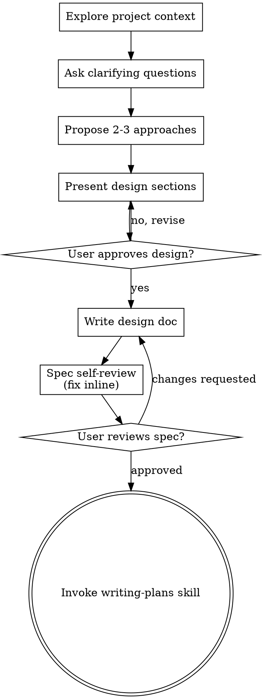
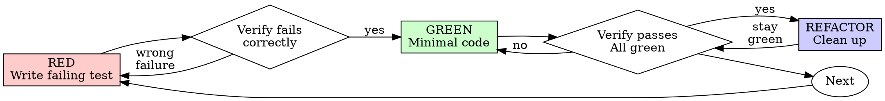

warning: `--full-auto` is deprecated; use `--sandbox workspace-write` instead.
Reading prompt from stdin...
2026-08-04T19:02:23.568931Z ERROR codex_core::shell_snapshot: Shell snapshot validation failed: Snapshot command exited with status exit status: 2: /bin/sh: 115: /opt/data/.codex/shell_snapshots/019fce27-cf79-7f82-b99f-17597dfb9d87.tmp-1785870143456721044: Syntax error: Unterminated quoted string

OpenAI Codex v0.145.0
--------
workdir: /opt/data/mowgo
model: gpt-5.6-sol
provider: openai
approval: never
sandbox: workspace-write [workdir, /tmp, $TMPDIR]
reasoning effort: none
reasoning summaries: none
session id: 019fce27-cf79-7f82-b99f-17597dfb9d87
--------
user
# FIX: iOS annual billing toggle + fact-lock card copy (MowGo)

Repo: /opt/data/mowgo. Work ONLY in `ios-native/MowGo/`. Do NOT touch Android, web, or edge functions (parallel agent handles Android; edge function ALREADY supports `interval` — verified).

## Goal

The web app has a Month/Annual billing toggle; iOS does not (native checkout is monthly-only). Add the toggle to the iOS Plans screen, pass the interval through to the edge function, and fix plan-card copy that contradicts the web (fact-lock).

## Verified ground truth (do not re-litigate)

- Edge function `create-checkout-session` (deployed) accepts `{ tier: 'solo'|'crew', interval: 'month'|'year' }` and maps to env prices: SOLO=$39/mo, SOLO_ANNUAL=$390/yr, CREW=$79/mo, CREW_ANNUAL=$790/yr. Annual secrets are set in Supabase. The function defaults `interval = "month"`.
- Web plan definitions (source of truth, `client/src/pages/Landing.jsx:23-42`):
  - Solo: $39/mo or $390/yr; features: "Unlimited clients & jobs", "Recurring job automation", "GPS route navigation (coming soon)", "Client notes, codes & pets", "Offline mode"
  - Crew: $79/mo or $790/yr; features: "Everything in Solo", "Unlimited clients", "Job assignment & tracking", "Team progress dashboard"
- Web annual toggle shows a "2 months free" badge on Annual. Savings math: Solo $78/yr saved ($39×12−$390), Crew $158/yr saved ($79×12−$790).
- iOS `StripeService.createCheckoutSession(tier:)` (`ios-native/MowGo/Services/StripeService.swift:108`) sends `["tier": tier]` only. Must send `["tier": tier, "interval": interval]`.
- iOS Plans UI: `SubscriptionView` in `ios-native/MowGo/Views/Settings/SettingsView.swift:652-712` renders three hardcoded `SubscriptionPlanCard`s (Free $0/mo, Solo "$39/mo", Crew "$79/mo"). Card component: `SubscriptionPlanCard` in `ios-native/MowGo/Views/Payments/PaymentView.swift:152-265`; its `subscribe()` (line 245) calls `stripe.createCheckoutSession(tier: tier)`.

## Changes required

### 1. `ios-native/MowGo/Services/StripeService.swift`
`createCheckoutSession(tier: String)` → `createCheckoutSession(tier: String, interval: String = "month")`. Body: `["tier": tier, "interval": interval]`. No other changes.

### 2. `ios-native/MowGo/Views/Payments/PaymentView.swift` — `SubscriptionPlanCard`
- Add a `billingInterval: String = "month"` parameter to the struct.
- `subscribe()` passes it: `stripe.createCheckoutSession(tier: tier, interval: billingInterval)`.

### 3. `ios-native/MowGo/Views/Settings/SettingsView.swift` — `SubscriptionView`
- Add `@State private var billingInterval = "month"` (allowed values "month"/"year").
- Add a segmented Month/Annual picker above the plan cards (SwiftUI `Picker` with `.pickerStyle(.segmented)`, matching the app's theme). Label Annual with "2 months free" (small caption, brand color).
- Card prices become interval-aware:
  - Solo: `"$39/mo"` ↔ `"$390/yr"` (add a small "Save $78" caption when annual)
  - Crew: `"$79/mo"` ↔ `"$790/yr"` (caption "Save $158" when annual)
  - Free card stays "$0/mo" always.
- Pass `billingInterval: billingInterval` to all three `SubscriptionPlanCard`s.
- **Fix card feature copy to match web (fact-lock):**
  - Solo features: `["Unlimited clients & jobs", "Recurring job automation", "GPS route navigation (coming soon)", "Client notes, codes & pets", "Offline mode"]` (replaces the wrong "15 clients / Route optimization / Photo attachments / Priority support" — route optimization is NOT live, it's coming soon).
  - Crew features: `["Everything in Solo", "Unlimited clients", "Job assignment & tracking", "Team progress dashboard"]` (replaces "Multi-user / crew" etc. — keep it matching web).
  - Free features: `["Up to 5 clients", "Daily job scheduling", "Rain delay auto-reschedule", "Invoice tracking", "Dark mode + installable PWA"]` (matches web; replaces "Basic scheduling").

### Constraints
- SwiftUI only; use `MowGoTheme` colors (no raw hex).
- No new dependencies, no data-layer changes, no i18n (iOS app is English-only).
- Do NOT run builds (CI compiles on push).
- After edits: run `git diff --stat` and print it, plus `grep -n "billingInterval" ios-native/MowGo/` output.

## Done criteria
- `createCheckoutSession` signature includes interval and sends it in the body.
- SubscriptionView has a segmented toggle; prices and "Save $X" captions switch with it.
- No card advertises "15 clients", "Route optimization" as live, "AI assistant", or "Photo attachments".
- `git diff --stat` shows changes confined to the 3 files above.

warning: Codex could not find bubblewrap on PATH. Install bubblewrap with your OS package manager. See the sandbox prerequisites: https://developers.openai.com/codex/concepts/sandboxing#prerequisites. Codex will use the bundled bubblewrap in the meantime.
codex
I’ll make the narrowly scoped SwiftUI/service edits in the three specified files, then verify the diff, forbidden copy, and `billingInterval` references without running a build. I’m first applying the repository’s required workflow skills for feature changes.
exec
/bin/sh -lc "sed -n '1,240p' /opt/data/.agents/skills/using-superpowers/SKILL.md && sed -n '1,260p' /opt/data/.agents/skills/brainstorming/SKILL.md && sed -n '1,260p' /opt/data/.agents/skills/test-driven-development/SKILL.md && sed -n '1,260p' /opt/data/.agents/skills/verification-before-completion/SKILL.md" in /opt/data/mowgo
 succeeded in 0ms:
---
name: using-superpowers
description: Use when starting any conversation - establishes how to find and use skills, requiring skill invocation before ANY response including clarifying questions
---

<SUBAGENT-STOP>
If you were dispatched as a subagent to execute a specific task, ignore this skill.
</SUBAGENT-STOP>

<EXTREMELY-IMPORTANT>
If you think there is even a 1% chance a skill might apply to what you are doing, you ABSOLUTELY MUST invoke the skill.

IF A SKILL APPLIES TO YOUR TASK, YOU DO NOT HAVE A CHOICE. YOU MUST USE IT.

This is not negotiable. You cannot rationalize your way out of this.
</EXTREMELY-IMPORTANT>

## The Rule

**Invoke relevant or requested skills BEFORE any response or action** — including clarifying questions, exploring the codebase, or checking files. If it turns out wrong for the situation, you don't have to use it.

**Before entering plan mode:** if you haven't already brainstormed, invoke the brainstorming skill first.

Then announce "Using [skill] to [purpose]" and follow the skill exactly. If it has a checklist, create a todo per item.

## Skill Priority

When multiple skills apply, process skills come first — they set the approach, then implementation skills (frontend-design, etc.) carry it out. Brainstorming and systematic-debugging are Superpowers' most common process skills, but the rule holds for any of them.

- "Let's build X" → superpowers:brainstorming first, then implementation skills.
- "Fix this bug" → superpowers:systematic-debugging first, then domain skills.

## Red Flags

These thoughts mean STOP—you're rationalizing:

| Thought | Reality |
|---------|---------|
| "This is just a simple question" | Questions are tasks. Check for skills. |
| "I need more context first" | Skill check comes BEFORE clarifying questions. |
| "Let me explore the codebase first" | Skills tell you HOW to explore. Check first. |
| "I can check git/files quickly" | Files lack conversation context. Check for skills. |
| "Let me gather information first" | Skills tell you HOW to gather information. |
| "This doesn't need a formal skill" | If a skill exists, use it. |
| "I remember this skill" | Skills evolve. Read current version. |
| "This doesn't count as a task" | Action = task. Check for skills. |
| "The skill is overkill" | Simple things become complex. Use it. |
| "I'll just do this one thing first" | Check BEFORE doing anything. |
| "This feels productive" | Undisciplined action wastes time. Skills prevent this. |
| "I know what that means" | Knowing the concept ≠ using the skill. Invoke it. |

## Platform Adaptation

If your harness appears here, read its reference file for special instructions:

- Codex: `references/codex-tools.md`
- Pi: `references/pi-tools.md`
- Antigravity: `references/antigravity-tools.md`

## User Instructions

User instructions (CLAUDE.md, AGENTS.md, GEMINI.md, etc, direct requests) take precedence over skills, which in turn override default behavior. Only skip skill workflows or instructions when your human partner has explicitly told you to.
---
name: brainstorming
description: "You MUST use this before any creative work - creating features, building components, adding functionality, or modifying behavior. Explores user intent, requirements and design before implementation."
---

# Brainstorming Ideas Into Designs

Help turn ideas into fully formed designs and specs through natural collaborative dialogue.

Start by understanding the current project context, then ask questions one at a time to refine the idea. Once you understand what you're building, present the design and get user approval.

<HARD-GATE>
Do NOT invoke any implementation skill, write any code, scaffold any project, or take any implementation action until you have presented a design and the user has approved it. This applies to EVERY project regardless of perceived simplicity.
</HARD-GATE>

## Anti-Pattern: "This Is Too Simple To Need A Design"

Every project goes through this process. A todo list, a single-function utility, a config change — all of them. "Simple" projects are where unexamined assumptions cause the most wasted work. The design can be short (a few sentences for truly simple projects), but you MUST present it and get approval.

## Checklist

You MUST create a task for each of these items and complete them in order:

1. **Explore project context** — check files, docs, recent commits
2. **Offer the visual companion just-in-time** — NOT upfront. The first time a question would genuinely be clearer shown than described, offer it then (its own message); on approval its browser tab opens for you. If no visual question ever arises, never offer it. See the Visual Companion section below.
3. **Ask clarifying questions** — one at a time, understand purpose/constraints/success criteria
4. **Propose 2-3 approaches** — with trade-offs and your recommendation
5. **Present design** — in sections scaled to their complexity, get user approval after each section
6. **Write design doc** — save to `docs/superpowers/specs/YYYY-MM-DD-<topic>-design.md` and commit
7. **Spec self-review** — quick inline check for placeholders, contradictions, ambiguity, scope (see below)
8. **User reviews written spec** — ask user to review the spec file before proceeding
9. **Transition to implementation** — invoke writing-plans skill to create implementation plan

## Process Flow



**The terminal state is invoking writing-plans.** Do NOT invoke frontend-design, mcp-builder, or any other implementation skill. The ONLY skill you invoke after brainstorming is writing-plans.

## The Process

**Understanding the idea:**

- Check out the current project state first (files, docs, recent commits)
- Before asking detailed questions, assess scope: if the request describes multiple independent subsystems (e.g., "build a platform with chat, file storage, billing, and analytics"), flag this immediately. Don't spend questions refining details of a project that needs to be decomposed first.
- If the project is too large for a single spec, help the user decompose into sub-projects: what are the independent pieces, how do they relate, what order should they be built? Then brainstorm the first sub-project through the normal design flow. Each sub-project gets its own spec → plan → implementation cycle.
- For appropriately-scoped projects, ask questions one at a time to refine the idea
- Prefer multiple choice questions when possible, but open-ended is fine too
- Only one question per message - if a topic needs more exploration, break it into multiple questions
- Focus on understanding: purpose, constraints, success criteria

**Exploring approaches:**

- Propose 2-3 different approaches with trade-offs
- Present options conversationally with your recommendation and reasoning
- Lead with your recommended option and explain why

**Presenting the design:**

- Once you believe you understand what you're building, present the design
- Scale each section to its complexity: a few sentences if straightforward, up to 200-300 words if nuanced
- Ask after each section whether it looks right so far
- Cover: architecture, components, data flow, error handling, testing
- Be ready to go back and clarify if something doesn't make sense

**Design for isolation and clarity:**

- Break the system into smaller units that each have one clear purpose, communicate through well-defined interfaces, and can be understood and tested independently
- For each unit, you should be able to answer: what does it do, how do you use it, and what does it depend on?
- Can someone understand what a unit does without reading its internals? Can you change the internals without breaking consumers? If not, the boundaries need work.
- Smaller, well-bounded units are also easier for you to work with - you reason better about code you can hold in context at once, and your edits are more reliable when files are focused. When a file grows large, that's often a signal that it's doing too much.

**Working in existing codebases:**

- Explore the current structure before proposing changes. Follow existing patterns.
- Where existing code has problems that affect the work (e.g., a file that's grown too large, unclear boundaries, tangled responsibilities), include targeted improvements as part of the design - the way a good developer improves code they're working in.
- Don't propose unrelated refactoring. Stay focused on what serves the current goal.

## After the Design

**Documentation:**

- Write the validated design (spec) to `docs/superpowers/specs/YYYY-MM-DD-<topic>-design.md`
  - (User preferences for spec location override this default)
- Use elements-of-style:writing-clearly-and-concisely skill if available
- Commit the design document to git

**Spec Self-Review:**
After writing the spec document, look at it with fresh eyes:

1. **Placeholder scan:** Any "TBD", "TODO", incomplete sections, or vague requirements? Fix them.
2. **Internal consistency:** Do any sections contradict each other? Does the architecture match the feature descriptions?
3. **Scope check:** Is this focused enough for a single implementation plan, or does it need decomposition?
4. **Ambiguity check:** Could any requirement be interpreted two different ways? If so, pick one and make it explicit.

Fix any issues inline. No need to re-review — just fix and move on.

**User Review Gate:**
After the spec review loop passes, ask the user to review the written spec before proceeding:

> "Spec written and committed to `<path>`. Please review it and let me know if you want to make any changes before we start writing out the implementation plan."

Wait for the user's response. If they request changes, make them and re-run the spec review loop. Only proceed once the user approves.

**Implementation:**

- Invoke the writing-plans skill to create a detailed implementation plan
- Do NOT invoke any other skill. writing-plans is the next step.

## Key Principles

- **One question at a time** - Don't overwhelm with multiple questions
- **Multiple choice preferred** - Easier to answer than open-ended when possible
- **YAGNI ruthlessly** - Remove unnecessary features from all designs
- **Explore alternatives** - Always propose 2-3 approaches before settling
- **Incremental validation** - Present design, get approval before moving on
- **Be flexible** - Go back and clarify when something doesn't make sense

## Visual Companion

A browser-based companion for showing mockups, diagrams, and visual options during brainstorming. Available as a tool — not a mode. Accepting the companion means it's available for questions that benefit from visual treatment; it does NOT mean every question goes through the browser.

**Offering the companion (just-in-time):** Do NOT offer it upfront. Wait until a question would genuinely be clearer shown than told — a real mockup / layout / diagram question, not merely a UI *topic*. The first time that happens, offer it then, as its own message:
> "This next part might be easier if I show you — I can put together mockups, diagrams, and comparisons in a browser tab as we go. It's still new and can be token-intensive. Want me to? I'll open it for you."

**This offer MUST be its own message.** Only the offer — no clarifying question, summary, or other content. Wait for the user's response. If they accept, start the server with `--open` so their browser opens to the first screen automatically. If they decline, continue text-only and don't offer again unless they raise it.

**Per-question decision:** Even after the user accepts, decide FOR EACH QUESTION whether to use the browser or the terminal. The test: **would the user understand this better by seeing it than reading it?**

- **Use the browser** for content that IS visual — mockups, wireframes, layout comparisons, architecture diagrams, side-by-side visual designs
- **Use the terminal** for content that is text — requirements questions, conceptual choices, tradeoff lists, A/B/C/D text options, scope decisions

A question about a UI topic is not automatically a visual question. "What does personality mean in this context?" is a conceptual question — use the terminal. "Which wizard layout works better?" is a visual question — use the browser.

If they agree to the companion, read the detailed guide before proceeding:
`skills/brainstorming/visual-companion.md`
---
name: test-driven-development
description: Use when implementing any feature or bugfix, before writing implementation code - write the test first, watch it fail, write minimal code to pass; ensures tests actually verify behavior by requiring failure first
---

# Test-Driven Development (TDD)

## Overview

Write the test first. Watch it fail. Write minimal code to pass.

**Core principle:** If you didn't watch the test fail, you don't know if it tests the right thing.

**Violating the letter of the rules is violating the spirit of the rules.**

## When to Use

**Always:**

- New features
- Bug fixes
- Refactoring
- Behavior changes

**Exceptions (ask your human partner):**

- Throwaway prototypes
- Generated code
- Configuration files

Thinking "skip TDD just this once"? Stop. That's rationalization.

## The Iron Law

```
NO PRODUCTION CODE WITHOUT A FAILING TEST FIRST
```

Write code before the test? Delete it. Start over.

**No exceptions:**

- Don't keep it as "reference"
- Don't "adapt" it while writing tests
- Don't look at it
- Delete means delete

Implement fresh from tests. Period.

## Red-Green-Refactor



### RED - Write Failing Test

Write one minimal test showing what should happen.

<Good>
```typescript
test('retries failed operations 3 times', async () => {
  let attempts = 0;
  const operation = () => {
    attempts++;
    if (attempts < 3) throw new Error('fail');
    return 'success';
  };

  const result = await retryOperation(operation);

  expect(result).toBe('success');
  expect(attempts).toBe(3);
});

```
Clear name, tests real behavior, one thing
</Good>

<Bad>
```typescript
test('retry works', async () => {
  const mock = jest.fn()
    .mockRejectedValueOnce(new Error())
    .mockRejectedValueOnce(new Error())
    .mockResolvedValueOnce('success');
  await retryOperation(mock);
  expect(mock).toHaveBeenCalledTimes(3);
});
```

Vague name, tests mock not code
</Bad>

**Requirements:**

- One behavior
- Clear name
- Real code (no mocks unless unavoidable)

### Verify RED - Watch It Fail

**MANDATORY. Never skip.**

```bash
npm test path/to/test.test.ts
```

Confirm:

- Test fails (not errors)
- Failure message is expected
- Fails because feature missing (not typos)

**Test passes?** You're testing existing behavior. Fix test.

**Test errors?** Fix error, re-run until it fails correctly.

### GREEN - Minimal Code

Write simplest code to pass the test.

<Good>
```typescript
async function retryOperation<T>(fn: () => Promise<T>): Promise<T> {
  for (let i = 0; i < 3; i++) {
    try {
      return await fn();
    } catch (e) {
      if (i === 2) throw e;
    }
  }
  throw new Error('unreachable');
}
```
Just enough to pass
</Good>

<Bad>
```typescript
async function retryOperation<T>(
  fn: () => Promise<T>,
  options?: {
    maxRetries?: number;
    backoff?: 'linear' | 'exponential';
    onRetry?: (attempt: number) => void;
  }
): Promise<T> {
  // YAGNI
}
```
Over-engineered
</Bad>

Don't add features, refactor other code, or "improve" beyond the test.

### Verify GREEN - Watch It Pass

**MANDATORY.**

```bash
npm test path/to/test.test.ts
```

Confirm:

- Test passes
- Other tests still pass
- Output pristine (no errors, warnings)

**Test fails?** Fix code, not test.

**Other tests fail?** Fix now.

### REFACTOR - Clean Up

After green only:

- Remove duplication
- Improve names
- Extract helpers

Keep tests green. Don't add behavior.

### Repeat

Next failing test for next feature.

## Good Tests

| Quality | Good | Bad |
|---------|------|-----|
| **Minimal** | One thing. "and" in name? Split it. | `test('validates email and domain and whitespace')` |
| **Clear** | Name describes behavior | `test('test1')` |
| **Shows intent** | Demonstrates desired API | Obscures what code should do |

## Why Order Matters

**"I'll write tests after to verify it works"**

Tests written after code pass immediately. Passing immediately proves nothing:

- Might test wrong thing
- Might test implementation, not behavior
- Might miss edge cases you forgot
- You never saw it catch the bug

Test-first forces you to see the test fail, proving it actually tests something.

**"I already manually tested all the edge cases"**

Manual testing is ad-hoc. You think you tested everything but:

- No record of what you tested
- Can't re-run when code changes
- Easy to forget cases under pressure
- "It worked when I tried it" ≠ comprehensive

Automated tests are systematic. They run the same way every time.

**"Deleting X hours of work is wasteful"**

Sunk cost fallacy. The time is already gone. Your choice now:

- Delete and rewrite with TDD (X more hours, high confidence)
- Keep it and add tests after (30 min, low confidence, likely bugs)

The "waste" is keeping code you can't trust. Working code without real tests is technical debt.

**"TDD is dogmatic, being pragmatic means adapting"**

TDD IS pragmatic:

- Finds bugs before commit (faster than debugging after)
- Prevents regressions (tests catch breaks immediately)
- Documents behavior (tests show how to use code)
- Enables refactoring (change freely, tests catch breaks)

"Pragmatic" shortcuts = debugging in production = slower.

**"Tests after achieve the same goals - it's spirit not ritual"**

---
name: verification-before-completion
description: Use when about to claim work is complete, fixed, or passing, before committing or creating PRs - requires running verification commands and confirming output before making any success claims; evidence before assertions always
---

# Verification Before Completion

## Overview

Claiming work is complete without verification is dishonesty, not efficiency.

**Core principle:** Evidence before claims, always.

**Violating the letter of this rule is violating the spirit of this rule.**

## The Iron Law

```
NO COMPLETION CLAIMS WITHOUT FRESH VERIFICATION EVIDENCE
```

If you haven't run the verification command in this message, you cannot claim it passes.

## The Gate Function

```
BEFORE claiming any status or expressing satisfaction:

1. IDENTIFY: What command proves this claim?
2. RUN: Execute the FULL command (fresh, complete)
3. READ: Full output, check exit code, count failures
4. VERIFY: Does output confirm the claim?
   - If NO: State actual status with evidence
   - If YES: State claim WITH evidence
5. ONLY THEN: Make the claim

Skip any step = lying, not verifying
```

## Common Failures

| Claim | Requires | Not Sufficient |
|-------|----------|----------------|
| Tests pass | Test command output: 0 failures | Previous run, "should pass" |
| Linter clean | Linter output: 0 errors | Partial check, extrapolation |
| Build succeeds | Build command: exit 0 | Linter passing, logs look good |
| Bug fixed | Test original symptom: passes | Code changed, assumed fixed |
| Regression test works | Red-green cycle verified | Test passes once |
| Agent completed | VCS diff shows changes | Agent reports "success" |
| Requirements met | Line-by-line checklist | Tests passing |

## Red Flags - STOP

- Using "should", "probably", "seems to"
- Expressing satisfaction before verification ("Great!", "Perfect!", "Done!", etc.)
- About to commit/push/PR without verification
- Trusting agent success reports
- Relying on partial verification
- Thinking "just this once"
- Tired and wanting work over
- **ANY wording implying success without having run verification**

## Rationalization Prevention

| Excuse | Reality |
|--------|---------|
| "Should work now" | RUN the verification |
| "I'm confident" | Confidence ≠ evidence |
| "Just this once" | No exceptions |
| "Linter passed" | Linter ≠ compiler |
| "Agent said success" | Verify independently |
| "I'm tired" | Exhaustion ≠ excuse |
| "Partial check is enough" | Partial proves nothing |
| "Different words so rule doesn't apply" | Spirit over letter |

## Key Patterns

**Tests:**
```
✅ [Run test command] [See: 34/34 pass] "All tests pass"
❌ "Should pass now" / "Looks correct"
```

**Regression tests (TDD Red-Green):**
```
✅ Write → Run (pass) → Revert fix → Run (MUST FAIL) → Restore → Run (pass)
❌ "I've written a regression test" (without red-green verification)
```

**Build:**
```
✅ [Run build] [See: exit 0] "Build passes"
❌ "Linter passed" (linter doesn't check compilation)
```

**Requirements:**
```
✅ Re-read plan → Create checklist → Verify each → Report gaps or completion
❌ "Tests pass, phase complete"
```

**Agent delegation:**
```
✅ Agent reports success → Check VCS diff → Verify changes → Report actual state
❌ Trust agent report
```

## Why This Matters

From 24 failure memories:
- your human partner said "I don't believe you" - trust broken
- Undefined functions shipped - would crash
- Missing requirements shipped - incomplete features
- Time wasted on false completion → redirect → rework
- Violates: "Honesty is a core value. If you lie, you'll be replaced."

## When To Apply

**ALWAYS before:**
- ANY variation of success/completion claims
- ANY expression of satisfaction
- ANY positive statement about work state
- Committing, PR creation, task completion
- Moving to next task
- Delegating to agents

**Rule applies to:**
- Exact phrases
- Paraphrases and synonyms
- Implications of success
- ANY communication suggesting completion/correctness

## The Bottom Line

**No shortcuts for verification.**

Run the command. Read the output. THEN claim the result.

This is non-negotiable.

codex
The supplied request is already a fully approved design and explicitly confines changes to three files, so I’m treating the design/spec-writing and new-test steps as superseded by your constraints (a design doc or test file would violate scope). I’ll use the verification skill after implementation with static checks only, honoring “Do NOT run builds.”
exec
/bin/sh -lc "sed -n '90,135p' ios-native/MowGo/Services/StripeService.swift
sed -n '140,275p' ios-native/MowGo/Views/Payments/PaymentView.swift
sed -n '630,735p' ios-native/MowGo/Views/Settings/SettingsView.swift
rg -n \"struct MowGoTheme|enum MowGoTheme|MowGoTheme\\.\" ios-native/MowGo | head -80
git status --short" in /opt/data/mowgo
 succeeded in 0ms:
    private func idempotencyKey(for invoiceId: UUID) -> String {
        let storageKey = "payment_idempotency_\(invoiceId.uuidString)"
        if let existing = UserDefaults.standard.string(forKey: storageKey),
           !existing.isEmpty {
            return existing
        }
        let key = UUID().uuidString
        UserDefaults.standard.set(key, forKey: storageKey)
        return key
    }

    private func clearIdempotencyKey(for invoiceId: UUID) {
        let storageKey = "payment_idempotency_\(invoiceId.uuidString)"
        UserDefaults.standard.removeObject(forKey: storageKey)
    }

    // MARK: - Subscription checkout (Stripe Checkout redirect)

    func createCheckoutSession(tier: String) async throws -> URL {
        let body: [String: Any] = ["tier": tier]
        let data = try await sb.requestFunction("create-checkout-session", body: body)
        let json = try JSONSerialization.jsonObject(with: data) as? [String: Any]
        guard let urlString = json?["url"] as? String,
              let url = URL(string: urlString),
              url.scheme == "https",
              url.host == "checkout.stripe.com" else {
            throw StripeError.noCheckoutURL
        }
        return url
    }

    // MARK: - Customer Portal (manage/cancel subscription)

    func createCustomerPortal() async throws -> URL {
        let data = try await sb.requestFunction("create-customer-portal", body: [:])
        let json = try JSONSerialization.jsonObject(with: data) as? [String: Any]
        guard let urlString = json?["url"] as? String,
              let url = URL(string: urlString),
              url.scheme == "https",
              url.host == "billing.stripe.com" else {
            throw StripeError.noPortalURL
        }
        return url
    }

    // MARK: - Cancel Subscription
        if let navigationController = viewController as? UINavigationController {
            return topmostViewController(from: navigationController.visibleViewController)
        }
        if let tabBarController = viewController as? UITabBarController {
            return topmostViewController(from: tabBarController.selectedViewController)
        }
        return viewController
    }
}

// MARK: - Subscription Plan Card

struct SubscriptionPlanCard: View {
    @Environment(\.colorScheme) private var colorScheme
    let name: String
    let price: String
    let features: [String]
    let tier: String
    let isCurrent: Bool
    var userTier: String = "free"

    private let stripe = StripeService.shared
    @State private var isPurchasing = false
    @State private var error: String?

    private var theme: MowGoTheme { MowGoTheme.themed(colorScheme) }
    private var tierOrder: Int {
        switch tier {
        case "crew": return 2
        case "solo": return 1
        default: return 0
        }
    }
    private var userTierOrder: Int {
        switch userTier.lowercased() {
        case "crew": return 2
        case "solo": return 1
        default: return 0
        }
    }
    private var canUpgrade: Bool { !isCurrent && tierOrder > userTierOrder }
    var body: some View {
        VStack(alignment: .leading, spacing: 12) {
            HStack {
                VStack(alignment: .leading, spacing: 2) {
                    Text(name)
                        .font(.headline)
                        .foregroundColor(theme.textPrimary)
                    Text(price)
                        .font(.title3.weight(.bold))
                        .foregroundColor(MowGoTheme.deepGreen)
                }
                Spacer()
                if isCurrent {
                    Text("Current")
                        .font(.caption.weight(.medium))
                        .foregroundColor(MowGoTheme.deepGreen)
                        .padding(.horizontal, 10)
                        .padding(.vertical, 4)
                        .background(MowGoTheme.deepGreen.opacity(MowGoTheme.accentOpacity))
                        .cornerRadius(8)
                }
            }

            ForEach(features, id: \.self) { feature in
                HStack(spacing: 8) {
                    Image(systemName: "checkmark.circle.fill")
                        .font(.caption)
                        .foregroundColor(MowGoTheme.deepGreen)
                    Text(feature)
                        .font(.caption)
                        .foregroundColor(theme.textSecondary)
                }
            }

            if canUpgrade {
                Button {
                    Task { await subscribe() }
                } label: {
                    if isPurchasing {
                        ProgressView().tint(MowGoTheme.onAccent)
                    } else {
                        Text("Upgrade")
                            .fontWeight(.semibold)
                    }
                }
                .frame(maxWidth: .infinity)
                .padding(.vertical, 10)
                .background(MowGoTheme.deepGreen)
                .foregroundColor(MowGoTheme.onAccent)
                .cornerRadius(10)
                .disabled(isPurchasing)
            }

            if let err = error {
                Text(err)
                    .font(.caption2)
                    .foregroundColor(.red)
            }
        }
        .padding(16)
        .background(theme.surface)
        .cornerRadius(16)
    }

    private func subscribe() async {
        guard stripe.isConfigured else {
            error = "Stripe not configured."
            return
        }
        isPurchasing = true
        error = nil
        do {
            let url = try await stripe.createCheckoutSession(tier: tier)
            // Open in Safari
            let didOpen = await UIApplication.shared.open(url)
            if !didOpen {
                self.error = "Could not open checkout."
            }
            isPurchasing = false
        } catch {
            self.error = error.localizedDescription
            isPurchasing = false
        }
    }
}
                    .frame(maxWidth: .infinity).padding()
                    .background(MowGoTheme.deepGreen).cornerRadius(12)

                if isPaidTier {
                    Button("Cancel Subscription", role: .destructive, action: onCancelSubscription)
                        .frame(maxWidth: .infinity).padding()
                        .background(theme.surface).cornerRadius(12)
                }
                if let errorMessage {
                    Text(errorMessage).font(.caption).foregroundColor(.red).frame(maxWidth: .infinity, alignment: .leading)
                }
            }
            .padding(16)
        }
        .background(theme.background)
        .navigationTitle("Billing")
        .navigationBarTitleDisplayMode(.inline)
    }
}

// MARK: - Subscription View

struct SubscriptionView: View {
    @Environment(\.dismiss) var dismiss
    @Environment(\.colorScheme) private var colorScheme
    let currentTier: String

    /// When true, Free card is hidden (user is already above Free).
    private var showFreeCard: Bool { normalizedCurrentTier == "free" }

    private var theme: MowGoTheme { MowGoTheme.themed(colorScheme) }

    private var normalizedCurrentTier: String {
        currentTier.lowercased()
    }

    var body: some View {
        NavigationStack {
            ZStack {
                theme.background.ignoresSafeArea()

                ScrollView {
                    VStack(spacing: 16) {
                        if showFreeCard {
                        SubscriptionPlanCard(
                            name: "Free",
                            price: "$0/mo",
                            features: ["5 clients", "Basic scheduling", "Invoice tracking"],
                            tier: "free",
                            isCurrent: normalizedCurrentTier == "free",
                            userTier: normalizedCurrentTier
                        )
                        }

                        SubscriptionPlanCard(
                            name: "Solo",
                            price: "$39/mo",
                            features: [
                                "15 clients",
                                "Route optimization",
                                "Photo attachments",
                                "Priority support"
                            ],
                            tier: "solo",
                            isCurrent: normalizedCurrentTier == "solo",
                            userTier: normalizedCurrentTier
                        )

                        SubscriptionPlanCard(
                            name: "Crew",
                            price: "$79/mo",
                            features: [
                                "Everything in Solo",
                                "Unlimited clients",
                                "Multi-user / crew",
                                "Job assignment & tracking",
                                "Team progress dashboard"
                            ],
                            tier: "crew",
                            isCurrent: normalizedCurrentTier == "crew",
                            userTier: normalizedCurrentTier
                        )
                    }
                    .padding(16)
                }
            }
            .navigationTitle("Plans")
            .navigationBarTitleDisplayMode(.inline)
            .toolbar {
                ToolbarItem(placement: .cancellationAction) {
                    Button("Close") { dismiss() }
                }
            }
        }
    }
}

private struct SectionHeader: View {
    let title: String
    init(_ title: String) { self.title = title }
    var body: some View {
        Text(title.uppercased())
            .font(.caption.weight(.semibold))
            .foregroundColor(.gray)
            .padding(.top, 12)
            .padding(.leading, 4)
ios-native/MowGo/MowGoApp.swift:149:    private var theme: MowGoTheme { MowGoTheme.themed(colorScheme) }
ios-native/MowGo/MowGoApp.swift:157:                    .foregroundColor(MowGoTheme.deepGreen)
ios-native/MowGo/Views/Clients/NewClientFormView.swift:40:    private var theme: MowGoTheme { MowGoTheme.themed(colorScheme) }
ios-native/MowGo/Theme.swift:11:struct MowGoTheme: Equatable {
ios-native/MowGo/Views/Invoices/InvoicesView.swift:14:    private var theme: MowGoTheme { MowGoTheme.themed(colorScheme) }
ios-native/MowGo/Views/Invoices/InvoicesView.swift:27:                    .pickerStyle(.segmented).tint(MowGoTheme.deepGreen).padding(.horizontal, 16).padding(.vertical, 10)
ios-native/MowGo/Views/Invoices/InvoicesView.swift:28:                    if store.isLoading { Spacer(); ProgressView().tint(MowGoTheme.deepGreen); Spacer() }
ios-native/MowGo/Views/Invoices/InvoicesView.swift:34:                        Image(systemName: "plus").font(.title2.weight(.semibold)).foregroundColor(MowGoTheme.onAccent)
ios-native/MowGo/Views/Invoices/InvoicesView.swift:35:                            .frame(width: 56, height: 56).background(MowGoTheme.deepGreen).clipShape(Circle()).shadow(radius: 4)
ios-native/MowGo/Views/Invoices/InvoicesView.swift:73:        HStack { VStack { Text("Unpaid").font(.caption); Text(totalUnpaid.formatted(.currency(code: "USD"))).font(.title2.bold()).foregroundColor(MowGoTheme.danger) }.frame(maxWidth: .infinity)
ios-native/MowGo/Views/Invoices/InvoicesView.swift:75:            VStack { Text("Paid").font(.caption); Text("\(paid.count)").font(.title2.bold()).foregroundColor(MowGoTheme.success) }.frame(maxWidth: .infinity)
ios-native/MowGo/Views/Invoices/InvoicesView.swift:86:    private var theme: MowGoTheme { MowGoTheme.themed(colorScheme) }
ios-native/MowGo/Views/Invoices/InvoicesView.swift:87:    var body: some View { HStack(spacing: 12) { VStack(alignment: .leading) { Text(invoice.clientName ?? "Invoice").font(.subheadline.weight(.medium)); if let date = invoice.createdAt { Text(String(date.prefix(10))).font(.caption).foregroundColor(theme.textMuted) } }; Spacer(); status; Text(invoice.amount.formatted(.currency(code: "USD"))).font(.subheadline.weight(.semibold)); if showPay { Button("Pay") { UIImpactFeedbackGenerator(style: .medium).impactOccurred(); onPay() }.buttonStyle(.borderedProminent).tint(MowGoTheme.deepGreen).controlSize(.small) } }.foregroundColor(theme.textPrimary).padding(12).background(theme.surface).cornerRadius(12) }
ios-native/MowGo/Views/Invoices/InvoicesView.swift:88:    private var status: some View { Text(showPay ? "Due" : "Paid").font(.caption2.weight(.medium)).foregroundColor(showPay ? MowGoTheme.warning : MowGoTheme.success).padding(.horizontal, 8).padding(.vertical, 3).background((showPay ? MowGoTheme.warning : MowGoTheme.success).opacity(0.12)).clipShape(Capsule()) }
ios-native/MowGo/Views/Invoices/InvoicesView.swift:94:    private var theme: MowGoTheme { MowGoTheme.themed(colorScheme) }
ios-native/MowGo/Views/Invoices/InvoicesView.swift:95:    private var color: Color { switch estimate.status { case .draft: theme.textMuted; case .sent: MowGoTheme.info; case .approved: MowGoTheme.success; case .declined: MowGoTheme.danger } }
ios-native/MowGo/Views/Invoices/InvoicesView.swift:96:    var body: some View { HStack(spacing: 12) { VStack(alignment: .leading, spacing: 3) { Text(estimate.clientName ?? "Estimate").font(.subheadline.weight(.medium)); if let date = estimate.createdAt { Text(String(date.prefix(10))).font(.caption).foregroundColor(theme.textMuted) }; if let note = estimate.note, !note.isEmpty { Text(note).font(.caption2).foregroundColor(theme.textMuted).lineLimit(1) }; if estimate.jobId != nil { Text("Converted ✓").font(.caption2.weight(.medium)).foregroundColor(MowGoTheme.success) } }; Spacer(); Text(estimate.status.label).font(.caption2.weight(.medium)).foregroundColor(color).padding(.horizontal, 8).padding(.vertical, 3).background(color.opacity(0.12)).clipShape(Capsule()); Text(estimate.amount.formatted(.currency(code: "USD"))).font(.subheadline.weight(.semibold)) }.foregroundColor(theme.textPrimary).padding(12).background(theme.surface).cornerRadius(12) }
ios-native/MowGo/Views/Invoices/InvoicesView.swift:102:    private var theme: MowGoTheme { MowGoTheme.themed(colorScheme) }
ios-native/MowGo/Views/Invoices/InvoicesView.swift:103:    var body: some View { NavigationStack { Form { Button(client?.name ?? "Select Client") { showClients = true }; TextField("Amount", text: $amount).keyboardType(.decimalPad); TextField("Note (optional)", text: $note); HStack { Button("Save Draft") { save(send: false) }.buttonStyle(.bordered).frame(maxWidth: .infinity); Button("Send") { save(send: true) }.buttonStyle(.borderedProminent).tint(MowGoTheme.deepGreen).frame(maxWidth: .infinity) }.disabled(client == nil || Decimal(string: amount) == nil || saving) }.scrollContentBackground(.hidden).background(theme.background).navigationTitle("New Estimate").navigationBarTitleDisplayMode(.inline).toolbar { ToolbarItem(placement: .cancellationAction) { Button("Cancel") { dismiss() } } }.sheet(isPresented: $showClients) { NavigationStack { List(store.clients) { item in Button(item.name) { client = item; amount = NSDecimalNumber(decimal: item.rate).stringValue; showClients = false } }.navigationTitle("Select Client").toolbar { ToolbarItem(placement: .cancellationAction) { Button("Cancel") { showClients = false } } } }.presentationDetents([.medium, .large]) } }.presentationDetents([.medium, .large]) }
ios-native/MowGo/Views/Invoices/InvoicesView.swift:111:    var body: some View { NavigationStack { Form { Section { EstimateRow(estimate: current) }; Section { Button("Copy estimate text") { copy(estimateText(current)) }; if canNudge { Button("Nudge") { copy(nudgeText(current)) }.tint(.orange) }; if current.status == .draft || current.status == .sent { Button("Mark Approved") { update(.approved) }; Button("Mark Declined", role: .destructive) { update(.declined) } }; if current.status == .approved && current.jobId == nil { Button("Convert to Job") { convert() } }; if current.jobId != nil { Text("Converted ✓").foregroundColor(MowGoTheme.success) } } }.navigationTitle("Estimate").navigationBarTitleDisplayMode(.inline).toolbar { ToolbarItem(placement: .cancellationAction) { Button("Close") { dismiss() } } }.alert("Job created", isPresented: $showJobCreated) { Button("OK") {} } }.presentationDetents([.medium, .large]) }
ios-native/MowGo/Views/Clients/NewLeadFormView.swift:18:    private var theme: MowGoTheme { MowGoTheme.themed(colorScheme) }
ios-native/MowGo/Views/Payments/PaymentView.swift:22:    private var theme: MowGoTheme { MowGoTheme.themed(colorScheme) }
ios-native/MowGo/Views/Payments/PaymentView.swift:33:                    .foregroundColor(MowGoTheme.deepGreen)
ios-native/MowGo/Views/Payments/PaymentView.swift:48:                        ProgressView().tint(MowGoTheme.onAccent)
ios-native/MowGo/Views/Payments/PaymentView.swift:57:                .background(MowGoTheme.deepGreen)
ios-native/MowGo/Views/Payments/PaymentView.swift:58:                .foregroundColor(MowGoTheme.onAccent)
ios-native/MowGo/Views/Payments/PaymentView.swift:165:    private var theme: MowGoTheme { MowGoTheme.themed(colorScheme) }
ios-native/MowGo/Views/Payments/PaymentView.swift:190:                        .foregroundColor(MowGoTheme.deepGreen)
ios-native/MowGo/Views/Payments/PaymentView.swift:196:                        .foregroundColor(MowGoTheme.deepGreen)
ios-native/MowGo/Views/Payments/PaymentView.swift:199:                        .background(MowGoTheme.deepGreen.opacity(MowGoTheme.accentOpacity))
ios-native/MowGo/Views/Payments/PaymentView.swift:208:                        .foregroundColor(MowGoTheme.deepGreen)
ios-native/MowGo/Views/Payments/PaymentView.swift:220:                        ProgressView().tint(MowGoTheme.onAccent)
ios-native/MowGo/Views/Payments/PaymentView.swift:228:                .background(MowGoTheme.deepGreen)
ios-native/MowGo/Views/Payments/PaymentView.swift:229:                .foregroundColor(MowGoTheme.onAccent)
ios-native/MowGo/Views/Clients/ClientsView.swift:22:    private var theme: MowGoTheme { MowGoTheme.themed(colorScheme) }
ios-native/MowGo/Views/Clients/ClientsView.swift:35:                    ProgressView().tint(MowGoTheme.deepGreen)
ios-native/MowGo/Views/Clients/ClientsView.swift:74:                                            .background(MowGoTheme.deepGreen)
ios-native/MowGo/Views/Clients/ClientsView.swift:120:                            .foregroundColor(MowGoTheme.deepGreen)
ios-native/MowGo/Views/Clients/ClientsView.swift:178:                        .font(.caption2.weight(.medium)).foregroundColor(MowGoTheme.deepGreen)
ios-native/MowGo/Views/Clients/ClientsView.swift:180:                        .background(MowGoTheme.deepGreen.opacity(0.12)).clipShape(Capsule())
ios-native/MowGo/Views/Clients/ClientsView.swift:210:                        .font(.caption.weight(.semibold)).buttonStyle(.borderedProminent).tint(MowGoTheme.deepGreen)
ios-native/MowGo/Views/Clients/ClientsView.swift:248:    private var theme: MowGoTheme { MowGoTheme.themed(colorScheme) }
ios-native/MowGo/Views/Clients/ClientsView.swift:258:                        .fill(MowGoTheme.deepGreen.opacity(0.12))
ios-native/MowGo/Views/Clients/ClientsView.swift:263:                                .foregroundColor(MowGoTheme.deepGreen)
ios-native/MowGo/Views/Clients/ClientsView.swift:280:                                .font(.caption.weight(.medium)).foregroundColor(MowGoTheme.deepGreen)
ios-native/MowGo/Views/Clients/ClientsView.swift:323:                                .foregroundColor(MowGoTheme.success)
ios-native/MowGo/Views/Clients/ClientsView.swift:337:                                .foregroundColor(MowGoTheme.info)
ios-native/MowGo/Views/Clients/ClientsView.swift:367:                    .foregroundColor(MowGoTheme.deepGreen)
ios-native/MowGo/Views/Clients/ClientsView.swift:399:    private var theme: MowGoTheme { MowGoTheme.themed(colorScheme) }
ios-native/MowGo/Views/Auth/ResetPasswordView.swift:18:    private var theme: MowGoTheme { MowGoTheme.themed(colorScheme) }
ios-native/MowGo/Views/Auth/ResetPasswordView.swift:30:                        .foregroundColor(MowGoTheme.deepGreen)
ios-native/MowGo/Views/Auth/ResetPasswordView.swift:56:                            .foregroundColor(MowGoTheme.deepGreen)
ios-native/MowGo/Views/Auth/ResetPasswordView.swift:70:                                ProgressView().tint(MowGoTheme.onAccent)
ios-native/MowGo/Views/Auth/ResetPasswordView.swift:77:                        .background(MowGoTheme.deepGreen)
ios-native/MowGo/Views/Auth/ResetPasswordView.swift:78:                        .foregroundColor(MowGoTheme.onAccent)
ios-native/MowGo/Views/Dashboard/DashboardView.swift:105:    private var theme: MowGoTheme { MowGoTheme.themed(colorScheme) }
ios-native/MowGo/Views/Dashboard/DashboardView.swift:237:                        .foregroundColor(MowGoTheme.deepGreen)
ios-native/MowGo/Views/Dashboard/DashboardView.swift:251:                        .foregroundColor(MowGoTheme.info)
ios-native/MowGo/Views/Dashboard/DashboardView.swift:275:                        .foregroundColor(MowGoTheme.deepGreen)
ios-native/MowGo/Views/Dashboard/DashboardView.swift:312:            rows.append((member.businessName ?? "Crew", done, ip, jobs.count, MowGoTheme.deepGreen))
ios-native/MowGo/Views/Dashboard/DashboardView.swift:357:                        .foregroundColor(MowGoTheme.success)
ios-native/MowGo/Views/Dashboard/DashboardView.swift:360:                        .background(MowGoTheme.success.opacity(0.12))
ios-native/MowGo/Views/Dashboard/DashboardView.swift:391:                .foregroundColor(MowGoTheme.deepGreen)
ios-native/MowGo/Views/Dashboard/DashboardView.swift:414:                .fill(member.role == "owner" ? MowGoTheme.deepGreen : MowGoTheme.info)
ios-native/MowGo/Views/Dashboard/DashboardView.swift:495:                    .background(inviteEmail.trimmingCharacters(in: .whitespaces).isEmpty ? Color.gray : MowGoTheme.deepGreen)
ios-native/MowGo/Views/Dashboard/DashboardView.swift:523:        let statusColor: Color = job.status == .done ? MowGoTheme.success : job.status == .inProgress ? Color.cyan : MowGoTheme.warning
ios-native/MowGo/Views/Dashboard/DashboardView.swift:532:                        .foregroundColor(MowGoTheme.deepGreen)
ios-native/MowGo/Views/Dashboard/DashboardView.swift:623:    private var theme: MowGoTheme { MowGoTheme.themed(colorScheme) }
ios-native/MowGo/Views/Settings/SettingsView.swift:35:    private var theme: MowGoTheme { MowGoTheme.themed(colorScheme) }
ios-native/MowGo/Views/Settings/SettingsView.swift:284:                .font(.system(size: 48)).foregroundColor(MowGoTheme.deepGreen)
ios-native/MowGo/Views/Settings/SettingsView.swift:383:    private var theme: MowGoTheme { MowGoTheme.themed(colorScheme) }
ios-native/MowGo/Views/Settings/SettingsView.swift:389:                .foregroundColor(MowGoTheme.deepGreen)
ios-native/MowGo/Views/Settings/SettingsView.swift:390:                .background(MowGoTheme.deepGreen.opacity(0.12))
ios-native/MowGo/Views/Settings/SettingsView.swift:415:    private var theme: MowGoTheme { MowGoTheme.themed(colorScheme) }
ios-native/MowGo/Views/Settings/SettingsView.swift:422:                    .foregroundColor(MowGoTheme.deepGreen)
ios-native/MowGo/Views/Settings/SettingsView.swift:423:                    .background(MowGoTheme.deepGreen.opacity(0.12))
ios-native/MowGo/Views/Settings/SettingsView.swift:460:    private var theme: MowGoTheme { MowGoTheme.themed(colorScheme) }
ios-native/MowGo/Views/Settings/SettingsView.swift:502:                    .listRowBackground(MowGoTheme.deepGreen)
ios-native/MowGo/Views/Settings/SettingsView.swift:516:                    .background(MowGoTheme.deepGreen)
ios-native/MowGo/Views/Settings/SettingsView.swift:533:    private var theme: MowGoTheme { MowGoTheme.themed(colorScheme) }
 M .bi_state.json
 M .run_markers/2026-08-02_0850.md
 M daily_actions.json
 M daily_scan.json
 M intel/2026-07-25_0730.md
 M intel/2026-08-02_0850.md
 M leads/reddit-threads.md
 D supabase/migrations/007_recurring_jobs.sql
 M vault/index.md
 M weekly_digest_2026-08-02.md
?? .bi_tools/
?? .run_markers/2026-08-02_2104.md
?? .run_markers/2026-08-03_0112.md
?? .run_markers/2026-08-03_0537.md
?? .run_markers/2026-08-03_0941.md
?? .run_markers/2026-08-03_1348.md
?? .run_markers/2026-08-03_2209.md
?? .run_markers/2026-08-04_0710.md
?? .run_markers/2026-08-04_1627.md
?? .tmp_android_annual_out.md
?? .tmp_android_annual_spec.md
?? .tmp_android_fix1_prompt.md
?? .tmp_android_fix2_prompt.md
?? .tmp_android_parity_prompt.md
?? .tmp_android_review.md
?? .tmp_batch10_spec.md
?? .tmp_batch11_spec.md
?? .tmp_batch11b_spec.md
?? .tmp_batch4_review.md
?? .tmp_batch4_spec.md
?? .tmp_batch5_spec.md
?? .tmp_batch6_spec.md
?? .tmp_batch7_spec.md
?? .tmp_batch7fix_spec.md
?? .tmp_batch89_review.md
?? .tmp_batch8_spec.md
?? .tmp_batch9_spec.md
?? .tmp_batch9fix_spec.md
?? .tmp_checkout_fix_out.md
?? .tmp_checkout_fix_spec.md
?? .tmp_checkout_review_out.md
?? .tmp_checkout_review_prompt.md
?? .tmp_ios_annual_out.md
?? .tmp_ios_annual_spec.md
?? .tmp_ios_fix7_prompt.md
?? .tmp_ios_fix7_review_out.md
?? .tmp_ios_fix7_review_prompt.md
?? .tmp_linkfix_spec.md
?? .tmp_rss/
?? bi_report_2026-08-02_2104.md
?? bi_report_2026-08-03_0112.md
?? bi_report_2026-08-03_0537.md
?? bi_report_2026-08-03_0941.md
?? bi_report_2026-08-03_1348.md
?? bi_report_2026-08-03_2209.md
?? bi_report_2026-08-04_0710.md
?? bi_report_2026-08-04_1627.md
?? code-review-2026-08-03.md
?? daily_actions/2026-08-04.json
?? daily_report_2026-08-03.md
?? daily_scan/2026-08-03.json
?? daily_scan/2026-08-04.json
?? docs/android-parity-leads-raindelay-v2.md
?? docs/concierge-build-spec.md
?? docs/concierge-fix-round2.md
?? docs/concierge-fix-schedule-scope.md
?? docs/concierge-fix-tier-gate.md
?? docs/concierge-onboarding-v1-scope.md
?? docs/concierge-organizer-spec.md
?? docs/concierge-review.md
?? docs/export-native-spec.md
?? docs/final-review.md
?? docs/fix-review-round1.md
?? docs/fix-review-round2.md
?? docs/ios-crew-data-fix-spec.md
?? docs/ios-parity-fixes-round1.md
?? docs/ios-parity-fixes-round2.md
?? docs/ios-parity-fixes-round3.md
?? docs/ios-parity-fixes-round4.md
?? docs/ios-parity-fixes-round5.md
?? docs/ios-parity-fixes-round6.md
?? docs/ios-parity-fixes-round7.md
?? docs/ios-parity-leads-raindelay-v2.md
?? docs/leads-v1-scope.md
?? docs/offer-copy-export-web-spec.md
?? docs/profile-location-web.md
?? docs/rain-delay-v2-scope.md
?? docs/review-export-offer.md
?? intel/2026-08-02_2104.md
?? intel/2026-08-03_0112.md
?? intel/2026-08-03_0537.md
?? intel/2026-08-03_0941.md
?? intel/2026-08-03_1348.md
?? intel/2026-08-03_2209.md
?? intel/2026-08-04_0710.md
?? intel/2026-08-04_1627.md
?? leads/content-draft-reddit-ig.md
?? leads/sms-scripts-batch1.md
?? leads/what-to-charge-ok-report.md
?? marketing/capterra-claim-kit.md
?? marketing/review-engine.md
?? social/
?? supabase/migrations/008_recurring_jobs.sql
?? vault/2026-08-03_channel-cowork-raw.md
?? vault/2026-08-03_channel-mowgo-raw.md
?? vault/2026-08-03_channel-outreach-raw.md
?? vault/2026-08-03_daily-sync.md

apply patch
patch: completed
/opt/data/mowgo/ios-native/MowGo/Services/StripeService.swift
/opt/data/mowgo/ios-native/MowGo/Views/Payments/PaymentView.swift
/opt/data/mowgo/ios-native/MowGo/Views/Settings/SettingsView.swift
diff --git a/ios-native/MowGo/Services/StripeService.swift b/ios-native/MowGo/Services/StripeService.swift
index 0312a65cc80321a74709d3764aa1ccc7ea6f48b0..e34325d1e6766b9c149f51878e51770236ced311
--- a/ios-native/MowGo/Services/StripeService.swift
+++ b/ios-native/MowGo/Services/StripeService.swift
@@ -105,8 +105,8 @@
 
     // MARK: - Subscription checkout (Stripe Checkout redirect)
 
-    func createCheckoutSession(tier: String) async throws -> URL {
-        let body: [String: Any] = ["tier": tier]
+    func createCheckoutSession(tier: String, interval: String = "month") async throws -> URL {
+        let body: [String: Any] = ["tier": tier, "interval": interval]
         let data = try await sb.requestFunction("create-checkout-session", body: body)
         let json = try JSONSerialization.jsonObject(with: data) as? [String: Any]
         guard let urlString = json?["url"] as? String,
diff --git a/ios-native/MowGo/Views/Payments/PaymentView.swift b/ios-native/MowGo/Views/Payments/PaymentView.swift
index de74165f09da8b412c2a0858aabf6851b62ff271..e0e43b4f237a089d8fd656fc039dd310269d1a55
--- a/ios-native/MowGo/Views/Payments/PaymentView.swift
+++ b/ios-native/MowGo/Views/Payments/PaymentView.swift
@@ -157,6 +157,7 @@
     let tier: String
     let isCurrent: Bool
     var userTier: String = "free"
+    var billingInterval: String = "month"
 
     private let stripe = StripeService.shared
     @State private var isPurchasing = false
@@ -188,6 +189,11 @@
                     Text(price)
                         .font(.title3.weight(.bold))
                         .foregroundColor(MowGoTheme.deepGreen)
+                    if billingInterval == "year", tier == "solo" || tier == "crew" {
+                        Text(tier == "solo" ? "Save $78" : "Save $158")
+                            .font(.caption)
+                            .foregroundColor(MowGoTheme.deepGreen)
+                    }
                 }
                 Spacer()
                 if isCurrent {
@@ -250,7 +256,7 @@
         isPurchasing = true
         error = nil
         do {
-            let url = try await stripe.createCheckoutSession(tier: tier)
+            let url = try await stripe.createCheckoutSession(tier: tier, interval: billingInterval)
             // Open in Safari
             let didOpen = await UIApplication.shared.open(url)
             if !didOpen {
diff --git a/ios-native/MowGo/Views/Settings/SettingsView.swift b/ios-native/MowGo/Views/Settings/SettingsView.swift
index 679166685b678fc6d69a8b7a78406ff84dc4d3a7..ed45a9e5a9f4facd45094309a90be60b30a274f3
--- a/ios-native/MowGo/Views/Settings/SettingsView.swift
+++ b/ios-native/MowGo/Views/Settings/SettingsView.swift
@@ -652,6 +652,7 @@
 struct SubscriptionView: View {
     @Environment(\.dismiss) var dismiss
     @Environment(\.colorScheme) private var colorScheme
+    @State private var billingInterval = "month"
     let currentTier: String
 
     /// When true, Free card is hidden (user is already above Free).
@@ -670,44 +671,71 @@
 
                 ScrollView {
                     VStack(spacing: 16) {
+                        VStack(spacing: 4) {
+                            Picker("Billing interval", selection: $billingInterval) {
+                                Text("Month").tag("month")
+                                Text("Annual").tag("year")
+                            }
+                            .pickerStyle(.segmented)
+                            .tint(MowGoTheme.deepGreen)
+
+                            HStack {
+                                Spacer()
+                                Text("2 months free")
+                                    .font(.caption)
+                                    .foregroundColor(MowGoTheme.deepGreen)
+                                    .frame(maxWidth: .infinity)
+                            }
+                            .padding(.leading, UIScreen.main.bounds.width / 2 - 16)
+                        }
+
                         if showFreeCard {
                         SubscriptionPlanCard(
                             name: "Free",
                             price: "$0/mo",
-                            features: ["5 clients", "Basic scheduling", "Invoice tracking"],
+                            features: [
+                                "Up to 5 clients",
+                                "Daily job scheduling",
+                                "Rain delay auto-reschedule",
+                                "Invoice tracking",
+                                "Dark mode + installable PWA"
+                            ],
                             tier: "free",
                             isCurrent: normalizedCurrentTier == "free",
-                            userTier: normalizedCurrentTier
+                            userTier: normalizedCurrentTier,
+                            billingInterval: billingInterval
                         )
                         }
 
                         SubscriptionPlanCard(
                             name: "Solo",
-                            price: "$39/mo",
+                            price: billingInterval == "year" ? "$390/yr" : "$39/mo",
                             features: [
-                                "15 clients",
-                                "Route optimization",
-                                "Photo attachments",
-                                "Priority support"
+                                "Unlimited clients & jobs",
+                                "Recurring job automation",
+                                "GPS route navigation (coming soon)",
+                                "Client notes, codes & pets",
+                                "Offline mode"
                             ],
                             tier: "solo",
                             isCurrent: normalizedCurrentTier == "solo",
-                            userTier: normalizedCurrentTier
+                            userTier: normalizedCurrentTier,
+                            billingInterval: billingInterval
                         )
 
                         SubscriptionPlanCard(
                             name: "Crew",
-                            price: "$79/mo",
+                            price: billingInterval == "year" ? "$790/yr" : "$79/mo",
                             features: [
                                 "Everything in Solo",
                                 "Unlimited clients",
-                                "Multi-user / crew",
                                 "Job assignment & tracking",
                                 "Team progress dashboard"
                             ],
                             tier: "crew",
                             isCurrent: normalizedCurrentTier == "crew",
-                            userTier: normalizedCurrentTier
+                            userTier: normalizedCurrentTier,
+                            billingInterval: billingInterval
                         )
                     }
                     .padding(16)

diff --git a/ios-native/MowGo/Services/StripeService.swift b/ios-native/MowGo/Services/StripeService.swift
index 0312a65cc80321a74709d3764aa1ccc7ea6f48b0..e34325d1e6766b9c149f51878e51770236ced311
--- a/ios-native/MowGo/Services/StripeService.swift
+++ b/ios-native/MowGo/Services/StripeService.swift
@@ -105,8 +105,8 @@
 
     // MARK: - Subscription checkout (Stripe Checkout redirect)
 
-    func createCheckoutSession(tier: String) async throws -> URL {
-        let body: [String: Any] = ["tier": tier]
+    func createCheckoutSession(tier: String, interval: String = "month") async throws -> URL {
+        let body: [String: Any] = ["tier": tier, "interval": interval]
         let data = try await sb.requestFunction("create-checkout-session", body: body)
         let json = try JSONSerialization.jsonObject(with: data) as? [String: Any]
         guard let urlString = json?["url"] as? String,
diff --git a/ios-native/MowGo/Views/Payments/PaymentView.swift b/ios-native/MowGo/Views/Payments/PaymentView.swift
index de74165f09da8b412c2a0858aabf6851b62ff271..e0e43b4f237a089d8fd656fc039dd310269d1a55
--- a/ios-native/MowGo/Views/Payments/PaymentView.swift
+++ b/ios-native/MowGo/Views/Payments/PaymentView.swift
@@ -157,6 +157,7 @@
     let tier: String
     let isCurrent: Bool
     var userTier: String = "free"
+    var billingInterval: String = "month"
 
     private let stripe = StripeService.shared
     @State private var isPurchasing = false
@@ -188,6 +189,11 @@
                     Text(price)
                         .font(.title3.weight(.bold))
                         .foregroundColor(MowGoTheme.deepGreen)
+                    if billingInterval == "year", tier == "solo" || tier == "crew" {
+                        Text(tier == "solo" ? "Save $78" : "Save $158")
+                            .font(.caption)
+                            .foregroundColor(MowGoTheme.deepGreen)
+                    }
                 }
                 Spacer()
                 if isCurrent {
@@ -250,7 +256,7 @@
         isPurchasing = true
         error = nil
         do {
-            let url = try await stripe.createCheckoutSession(tier: tier)
+            let url = try await stripe.createCheckoutSession(tier: tier, interval: billingInterval)
             // Open in Safari
             let didOpen = await UIApplication.shared.open(url)
             if !didOpen {
diff --git a/ios-native/MowGo/Views/Settings/SettingsView.swift b/ios-native/MowGo/Views/Settings/SettingsView.swift
index 679166685b678fc6d69a8b7a78406ff84dc4d3a7..ed45a9e5a9f4facd45094309a90be60b30a274f3
--- a/ios-native/MowGo/Views/Settings/SettingsView.swift
+++ b/ios-native/MowGo/Views/Settings/SettingsView.swift
@@ -652,6 +652,7 @@
 struct SubscriptionView: View {
     @Environment(\.dismiss) var dismiss
     @Environment(\.colorScheme) private var colorScheme
+    @State private var billingInterval = "month"
     let currentTier: String
 
     /// When true, Free card is hidden (user is already above Free).
@@ -670,44 +671,71 @@
 
                 ScrollView {
                     VStack(spacing: 16) {
+                        VStack(spacing: 4) {
+                            Picker("Billing interval", selection: $billingInterval) {
+                                Text("Month").tag("month")
+                                Text("Annual").tag("year")
+                            }
+                            .pickerStyle(.segmented)
+                            .tint(MowGoTheme.deepGreen)
+
+                            HStack {
+                                Spacer()
+                                Text("2 months free")
+                                    .font(.caption)
+                                    .foregroundColor(MowGoTheme.deepGreen)
+                                    .frame(maxWidth: .infinity)
+                            }
+                            .padding(.leading, UIScreen.main.bounds.width / 2 - 16)
+                        }
+
                         if showFreeCard {
                         SubscriptionPlanCard(
                             name: "Free",
                             price: "$0/mo",
-                            features: ["5 clients", "Basic scheduling", "Invoice tracking"],
+                            features: [
+                                "Up to 5 clients",
+                                "Daily job scheduling",
+                                "Rain delay auto-reschedule",
+                                "Invoice tracking",
+                                "Dark mode + installable PWA"
+                            ],
                             tier: "free",
                             isCurrent: normalizedCurrentTier == "free",
-                            userTier: normalizedCurrentTier
+                            userTier: normalizedCurrentTier,
+                            billingInterval: billingInterval
                         )
                         }
 
                         SubscriptionPlanCard(
                             name: "Solo",
-                            price: "$39/mo",
+                            price: billingInterval == "year" ? "$390/yr" : "$39/mo",
                             features: [
-                                "15 clients",
-                                "Route optimization",
-                                "Photo attachments",
-                                "Priority support"
+                                "Unlimited clients & jobs",
+                                "Recurring job automation",
+                                "GPS route navigation (coming soon)",
+                                "Client notes, codes & pets",
+                                "Offline mode"
                             ],
                             tier: "solo",
                             isCurrent: normalizedCurrentTier == "solo",
-                            userTier: normalizedCurrentTier
+                            userTier: normalizedCurrentTier,
+                            billingInterval: billingInterval
                         )
 
                         SubscriptionPlanCard(
                             name: "Crew",
-                            price: "$79/mo",
+                            price: billingInterval == "year" ? "$790/yr" : "$79/mo",
                             features: [
                                 "Everything in Solo",
                                 "Unlimited clients",
-                                "Multi-user / crew",
                                 "Job assignment & tracking",
                                 "Team progress dashboard"
                             ],
                             tier: "crew",
                             isCurrent: normalizedCurrentTier == "crew",
-                            userTier: normalizedCurrentTier
+                            userTier: normalizedCurrentTier,
+                            billingInterval: billingInterval
                         )
                     }
                     .padding(16)

codex
The core wiring and fact-locked copy are in place. I spotted one layout detail that can be expressed more cleanly in pure SwiftUI, so I’m replacing screen-width math with two equal SwiftUI columns before the final static verification.
apply patch
patch: completed
/opt/data/mowgo/ios-native/MowGo/Views/Settings/SettingsView.swift
diff --git a/ios-native/MowGo/Services/StripeService.swift b/ios-native/MowGo/Services/StripeService.swift
index 0312a65cc80321a74709d3764aa1ccc7ea6f48b0..e34325d1e6766b9c149f51878e51770236ced311
--- a/ios-native/MowGo/Services/StripeService.swift
+++ b/ios-native/MowGo/Services/StripeService.swift
@@ -105,8 +105,8 @@
 
     // MARK: - Subscription checkout (Stripe Checkout redirect)
 
-    func createCheckoutSession(tier: String) async throws -> URL {
-        let body: [String: Any] = ["tier": tier]
+    func createCheckoutSession(tier: String, interval: String = "month") async throws -> URL {
+        let body: [String: Any] = ["tier": tier, "interval": interval]
         let data = try await sb.requestFunction("create-checkout-session", body: body)
         let json = try JSONSerialization.jsonObject(with: data) as? [String: Any]
         guard let urlString = json?["url"] as? String,
diff --git a/ios-native/MowGo/Views/Payments/PaymentView.swift b/ios-native/MowGo/Views/Payments/PaymentView.swift
index de74165f09da8b412c2a0858aabf6851b62ff271..e0e43b4f237a089d8fd656fc039dd310269d1a55
--- a/ios-native/MowGo/Views/Payments/PaymentView.swift
+++ b/ios-native/MowGo/Views/Payments/PaymentView.swift
@@ -157,6 +157,7 @@
     let tier: String
     let isCurrent: Bool
     var userTier: String = "free"
+    var billingInterval: String = "month"
 
     private let stripe = StripeService.shared
     @State private var isPurchasing = false
@@ -188,6 +189,11 @@
                     Text(price)
                         .font(.title3.weight(.bold))
                         .foregroundColor(MowGoTheme.deepGreen)
+                    if billingInterval == "year", tier == "solo" || tier == "crew" {
+                        Text(tier == "solo" ? "Save $78" : "Save $158")
+                            .font(.caption)
+                            .foregroundColor(MowGoTheme.deepGreen)
+                    }
                 }
                 Spacer()
                 if isCurrent {
@@ -250,7 +256,7 @@
         isPurchasing = true
         error = nil
         do {
-            let url = try await stripe.createCheckoutSession(tier: tier)
+            let url = try await stripe.createCheckoutSession(tier: tier, interval: billingInterval)
             // Open in Safari
             let didOpen = await UIApplication.shared.open(url)
             if !didOpen {
diff --git a/ios-native/MowGo/Views/Settings/SettingsView.swift b/ios-native/MowGo/Views/Settings/SettingsView.swift
index 679166685b678fc6d69a8b7a78406ff84dc4d3a7..dd6a0f620cbd6feaf94ee3b88990fabacd2fd412
--- a/ios-native/MowGo/Views/Settings/SettingsView.swift
+++ b/ios-native/MowGo/Views/Settings/SettingsView.swift
@@ -652,6 +652,7 @@
 struct SubscriptionView: View {
     @Environment(\.dismiss) var dismiss
     @Environment(\.colorScheme) private var colorScheme
+    @State private var billingInterval = "month"
     let currentTier: String
 
     /// When true, Free card is hidden (user is already above Free).
@@ -670,44 +671,71 @@
 
                 ScrollView {
                     VStack(spacing: 16) {
+                        VStack(spacing: 4) {
+                            Picker("Billing interval", selection: $billingInterval) {
+                                Text("Month").tag("month")
+                                Text("Annual").tag("year")
+                            }
+                            .pickerStyle(.segmented)
+                            .tint(MowGoTheme.deepGreen)
+
+                            HStack {
+                                Color.clear
+                                    .frame(maxWidth: .infinity)
+                                Text("2 months free")
+                                    .font(.caption)
+                                    .foregroundColor(MowGoTheme.deepGreen)
+                                    .frame(maxWidth: .infinity)
+                            }
+                        }
+
                         if showFreeCard {
                         SubscriptionPlanCard(
                             name: "Free",
                             price: "$0/mo",
-                            features: ["5 clients", "Basic scheduling", "Invoice tracking"],
+                            features: [
+                                "Up to 5 clients",
+                                "Daily job scheduling",
+                                "Rain delay auto-reschedule",
+                                "Invoice tracking",
+                                "Dark mode + installable PWA"
+                            ],
                             tier: "free",
                             isCurrent: normalizedCurrentTier == "free",
-                            userTier: normalizedCurrentTier
+                            userTier: normalizedCurrentTier,
+                            billingInterval: billingInterval
                         )
                         }
 
                         SubscriptionPlanCard(
                             name: "Solo",
-                            price: "$39/mo",
+                            price: billingInterval == "year" ? "$390/yr" : "$39/mo",
                             features: [
-                                "15 clients",
-                                "Route optimization",
-                                "Photo attachments",
-                                "Priority support"
+                                "Unlimited clients & jobs",
+                                "Recurring job automation",
+                                "GPS route navigation (coming soon)",
+                                "Client notes, codes & pets",
+                                "Offline mode"
                             ],
                             tier: "solo",
                             isCurrent: normalizedCurrentTier == "solo",
-                            userTier: normalizedCurrentTier
+                            userTier: normalizedCurrentTier,
+                            billingInterval: billingInterval
                         )
 
                         SubscriptionPlanCard(
                             name: "Crew",
-                            price: "$79/mo",
+                            price: billingInterval == "year" ? "$790/yr" : "$79/mo",
                             features: [
                                 "Everything in Solo",
                                 "Unlimited clients",
-                                "Multi-user / crew",
                                 "Job assignment & tracking",
                                 "Team progress dashboard"
                             ],
                             tier: "crew",
                             isCurrent: normalizedCurrentTier == "crew",
-                            userTier: normalizedCurrentTier
+                            userTier: normalizedCurrentTier,
+                            billingInterval: billingInterval
                         )
                     }
                     .padding(16)

diff --git a/ios-native/MowGo/Services/StripeService.swift b/ios-native/MowGo/Services/StripeService.swift
index 0312a65cc80321a74709d3764aa1ccc7ea6f48b0..e34325d1e6766b9c149f51878e51770236ced311
--- a/ios-native/MowGo/Services/StripeService.swift
+++ b/ios-native/MowGo/Services/StripeService.swift
@@ -105,8 +105,8 @@
 
     // MARK: - Subscription checkout (Stripe Checkout redirect)
 
-    func createCheckoutSession(tier: String) async throws -> URL {
-        let body: [String: Any] = ["tier": tier]
+    func createCheckoutSession(tier: String, interval: String = "month") async throws -> URL {
+        let body: [String: Any] = ["tier": tier, "interval": interval]
         let data = try await sb.requestFunction("create-checkout-session", body: body)
         let json = try JSONSerialization.jsonObject(with: data) as? [String: Any]
         guard let urlString = json?["url"] as? String,
diff --git a/ios-native/MowGo/Views/Payments/PaymentView.swift b/ios-native/MowGo/Views/Payments/PaymentView.swift
index de74165f09da8b412c2a0858aabf6851b62ff271..e0e43b4f237a089d8fd656fc039dd310269d1a55
--- a/ios-native/MowGo/Views/Payments/PaymentView.swift
+++ b/ios-native/MowGo/Views/Payments/PaymentView.swift
@@ -157,6 +157,7 @@
     let tier: String
     let isCurrent: Bool
     var userTier: String = "free"
+    var billingInterval: String = "month"
 
     private let stripe = StripeService.shared
     @State private var isPurchasing = false
@@ -188,6 +189,11 @@
                     Text(price)
                         .font(.title3.weight(.bold))
                         .foregroundColor(MowGoTheme.deepGreen)
+                    if billingInterval == "year", tier == "solo" || tier == "crew" {
+                        Text(tier == "solo" ? "Save $78" : "Save $158")
+                            .font(.caption)
+                            .foregroundColor(MowGoTheme.deepGreen)
+                    }
                 }
                 Spacer()
                 if isCurrent {
@@ -250,7 +256,7 @@
         isPurchasing = true
         error = nil
         do {
-            let url = try await stripe.createCheckoutSession(tier: tier)
+            let url = try await stripe.createCheckoutSession(tier: tier, interval: billingInterval)
             // Open in Safari
             let didOpen = await UIApplication.shared.open(url)
             if !didOpen {
diff --git a/ios-native/MowGo/Views/Settings/SettingsView.swift b/ios-native/MowGo/Views/Settings/SettingsView.swift
index 679166685b678fc6d69a8b7a78406ff84dc4d3a7..dd6a0f620cbd6feaf94ee3b88990fabacd2fd412
--- a/ios-native/MowGo/Views/Settings/SettingsView.swift
+++ b/ios-native/MowGo/Views/Settings/SettingsView.swift
@@ -652,6 +652,7 @@
 struct SubscriptionView: View {
     @Environment(\.dismiss) var dismiss
     @Environment(\.colorScheme) private var colorScheme
+    @State private var billingInterval = "month"
     let currentTier: String
 
     /// When true, Free card is hidden (user is already above Free).
@@ -670,44 +671,71 @@
 
                 ScrollView {
                     VStack(spacing: 16) {
+                        VStack(spacing: 4) {
+                            Picker("Billing interval", selection: $billingInterval) {
+                                Text("Month").tag("month")
+                                Text("Annual").tag("year")
+                            }
+                            .pickerStyle(.segmented)
+                            .tint(MowGoTheme.deepGreen)
+
+                            HStack {
+                                Color.clear
+                                    .frame(maxWidth: .infinity)
+                                Text("2 months free")
+                                    .font(.caption)
+                                    .foregroundColor(MowGoTheme.deepGreen)
+                                    .frame(maxWidth: .infinity)
+                            }
+                        }
+
                         if showFreeCard {
                         SubscriptionPlanCard(
                             name: "Free",
                             price: "$0/mo",
-                            features: ["5 clients", "Basic scheduling", "Invoice tracking"],
+                            features: [
+                                "Up to 5 clients",
+                                "Daily job scheduling",
+                                "Rain delay auto-reschedule",
+                                "Invoice tracking",
+                                "Dark mode + installable PWA"
+                            ],
                             tier: "free",
                             isCurrent: normalizedCurrentTier == "free",
-                            userTier: normalizedCurrentTier
+                            userTier: normalizedCurrentTier,
+                            billingInterval: billingInterval
                         )
                         }
 
                         SubscriptionPlanCard(
                             name: "Solo",
-                            price: "$39/mo",
+                            price: billingInterval == "year" ? "$390/yr" : "$39/mo",
                             features: [
-                                "15 clients",
-                                "Route optimization",
-                                "Photo attachments",
-                                "Priority support"
+                                "Unlimited clients & jobs",
+                                "Recurring job automation",
+                                "GPS route navigation (coming soon)",
+                                "Client notes, codes & pets",
+                                "Offline mode"
                             ],
                             tier: "solo",
                             isCurrent: normalizedCurrentTier == "solo",
-                            userTier: normalizedCurrentTier
+                            userTier: normalizedCurrentTier,
+                            billingInterval: billingInterval
                         )
 
                         SubscriptionPlanCard(
                             name: "Crew",
-                            price: "$79/mo",
+                            price: billingInterval == "year" ? "$790/yr" : "$79/mo",
                             features: [
                                 "Everything in Solo",
                                 "Unlimited clients",
-                                "Multi-user / crew",
                                 "Job assignment & tracking",
                                 "Team progress dashboard"
                             ],
                             tier: "crew",
                             isCurrent: normalizedCurrentTier == "crew",
-                            userTier: normalizedCurrentTier
+                            userTier: normalizedCurrentTier,
+                            billingInterval: billingInterval
                         )
                     }
                     .padding(16)

exec
/bin/sh -lc "git diff --check -- ios-native/MowGo/Services/StripeService.swift ios-native/MowGo/Views/Payments/PaymentView.swift ios-native/MowGo/Views/Settings/SettingsView.swift
git diff -- ios-native/MowGo/Services/StripeService.swift ios-native/MowGo/Views/Payments/PaymentView.swift ios-native/MowGo/Views/Settings/SettingsView.swift
git diff --stat
git diff --stat -- ios-native/MowGo/
grep -R -n \"billingInterval\" ios-native/MowGo/
if rg -n '15 clients|Route optimization|AI assistant|Photo attachments|Multi-user / crew|Basic scheduling' ios-native/MowGo/Views/Payments/PaymentView.swift ios-native/MowGo/Views/Settings/SettingsView.swift; then exit 1; else echo 'Forbidden plan-card copy: none'; fi
rg -n 'createCheckoutSession\\(' ios-native/MowGo" in /opt/data/mowgo
 exited 1 in 0ms:
diff --git a/ios-native/MowGo/Services/StripeService.swift b/ios-native/MowGo/Services/StripeService.swift
index 0312a65..e34325d 100644
--- a/ios-native/MowGo/Services/StripeService.swift
+++ b/ios-native/MowGo/Services/StripeService.swift
@@ -105,8 +105,8 @@ final class StripeService: ObservableObject {
 
     // MARK: - Subscription checkout (Stripe Checkout redirect)
 
-    func createCheckoutSession(tier: String) async throws -> URL {
-        let body: [String: Any] = ["tier": tier]
+    func createCheckoutSession(tier: String, interval: String = "month") async throws -> URL {
+        let body: [String: Any] = ["tier": tier, "interval": interval]
         let data = try await sb.requestFunction("create-checkout-session", body: body)
         let json = try JSONSerialization.jsonObject(with: data) as? [String: Any]
         guard let urlString = json?["url"] as? String,
diff --git a/ios-native/MowGo/Views/Payments/PaymentView.swift b/ios-native/MowGo/Views/Payments/PaymentView.swift
index de74165..e0e43b4 100644
--- a/ios-native/MowGo/Views/Payments/PaymentView.swift
+++ b/ios-native/MowGo/Views/Payments/PaymentView.swift
@@ -157,6 +157,7 @@ struct SubscriptionPlanCard: View {
     let tier: String
     let isCurrent: Bool
     var userTier: String = "free"
+    var billingInterval: String = "month"
 
     private let stripe = StripeService.shared
     @State private var isPurchasing = false
@@ -188,6 +189,11 @@ struct SubscriptionPlanCard: View {
                     Text(price)
                         .font(.title3.weight(.bold))
                         .foregroundColor(MowGoTheme.deepGreen)
+                    if billingInterval == "year", tier == "solo" || tier == "crew" {
+                        Text(tier == "solo" ? "Save $78" : "Save $158")
+                            .font(.caption)
+                            .foregroundColor(MowGoTheme.deepGreen)
+                    }
                 }
                 Spacer()
                 if isCurrent {
@@ -250,7 +256,7 @@ struct SubscriptionPlanCard: View {
         isPurchasing = true
         error = nil
         do {
-            let url = try await stripe.createCheckoutSession(tier: tier)
+            let url = try await stripe.createCheckoutSession(tier: tier, interval: billingInterval)
             // Open in Safari
             let didOpen = await UIApplication.shared.open(url)
             if !didOpen {
diff --git a/ios-native/MowGo/Views/Settings/SettingsView.swift b/ios-native/MowGo/Views/Settings/SettingsView.swift
index 6791666..dd6a0f6 100644
--- a/ios-native/MowGo/Views/Settings/SettingsView.swift
+++ b/ios-native/MowGo/Views/Settings/SettingsView.swift
@@ -652,6 +652,7 @@ private struct BillingSettingsView: View {
 struct SubscriptionView: View {
     @Environment(\.dismiss) var dismiss
     @Environment(\.colorScheme) private var colorScheme
+    @State private var billingInterval = "month"
     let currentTier: String
 
     /// When true, Free card is hidden (user is already above Free).
@@ -670,44 +671,71 @@ struct SubscriptionView: View {
 
                 ScrollView {
                     VStack(spacing: 16) {
+                        VStack(spacing: 4) {
+                            Picker("Billing interval", selection: $billingInterval) {
+                                Text("Month").tag("month")
+                                Text("Annual").tag("year")
+                            }
+                            .pickerStyle(.segmented)
+                            .tint(MowGoTheme.deepGreen)
+
+                            HStack {
+                                Color.clear
+                                    .frame(maxWidth: .infinity)
+                                Text("2 months free")
+                                    .font(.caption)
+                                    .foregroundColor(MowGoTheme.deepGreen)
+                                    .frame(maxWidth: .infinity)
+                            }
+                        }
+
                         if showFreeCard {
                         SubscriptionPlanCard(
                             name: "Free",
                             price: "$0/mo",
-                            features: ["5 clients", "Basic scheduling", "Invoice tracking"],
+                            features: [
+                                "Up to 5 clients",
+                                "Daily job scheduling",
+                                "Rain delay auto-reschedule",
+                                "Invoice tracking",
+                                "Dark mode + installable PWA"
+                            ],
                             tier: "free",
                             isCurrent: normalizedCurrentTier == "free",
-                            userTier: normalizedCurrentTier
+                            userTier: normalizedCurrentTier,
+                            billingInterval: billingInterval
                         )
                         }
 
                         SubscriptionPlanCard(
                             name: "Solo",
-                            price: "$39/mo",
+                            price: billingInterval == "year" ? "$390/yr" : "$39/mo",
                             features: [
-                                "15 clients",
-                                "Route optimization",
-                                "Photo attachments",
-                                "Priority support"
+                                "Unlimited clients & jobs",
+                                "Recurring job automation",
+                                "GPS route navigation (coming soon)",
+                                "Client notes, codes & pets",
+                                "Offline mode"
                             ],
                             tier: "solo",
                             isCurrent: normalizedCurrentTier == "solo",
-                            userTier: normalizedCurrentTier
+                            userTier: normalizedCurrentTier,
+                            billingInterval: billingInterval
                         )
 
                         SubscriptionPlanCard(
                             name: "Crew",
-                            price: "$79/mo",
+                            price: billingInterval == "year" ? "$790/yr" : "$79/mo",
                             features: [
                                 "Everything in Solo",
                                 "Unlimited clients",
-                                "Multi-user / crew",
                                 "Job assignment & tracking",
                                 "Team progress dashboard"
                             ],
                             tier: "crew",
                             isCurrent: normalizedCurrentTier == "crew",
-                            userTier: normalizedCurrentTier
+                            userTier: normalizedCurrentTier,
+                            billingInterval: billingInterval
                         )
                     }
                     .padding(16)
 .bi_state.json                                     | 180 +++++++++-
 .run_markers/2026-08-02_0850.md                    |   2 +-
 .../java/com/mowgo/app/data/PaymentRepository.kt   |   6 +-
 .../com/mowgo/app/ui/screens/more/MoreScreen.kt    |  76 +++-
 .../com/mowgo/app/ui/screens/more/MoreViewModel.kt |   9 +-
 daily_actions.json                                 | 209 ++++-------
 daily_scan.json                                    | 392 +++++++++++----------
 intel/2026-07-25_0730.md                           |   8 +-
 intel/2026-08-02_0850.md                           |   2 +-
 ios-native/MowGo/Services/StripeService.swift      |   4 +-
 ios-native/MowGo/Views/Payments/PaymentView.swift  |   8 +-
 ios-native/MowGo/Views/Settings/SettingsView.swift |  50 ++-
 leads/reddit-threads.md                            | 102 +++++-
 supabase/migrations/007_recurring_jobs.sql         |  29 --
 vault/index.md                                     |  10 +-
 weekly_digest_2026-08-02.md                        |  10 +
 16 files changed, 678 insertions(+), 419 deletions(-)
 ios-native/MowGo/Services/StripeService.swift      |  4 +-
 ios-native/MowGo/Views/Payments/PaymentView.swift  |  8 +++-
 ios-native/MowGo/Views/Settings/SettingsView.swift | 50 +++++++++++++++++-----
 3 files changed, 48 insertions(+), 14 deletions(-)
ios-native/MowGo/Views/Payments/PaymentView.swift:160:    var billingInterval: String = "month"
ios-native/MowGo/Views/Payments/PaymentView.swift:192:                    if billingInterval == "year", tier == "solo" || tier == "crew" {
ios-native/MowGo/Views/Payments/PaymentView.swift:259:            let url = try await stripe.createCheckoutSession(tier: tier, interval: billingInterval)
ios-native/MowGo/Views/Settings/SettingsView.swift:655:    @State private var billingInterval = "month"
ios-native/MowGo/Views/Settings/SettingsView.swift:675:                            Picker("Billing interval", selection: $billingInterval) {
ios-native/MowGo/Views/Settings/SettingsView.swift:706:                            billingInterval: billingInterval
ios-native/MowGo/Views/Settings/SettingsView.swift:712:                            price: billingInterval == "year" ? "$390/yr" : "$39/mo",
ios-native/MowGo/Views/Settings/SettingsView.swift:723:                            billingInterval: billingInterval
ios-native/MowGo/Views/Settings/SettingsView.swift:728:                            price: billingInterval == "year" ? "$790/yr" : "$79/mo",
ios-native/MowGo/Views/Settings/SettingsView.swift:738:                            billingInterval: billingInterval
ios-native/MowGo/Views/Settings/SettingsView.swift:360:        case "solo": "15 clients · AI assistant"

diff --git a/ios-native/MowGo/Services/StripeService.swift b/ios-native/MowGo/Services/StripeService.swift
index 0312a65cc80321a74709d3764aa1ccc7ea6f48b0..e34325d1e6766b9c149f51878e51770236ced311
--- a/ios-native/MowGo/Services/StripeService.swift
+++ b/ios-native/MowGo/Services/StripeService.swift
@@ -105,8 +105,8 @@
 
     // MARK: - Subscription checkout (Stripe Checkout redirect)
 
-    func createCheckoutSession(tier: String) async throws -> URL {
-        let body: [String: Any] = ["tier": tier]
+    func createCheckoutSession(tier: String, interval: String = "month") async throws -> URL {
+        let body: [String: Any] = ["tier": tier, "interval": interval]
         let data = try await sb.requestFunction("create-checkout-session", body: body)
         let json = try JSONSerialization.jsonObject(with: data) as? [String: Any]
         guard let urlString = json?["url"] as? String,
diff --git a/ios-native/MowGo/Views/Payments/PaymentView.swift b/ios-native/MowGo/Views/Payments/PaymentView.swift
index de74165f09da8b412c2a0858aabf6851b62ff271..e0e43b4f237a089d8fd656fc039dd310269d1a55
--- a/ios-native/MowGo/Views/Payments/PaymentView.swift
+++ b/ios-native/MowGo/Views/Payments/PaymentView.swift
@@ -157,6 +157,7 @@
     let tier: String
     let isCurrent: Bool
     var userTier: String = "free"
+    var billingInterval: String = "month"
 
     private let stripe = StripeService.shared
     @State private var isPurchasing = false
@@ -188,6 +189,11 @@
                     Text(price)
                         .font(.title3.weight(.bold))
                         .foregroundColor(MowGoTheme.deepGreen)
+                    if billingInterval == "year", tier == "solo" || tier == "crew" {
+                        Text(tier == "solo" ? "Save $78" : "Save $158")
+                            .font(.caption)
+                            .foregroundColor(MowGoTheme.deepGreen)
+                    }
                 }
                 Spacer()
                 if isCurrent {
@@ -250,7 +256,7 @@
         isPurchasing = true
         error = nil
         do {
-            let url = try await stripe.createCheckoutSession(tier: tier)
+            let url = try await stripe.createCheckoutSession(tier: tier, interval: billingInterval)
             // Open in Safari
             let didOpen = await UIApplication.shared.open(url)
             if !didOpen {
diff --git a/ios-native/MowGo/Views/Settings/SettingsView.swift b/ios-native/MowGo/Views/Settings/SettingsView.swift
index 679166685b678fc6d69a8b7a78406ff84dc4d3a7..dd6a0f620cbd6feaf94ee3b88990fabacd2fd412
--- a/ios-native/MowGo/Views/Settings/SettingsView.swift
+++ b/ios-native/MowGo/Views/Settings/SettingsView.swift
@@ -652,6 +652,7 @@
 struct SubscriptionView: View {
     @Environment(\.dismiss) var dismiss
     @Environment(\.colorScheme) private var colorScheme
+    @State private var billingInterval = "month"
     let currentTier: String
 
     /// When true, Free card is hidden (user is already above Free).
@@ -670,44 +671,71 @@
 
                 ScrollView {
                     VStack(spacing: 16) {
+                        VStack(spacing: 4) {
+                            Picker("Billing interval", selection: $billingInterval) {
+                                Text("Month").tag("month")
+                                Text("Annual").tag("year")
+                            }
+                            .pickerStyle(.segmented)
+                            .tint(MowGoTheme.deepGreen)
+
+                            HStack {
+                                Color.clear
+                                    .frame(maxWidth: .infinity)
+                                Text("2 months free")
+                                    .font(.caption)
+                                    .foregroundColor(MowGoTheme.deepGreen)
+                                    .frame(maxWidth: .infinity)
+                            }
+                        }
+
                         if showFreeCard {
                         SubscriptionPlanCard(
                             name: "Free",
                             price: "$0/mo",
-                            features: ["5 clients", "Basic scheduling", "Invoice tracking"],
+                            features: [
+                                "Up to 5 clients",
+                                "Daily job scheduling",
+                                "Rain delay auto-reschedule",
+                                "Invoice tracking",
+                                "Dark mode + installable PWA"
+                            ],
                             tier: "free",
                             isCurrent: normalizedCurrentTier == "free",
-                            userTier: normalizedCurrentTier
+                            userTier: normalizedCurrentTier,
+                            billingInterval: billingInterval
                         )
                         }
 
                         SubscriptionPlanCard(
                             name: "Solo",
-                            price: "$39/mo",
+                            price: billingInterval == "year" ? "$390/yr" : "$39/mo",
                             features: [
-                                "15 clients",
-                                "Route optimization",
-                                "Photo attachments",
-                                "Priority support"
+                                "Unlimited clients & jobs",
+                                "Recurring job automation",
+                                "GPS route navigation (coming soon)",
+                                "Client notes, codes & pets",
+                                "Offline mode"
                             ],
                             tier: "solo",
                             isCurrent: normalizedCurrentTier == "solo",
-                            userTier: normalizedCurrentTier
+                            userTier: normalizedCurrentTier,
+                            billingInterval: billingInterval
                         )
 
                         SubscriptionPlanCard(
                             name: "Crew",
-                            price: "$79/mo",
+                            price: billingInterval == "year" ? "$790/yr" : "$79/mo",
                             features: [
                                 "Everything in Solo",
                                 "Unlimited clients",
-                                "Multi-user / crew",
                                 "Job assignment & tracking",
                                 "Team progress dashboard"
                             ],
                             tier: "crew",
                             isCurrent: normalizedCurrentTier == "crew",
-                            userTier: normalizedCurrentTier
+                            userTier: normalizedCurrentTier,
+                            billingInterval: billingInterval
                         )
                     }
                     .padding(16)

codex
Static verification found an additional existing Solo plan summary in the same permitted Settings file that still says “15 clients · AI assistant.” Since the done criteria explicitly forbid any card from advertising either phrase, I’m correcting that fact-lock copy too, without expanding file scope.
exec
/bin/sh -lc "sed -n '335,370p' ios-native/MowGo/Views/Settings/SettingsView.swift
rg -n '15 clients|Route optimization|AI assistant|Photo attachments' ios-native/MowGo/Views/Settings/SettingsView.swift ios-native/MowGo/Views/Payments/PaymentView.swift" in /opt/data/mowgo
 succeeded in 0ms:
            UIImpactFeedbackGenerator(style: .medium).impactOccurred()
            showingSignOut = true
        }) {
            Text("Sign Out").fontWeight(.medium).foregroundColor(.red)
                .frame(maxWidth: .infinity).padding()
                .background(theme.surface).cornerRadius(12)
        }
    }

    private var bookingLink: URL? {
        guard let user = auth.user else { return nil }
        let bid: String
        if user.role == "owner" {
            bid = user.id?.uuidString.lowercased() ?? ""
        } else {
            bid = user.businessId?.uuidString.lowercased() ?? ""
        }
        guard !bid.isEmpty else { return nil }
        return URL(string: "https://mowgo.pages.dev/#/book/\(bid)")
    }

    // MARK: - Helpers

    private var tierDescription: String {
        switch auth.user?.tier {
        case "solo": "15 clients · AI assistant"
        case "crew": "Unlimited · Team · Priority"
        default: "5 clients · Basic features"
        }
    }

    private var tierPrice: String {
        switch auth.user?.tier {
        case "solo": "$39/mo"
        case "crew": "$79/mo"
        default: "$0/mo"
ios-native/MowGo/Views/Settings/SettingsView.swift:360:        case "solo": "15 clients · AI assistant"

diff --git a/ios-native/MowGo/Services/StripeService.swift b/ios-native/MowGo/Services/StripeService.swift
index 0312a65cc80321a74709d3764aa1ccc7ea6f48b0..e34325d1e6766b9c149f51878e51770236ced311
--- a/ios-native/MowGo/Services/StripeService.swift
+++ b/ios-native/MowGo/Services/StripeService.swift
@@ -105,8 +105,8 @@
 
     // MARK: - Subscription checkout (Stripe Checkout redirect)
 
-    func createCheckoutSession(tier: String) async throws -> URL {
-        let body: [String: Any] = ["tier": tier]
+    func createCheckoutSession(tier: String, interval: String = "month") async throws -> URL {
+        let body: [String: Any] = ["tier": tier, "interval": interval]
         let data = try await sb.requestFunction("create-checkout-session", body: body)
         let json = try JSONSerialization.jsonObject(with: data) as? [String: Any]
         guard let urlString = json?["url"] as? String,
diff --git a/ios-native/MowGo/Views/Payments/PaymentView.swift b/ios-native/MowGo/Views/Payments/PaymentView.swift
index de74165f09da8b412c2a0858aabf6851b62ff271..e0e43b4f237a089d8fd656fc039dd310269d1a55
--- a/ios-native/MowGo/Views/Payments/PaymentView.swift
+++ b/ios-native/MowGo/Views/Payments/PaymentView.swift
@@ -157,6 +157,7 @@
     let tier: String
     let isCurrent: Bool
     var userTier: String = "free"
+    var billingInterval: String = "month"
 
     private let stripe = StripeService.shared
     @State private var isPurchasing = false
@@ -188,6 +189,11 @@
                     Text(price)
                         .font(.title3.weight(.bold))
                         .foregroundColor(MowGoTheme.deepGreen)
+                    if billingInterval == "year", tier == "solo" || tier == "crew" {
+                        Text(tier == "solo" ? "Save $78" : "Save $158")
+                            .font(.caption)
+                            .foregroundColor(MowGoTheme.deepGreen)
+                    }
                 }
                 Spacer()
                 if isCurrent {
@@ -250,7 +256,7 @@
         isPurchasing = true
         error = nil
         do {
-            let url = try await stripe.createCheckoutSession(tier: tier)
+            let url = try await stripe.createCheckoutSession(tier: tier, interval: billingInterval)
             // Open in Safari
             let didOpen = await UIApplication.shared.open(url)
             if !didOpen {
diff --git a/ios-native/MowGo/Views/Settings/SettingsView.swift b/ios-native/MowGo/Views/Settings/SettingsView.swift
index 679166685b678fc6d69a8b7a78406ff84dc4d3a7..dd6a0f620cbd6feaf94ee3b88990fabacd2fd412
--- a/ios-native/MowGo/Views/Settings/SettingsView.swift
+++ b/ios-native/MowGo/Views/Settings/SettingsView.swift
@@ -652,6 +652,7 @@
 struct SubscriptionView: View {
     @Environment(\.dismiss) var dismiss
     @Environment(\.colorScheme) private var colorScheme
+    @State private var billingInterval = "month"
     let currentTier: String
 
     /// When true, Free card is hidden (user is already above Free).
@@ -670,44 +671,71 @@
 
                 ScrollView {
                     VStack(spacing: 16) {
+                        VStack(spacing: 4) {
+                            Picker("Billing interval", selection: $billingInterval) {
+                                Text("Month").tag("month")
+                                Text("Annual").tag("year")
+                            }
+                            .pickerStyle(.segmented)
+                            .tint(MowGoTheme.deepGreen)
+
+                            HStack {
+                                Color.clear
+                                    .frame(maxWidth: .infinity)
+                                Text("2 months free")
+                                    .font(.caption)
+                                    .foregroundColor(MowGoTheme.deepGreen)
+                                    .frame(maxWidth: .infinity)
+                            }
+                        }
+
                         if showFreeCard {
                         SubscriptionPlanCard(
                             name: "Free",
                             price: "$0/mo",
-                            features: ["5 clients", "Basic scheduling", "Invoice tracking"],
+                            features: [
+                                "Up to 5 clients",
+                                "Daily job scheduling",
+                                "Rain delay auto-reschedule",
+                                "Invoice tracking",
+                                "Dark mode + installable PWA"
+                            ],
                             tier: "free",
                             isCurrent: normalizedCurrentTier == "free",
-                            userTier: normalizedCurrentTier
+                            userTier: normalizedCurrentTier,
+                            billingInterval: billingInterval
                         )
                         }
 
                         SubscriptionPlanCard(
                             name: "Solo",
-                            price: "$39/mo",
+                            price: billingInterval == "year" ? "$390/yr" : "$39/mo",
                             features: [
-                                "15 clients",
-                                "Route optimization",
-                                "Photo attachments",
-                                "Priority support"
+                                "Unlimited clients & jobs",
+                                "Recurring job automation",
+                                "GPS route navigation (coming soon)",
+                                "Client notes, codes & pets",
+                                "Offline mode"
                             ],
                             tier: "solo",
                             isCurrent: normalizedCurrentTier == "solo",
-                            userTier: normalizedCurrentTier
+                            userTier: normalizedCurrentTier,
+                            billingInterval: billingInterval
                         )
 
                         SubscriptionPlanCard(
                             name: "Crew",
-                            price: "$79/mo",
+                            price: billingInterval == "year" ? "$790/yr" : "$79/mo",
                             features: [
                                 "Everything in Solo",
                                 "Unlimited clients",
-                                "Multi-user / crew",
                                 "Job assignment & tracking",
                                 "Team progress dashboard"
                             ],
                             tier: "crew",
                             isCurrent: normalizedCurrentTier == "crew",
-                            userTier: normalizedCurrentTier
+                            userTier: normalizedCurrentTier,
+                            billingInterval: billingInterval
                         )
                     }
                     .padding(16)

apply patch
patch: completed
/opt/data/mowgo/ios-native/MowGo/Views/Settings/SettingsView.swift
diff --git a/ios-native/MowGo/Services/StripeService.swift b/ios-native/MowGo/Services/StripeService.swift
index 0312a65cc80321a74709d3764aa1ccc7ea6f48b0..e34325d1e6766b9c149f51878e51770236ced311
--- a/ios-native/MowGo/Services/StripeService.swift
+++ b/ios-native/MowGo/Services/StripeService.swift
@@ -105,8 +105,8 @@
 
     // MARK: - Subscription checkout (Stripe Checkout redirect)
 
-    func createCheckoutSession(tier: String) async throws -> URL {
-        let body: [String: Any] = ["tier": tier]
+    func createCheckoutSession(tier: String, interval: String = "month") async throws -> URL {
+        let body: [String: Any] = ["tier": tier, "interval": interval]
         let data = try await sb.requestFunction("create-checkout-session", body: body)
         let json = try JSONSerialization.jsonObject(with: data) as? [String: Any]
         guard let urlString = json?["url"] as? String,
diff --git a/ios-native/MowGo/Views/Payments/PaymentView.swift b/ios-native/MowGo/Views/Payments/PaymentView.swift
index de74165f09da8b412c2a0858aabf6851b62ff271..e0e43b4f237a089d8fd656fc039dd310269d1a55
--- a/ios-native/MowGo/Views/Payments/PaymentView.swift
+++ b/ios-native/MowGo/Views/Payments/PaymentView.swift
@@ -157,6 +157,7 @@
     let tier: String
     let isCurrent: Bool
     var userTier: String = "free"
+    var billingInterval: String = "month"
 
     private let stripe = StripeService.shared
     @State private var isPurchasing = false
@@ -188,6 +189,11 @@
                     Text(price)
                         .font(.title3.weight(.bold))
                         .foregroundColor(MowGoTheme.deepGreen)
+                    if billingInterval == "year", tier == "solo" || tier == "crew" {
+                        Text(tier == "solo" ? "Save $78" : "Save $158")
+                            .font(.caption)
+                            .foregroundColor(MowGoTheme.deepGreen)
+                    }
                 }
                 Spacer()
                 if isCurrent {
@@ -250,7 +256,7 @@
         isPurchasing = true
         error = nil
         do {
-            let url = try await stripe.createCheckoutSession(tier: tier)
+            let url = try await stripe.createCheckoutSession(tier: tier, interval: billingInterval)
             // Open in Safari
             let didOpen = await UIApplication.shared.open(url)
             if !didOpen {
diff --git a/ios-native/MowGo/Views/Settings/SettingsView.swift b/ios-native/MowGo/Views/Settings/SettingsView.swift
index 679166685b678fc6d69a8b7a78406ff84dc4d3a7..8d8f9f7cf7f8afea798666d4f28b7872ff14eb47
--- a/ios-native/MowGo/Views/Settings/SettingsView.swift
+++ b/ios-native/MowGo/Views/Settings/SettingsView.swift
@@ -357,7 +357,7 @@
 
     private var tierDescription: String {
         switch auth.user?.tier {
-        case "solo": "15 clients · AI assistant"
+        case "solo": "Unlimited clients & jobs · Recurring jobs"
         case "crew": "Unlimited · Team · Priority"
         default: "5 clients · Basic features"
         }
@@ -652,6 +652,7 @@
 struct SubscriptionView: View {
     @Environment(\.dismiss) var dismiss
     @Environment(\.colorScheme) private var colorScheme
+    @State private var billingInterval = "month"
     let currentTier: String
 
     /// When true, Free card is hidden (user is already above Free).
@@ -670,44 +671,71 @@
 
                 ScrollView {
                     VStack(spacing: 16) {
+                        VStack(spacing: 4) {
+                            Picker("Billing interval", selection: $billingInterval) {
+                                Text("Month").tag("month")
+                                Text("Annual").tag("year")
+                            }
+                            .pickerStyle(.segmented)
+                            .tint(MowGoTheme.deepGreen)
+
+                            HStack {
+                                Color.clear
+                                    .frame(maxWidth: .infinity)
+                                Text("2 months free")
+                                    .font(.caption)
+                                    .foregroundColor(MowGoTheme.deepGreen)
+                                    .frame(maxWidth: .infinity)
+                            }
+                        }
+
                         if showFreeCard {
                         SubscriptionPlanCard(
                             name: "Free",
                             price: "$0/mo",
-                            features: ["5 clients", "Basic scheduling", "Invoice tracking"],
+                            features: [
+                                "Up to 5 clients",
+                                "Daily job scheduling",
+                                "Rain delay auto-reschedule",
+                                "Invoice tracking",
+                                "Dark mode + installable PWA"
+                            ],
                             tier: "free",
                             isCurrent: normalizedCurrentTier == "free",
-                            userTier: normalizedCurrentTier
+                            userTier: normalizedCurrentTier,
+                            billingInterval: billingInterval
                         )
                         }
 
                         SubscriptionPlanCard(
                             name: "Solo",
-                            price: "$39/mo",
+                            price: billingInterval == "year" ? "$390/yr" : "$39/mo",
                             features: [
-                                "15 clients",
-                                "Route optimization",
-                                "Photo attachments",
-                                "Priority support"
+                                "Unlimited clients & jobs",
+                                "Recurring job automation",
+                                "GPS route navigation (coming soon)",
+                                "Client notes, codes & pets",
+                                "Offline mode"
                             ],
                             tier: "solo",
                             isCurrent: normalizedCurrentTier == "solo",
-                            userTier: normalizedCurrentTier
+                            userTier: normalizedCurrentTier,
+                            billingInterval: billingInterval
                         )
 
                         SubscriptionPlanCard(
                             name: "Crew",
-                            price: "$79/mo",
+                            price: billingInterval == "year" ? "$790/yr" : "$79/mo",
                             features: [
                                 "Everything in Solo",
                                 "Unlimited clients",
-                                "Multi-user / crew",
                                 "Job assignment & tracking",
                                 "Team progress dashboard"
                             ],
                             tier: "crew",
                             isCurrent: normalizedCurrentTier == "crew",
-                            userTier: normalizedCurrentTier
+                            userTier: normalizedCurrentTier,
+                            billingInterval: billingInterval
                         )
                     }
                     .padding(16)

diff --git a/ios-native/MowGo/Services/StripeService.swift b/ios-native/MowGo/Services/StripeService.swift
index 0312a65cc80321a74709d3764aa1ccc7ea6f48b0..e34325d1e6766b9c149f51878e51770236ced311
--- a/ios-native/MowGo/Services/StripeService.swift
+++ b/ios-native/MowGo/Services/StripeService.swift
@@ -105,8 +105,8 @@
 
     // MARK: - Subscription checkout (Stripe Checkout redirect)
 
-    func createCheckoutSession(tier: String) async throws -> URL {
-        let body: [String: Any] = ["tier": tier]
+    func createCheckoutSession(tier: String, interval: String = "month") async throws -> URL {
+        let body: [String: Any] = ["tier": tier, "interval": interval]
         let data = try await sb.requestFunction("create-checkout-session", body: body)
         let json = try JSONSerialization.jsonObject(with: data) as? [String: Any]
         guard let urlString = json?["url"] as? String,
diff --git a/ios-native/MowGo/Views/Payments/PaymentView.swift b/ios-native/MowGo/Views/Payments/PaymentView.swift
index de74165f09da8b412c2a0858aabf6851b62ff271..e0e43b4f237a089d8fd656fc039dd310269d1a55
--- a/ios-native/MowGo/Views/Payments/PaymentView.swift
+++ b/ios-native/MowGo/Views/Payments/PaymentView.swift
@@ -157,6 +157,7 @@
     let tier: String
     let isCurrent: Bool
     var userTier: String = "free"
+    var billingInterval: String = "month"
 
     private let stripe = StripeService.shared
     @State private var isPurchasing = false
@@ -188,6 +189,11 @@
                     Text(price)
                         .font(.title3.weight(.bold))
                         .foregroundColor(MowGoTheme.deepGreen)
+                    if billingInterval == "year", tier == "solo" || tier == "crew" {
+                        Text(tier == "solo" ? "Save $78" : "Save $158")
+                            .font(.caption)
+                            .foregroundColor(MowGoTheme.deepGreen)
+                    }
                 }
                 Spacer()
                 if isCurrent {
@@ -250,7 +256,7 @@
         isPurchasing = true
         error = nil
         do {
-            let url = try await stripe.createCheckoutSession(tier: tier)
+            let url = try await stripe.createCheckoutSession(tier: tier, interval: billingInterval)
             // Open in Safari
             let didOpen = await UIApplication.shared.open(url)
             if !didOpen {
diff --git a/ios-native/MowGo/Views/Settings/SettingsView.swift b/ios-native/MowGo/Views/Settings/SettingsView.swift
index 679166685b678fc6d69a8b7a78406ff84dc4d3a7..8d8f9f7cf7f8afea798666d4f28b7872ff14eb47
--- a/ios-native/MowGo/Views/Settings/SettingsView.swift
+++ b/ios-native/MowGo/Views/Settings/SettingsView.swift
@@ -357,7 +357,7 @@
 
     private var tierDescription: String {
         switch auth.user?.tier {
-        case "solo": "15 clients · AI assistant"
+        case "solo": "Unlimited clients & jobs · Recurring jobs"
         case "crew": "Unlimited · Team · Priority"
         default: "5 clients · Basic features"
         }
@@ -652,6 +652,7 @@
 struct SubscriptionView: View {
     @Environment(\.dismiss) var dismiss
     @Environment(\.colorScheme) private var colorScheme
+    @State private var billingInterval = "month"
     let currentTier: String
 
     /// When true, Free card is hidden (user is already above Free).
@@ -670,44 +671,71 @@
 
                 ScrollView {
                     VStack(spacing: 16) {
+                        VStack(spacing: 4) {
+                            Picker("Billing interval", selection: $billingInterval) {
+                                Text("Month").tag("month")
+                                Text("Annual").tag("year")
+                            }
+                            .pickerStyle(.segmented)
+                            .tint(MowGoTheme.deepGreen)
+
+                            HStack {
+                                Color.clear
+                                    .frame(maxWidth: .infinity)
+                                Text("2 months free")
+                                    .font(.caption)
+                                    .foregroundColor(MowGoTheme.deepGreen)
+                                    .frame(maxWidth: .infinity)
+                            }
+                        }
+
                         if showFreeCard {
                         SubscriptionPlanCard(
                             name: "Free",
                             price: "$0/mo",
-                            features: ["5 clients", "Basic scheduling", "Invoice tracking"],
+                            features: [
+                                "Up to 5 clients",
+                                "Daily job scheduling",
+                                "Rain delay auto-reschedule",
+                                "Invoice tracking",
+                                "Dark mode + installable PWA"
+                            ],
                             tier: "free",
                             isCurrent: normalizedCurrentTier == "free",
-                            userTier: normalizedCurrentTier
+                            userTier: normalizedCurrentTier,
+                            billingInterval: billingInterval
                         )
                         }
 
                         SubscriptionPlanCard(
                             name: "Solo",
-                            price: "$39/mo",
+                            price: billingInterval == "year" ? "$390/yr" : "$39/mo",
                             features: [
-                                "15 clients",
-                                "Route optimization",
-                                "Photo attachments",
-                                "Priority support"
+                                "Unlimited clients & jobs",
+                                "Recurring job automation",
+                                "GPS route navigation (coming soon)",
+                                "Client notes, codes & pets",
+                                "Offline mode"
                             ],
                             tier: "solo",
                             isCurrent: normalizedCurrentTier == "solo",
-                            userTier: normalizedCurrentTier
+                            userTier: normalizedCurrentTier,
+                            billingInterval: billingInterval
                         )
 
                         SubscriptionPlanCard(
                             name: "Crew",
-                            price: "$79/mo",
+                            price: billingInterval == "year" ? "$790/yr" : "$79/mo",
                             features: [
                                 "Everything in Solo",
                                 "Unlimited clients",
-                                "Multi-user / crew",
                                 "Job assignment & tracking",
                                 "Team progress dashboard"
                             ],
                             tier: "crew",
                             isCurrent: normalizedCurrentTier == "crew",
-                            userTier: normalizedCurrentTier
+                            userTier: normalizedCurrentTier,
+                            billingInterval: billingInterval
                         )
                     }
                     .padding(16)

exec
/bin/sh -lc "set -e
git diff --check -- ios-native/MowGo/Services/StripeService.swift ios-native/MowGo/Views/Payments/PaymentView.swift ios-native/MowGo/Views/Settings/SettingsView.swift
printf '%s\\n' '--- git diff --stat (iOS scope) ---'
git diff --stat -- ios-native/MowGo/
printf '%s\\n' '--- changed files (iOS scope) ---'
git diff --name-only -- ios-native/MowGo/
printf '%s\\n' '--- grep billingInterval ---'
grep -R -n \"billingInterval\" ios-native/MowGo/
printf '%s\\n' '--- forbidden plan-card copy check ---'
if rg -n '15 clients|Route optimization|AI assistant|Photo attachments' ios-native/MowGo/Views/Payments/PaymentView.swift ios-native/MowGo/Views/Settings/SettingsView.swift; then
  exit 1
else
  printf '%s\\n' 'none'
fi
printf '%s\\n' '--- checkout body/signature check ---'
rg -n 'func createCheckoutSession|\"interval\": interval|createCheckoutSession\\(tier: tier, interval: billingInterval\\)' ios-native/MowGo/Services/StripeService.swift ios-native/MowGo/Views/Payments/PaymentView.swift" in /opt/data/mowgo
 succeeded in 0ms:
--- git diff --stat (iOS scope) ---
 ios-native/MowGo/Services/StripeService.swift      |  4 +-
 ios-native/MowGo/Views/Payments/PaymentView.swift  |  8 +++-
 ios-native/MowGo/Views/Settings/SettingsView.swift | 52 +++++++++++++++++-----
 3 files changed, 49 insertions(+), 15 deletions(-)
--- changed files (iOS scope) ---
ios-native/MowGo/Services/StripeService.swift
ios-native/MowGo/Views/Payments/PaymentView.swift
ios-native/MowGo/Views/Settings/SettingsView.swift
--- grep billingInterval ---
ios-native/MowGo/Views/Payments/PaymentView.swift:160:    var billingInterval: String = "month"
ios-native/MowGo/Views/Payments/PaymentView.swift:192:                    if billingInterval == "year", tier == "solo" || tier == "crew" {
ios-native/MowGo/Views/Payments/PaymentView.swift:259:            let url = try await stripe.createCheckoutSession(tier: tier, interval: billingInterval)
ios-native/MowGo/Views/Settings/SettingsView.swift:655:    @State private var billingInterval = "month"
ios-native/MowGo/Views/Settings/SettingsView.swift:675:                            Picker("Billing interval", selection: $billingInterval) {
ios-native/MowGo/Views/Settings/SettingsView.swift:706:                            billingInterval: billingInterval
ios-native/MowGo/Views/Settings/SettingsView.swift:712:                            price: billingInterval == "year" ? "$390/yr" : "$39/mo",
ios-native/MowGo/Views/Settings/SettingsView.swift:723:                            billingInterval: billingInterval
ios-native/MowGo/Views/Settings/SettingsView.swift:728:                            price: billingInterval == "year" ? "$790/yr" : "$79/mo",
ios-native/MowGo/Views/Settings/SettingsView.swift:738:                            billingInterval: billingInterval
--- forbidden plan-card copy check ---
none
--- checkout body/signature check ---
ios-native/MowGo/Services/StripeService.swift:108:    func createCheckoutSession(tier: String, interval: String = "month") async throws -> URL {
ios-native/MowGo/Services/StripeService.swift:109:        let body: [String: Any] = ["tier": tier, "interval": interval]
ios-native/MowGo/Views/Payments/PaymentView.swift:259:            let url = try await stripe.createCheckoutSession(tier: tier, interval: billingInterval)

diff --git a/ios-native/MowGo/Services/StripeService.swift b/ios-native/MowGo/Services/StripeService.swift
index 0312a65cc80321a74709d3764aa1ccc7ea6f48b0..e34325d1e6766b9c149f51878e51770236ced311
--- a/ios-native/MowGo/Services/StripeService.swift
+++ b/ios-native/MowGo/Services/StripeService.swift
@@ -105,8 +105,8 @@
 
     // MARK: - Subscription checkout (Stripe Checkout redirect)
 
-    func createCheckoutSession(tier: String) async throws -> URL {
-        let body: [String: Any] = ["tier": tier]
+    func createCheckoutSession(tier: String, interval: String = "month") async throws -> URL {
+        let body: [String: Any] = ["tier": tier, "interval": interval]
         let data = try await sb.requestFunction("create-checkout-session", body: body)
         let json = try JSONSerialization.jsonObject(with: data) as? [String: Any]
         guard let urlString = json?["url"] as? String,
diff --git a/ios-native/MowGo/Views/Payments/PaymentView.swift b/ios-native/MowGo/Views/Payments/PaymentView.swift
index de74165f09da8b412c2a0858aabf6851b62ff271..e0e43b4f237a089d8fd656fc039dd310269d1a55
--- a/ios-native/MowGo/Views/Payments/PaymentView.swift
+++ b/ios-native/MowGo/Views/Payments/PaymentView.swift
@@ -157,6 +157,7 @@
     let tier: String
     let isCurrent: Bool
     var userTier: String = "free"
+    var billingInterval: String = "month"
 
     private let stripe = StripeService.shared
     @State private var isPurchasing = false
@@ -188,6 +189,11 @@
                     Text(price)
                         .font(.title3.weight(.bold))
                         .foregroundColor(MowGoTheme.deepGreen)
+                    if billingInterval == "year", tier == "solo" || tier == "crew" {
+                        Text(tier == "solo" ? "Save $78" : "Save $158")
+                            .font(.caption)
+                            .foregroundColor(MowGoTheme.deepGreen)
+                    }
                 }
                 Spacer()
                 if isCurrent {
@@ -250,7 +256,7 @@
         isPurchasing = true
         error = nil
         do {
-            let url = try await stripe.createCheckoutSession(tier: tier)
+            let url = try await stripe.createCheckoutSession(tier: tier, interval: billingInterval)
             // Open in Safari
             let didOpen = await UIApplication.shared.open(url)
             if !didOpen {
diff --git a/ios-native/MowGo/Views/Settings/SettingsView.swift b/ios-native/MowGo/Views/Settings/SettingsView.swift
index 679166685b678fc6d69a8b7a78406ff84dc4d3a7..8d8f9f7cf7f8afea798666d4f28b7872ff14eb47
--- a/ios-native/MowGo/Views/Settings/SettingsView.swift
+++ b/ios-native/MowGo/Views/Settings/SettingsView.swift
@@ -357,7 +357,7 @@
 
     private var tierDescription: String {
         switch auth.user?.tier {
-        case "solo": "15 clients · AI assistant"
+        case "solo": "Unlimited clients & jobs · Recurring jobs"
         case "crew": "Unlimited · Team · Priority"
         default: "5 clients · Basic features"
         }
@@ -652,6 +652,7 @@
 struct SubscriptionView: View {
     @Environment(\.dismiss) var dismiss
     @Environment(\.colorScheme) private var colorScheme
+    @State private var billingInterval = "month"
     let currentTier: String
 
     /// When true, Free card is hidden (user is already above Free).
@@ -670,44 +671,71 @@
 
                 ScrollView {
                     VStack(spacing: 16) {
+                        VStack(spacing: 4) {
+                            Picker("Billing interval", selection: $billingInterval) {
+                                Text("Month").tag("month")
+                                Text("Annual").tag("year")
+                            }
+                            .pickerStyle(.segmented)
+                            .tint(MowGoTheme.deepGreen)
+
+                            HStack {
+                                Color.clear
+                                    .frame(maxWidth: .infinity)
+                                Text("2 months free")
+                                    .font(.caption)
+                                    .foregroundColor(MowGoTheme.deepGreen)
+                                    .frame(maxWidth: .infinity)
+                            }
+                        }
+
                         if showFreeCard {
                         SubscriptionPlanCard(
                             name: "Free",
                             price: "$0/mo",
-                            features: ["5 clients", "Basic scheduling", "Invoice tracking"],
+                            features: [
+                                "Up to 5 clients",
+                                "Daily job scheduling",
+                                "Rain delay auto-reschedule",
+                                "Invoice tracking",
+                                "Dark mode + installable PWA"
+                            ],
                             tier: "free",
                             isCurrent: normalizedCurrentTier == "free",
-                            userTier: normalizedCurrentTier
+                            userTier: normalizedCurrentTier,
+                            billingInterval: billingInterval
                         )
                         }
 
                         SubscriptionPlanCard(
                             name: "Solo",
-                            price: "$39/mo",
+                            price: billingInterval == "year" ? "$390/yr" : "$39/mo",
                             features: [
-                                "15 clients",
-                                "Route optimization",
-                                "Photo attachments",
-                                "Priority support"
+                                "Unlimited clients & jobs",
+                                "Recurring job automation",
+                                "GPS route navigation (coming soon)",
+                                "Client notes, codes & pets",
+                                "Offline mode"
                             ],
                             tier: "solo",
                             isCurrent: normalizedCurrentTier == "solo",
-                            userTier: normalizedCurrentTier
+                            userTier: normalizedCurrentTier,
+                            billingInterval: billingInterval
                         )
 
                         SubscriptionPlanCard(
                             name: "Crew",
-                            price: "$79/mo",
+                            price: billingInterval == "year" ? "$790/yr" : "$79/mo",
                             features: [
                                 "Everything in Solo",
                                 "Unlimited clients",
-                                "Multi-user / crew",
                                 "Job assignment & tracking",
                                 "Team progress dashboard"
                             ],
                             tier: "crew",
                             isCurrent: normalizedCurrentTier == "crew",
-                            userTier: normalizedCurrentTier
+                            userTier: normalizedCurrentTier,
+                            billingInterval: billingInterval
                         )
                     }
                     .padding(16)

codex
Implemented the iOS annual billing toggle and fact-lock copy updates.

- Checkout now sends `tier` and `interval`.
- Added Month/Annual segmented picker with “2 months free.”
- Added annual prices and Solo/Crew savings captions.
- Updated Free, Solo, and Crew features to match web.
- Removed remaining “15 clients · AI assistant” copy.
- `git diff --check` passed.
- No builds run, as requested.

```text
ios-native/MowGo/Services/StripeService.swift      |  4 +-
ios-native/MowGo/Views/Payments/PaymentView.swift  |  8 +++-
ios-native/MowGo/Views/Settings/SettingsView.swift | 52 +++++++++++++++++-----
3 files changed, 49 insertions(+), 15 deletions(-)
```

`billingInterval` grep found the state, picker, all three card arguments, annual price switches, savings logic, and checkout call. Forbidden plan-card copy check returned `none`.
diff --git a/ios-native/MowGo/Services/StripeService.swift b/ios-native/MowGo/Services/StripeService.swift
index 0312a65cc80321a74709d3764aa1ccc7ea6f48b0..e34325d1e6766b9c149f51878e51770236ced311
--- a/ios-native/MowGo/Services/StripeService.swift
+++ b/ios-native/MowGo/Services/StripeService.swift
@@ -105,8 +105,8 @@
 
     // MARK: - Subscription checkout (Stripe Checkout redirect)
 
-    func createCheckoutSession(tier: String) async throws -> URL {
-        let body: [String: Any] = ["tier": tier]
+    func createCheckoutSession(tier: String, interval: String = "month") async throws -> URL {
+        let body: [String: Any] = ["tier": tier, "interval": interval]
         let data = try await sb.requestFunction("create-checkout-session", body: body)
         let json = try JSONSerialization.jsonObject(with: data) as? [String: Any]
         guard let urlString = json?["url"] as? String,
diff --git a/ios-native/MowGo/Views/Payments/PaymentView.swift b/ios-native/MowGo/Views/Payments/PaymentView.swift
index de74165f09da8b412c2a0858aabf6851b62ff271..e0e43b4f237a089d8fd656fc039dd310269d1a55
--- a/ios-native/MowGo/Views/Payments/PaymentView.swift
+++ b/ios-native/MowGo/Views/Payments/PaymentView.swift
@@ -157,6 +157,7 @@
     let tier: String
     let isCurrent: Bool
     var userTier: String = "free"
+    var billingInterval: String = "month"
 
     private let stripe = StripeService.shared
     @State private var isPurchasing = false
@@ -188,6 +189,11 @@
                     Text(price)
                         .font(.title3.weight(.bold))
                         .foregroundColor(MowGoTheme.deepGreen)
+                    if billingInterval == "year", tier == "solo" || tier == "crew" {
+                        Text(tier == "solo" ? "Save $78" : "Save $158")
+                            .font(.caption)
+                            .foregroundColor(MowGoTheme.deepGreen)
+                    }
                 }
                 Spacer()
                 if isCurrent {
@@ -250,7 +256,7 @@
         isPurchasing = true
         error = nil
         do {
-            let url = try await stripe.createCheckoutSession(tier: tier)
+            let url = try await stripe.createCheckoutSession(tier: tier, interval: billingInterval)
             // Open in Safari
             let didOpen = await UIApplication.shared.open(url)
             if !didOpen {
diff --git a/ios-native/MowGo/Views/Settings/SettingsView.swift b/ios-native/MowGo/Views/Settings/SettingsView.swift
index 679166685b678fc6d69a8b7a78406ff84dc4d3a7..8d8f9f7cf7f8afea798666d4f28b7872ff14eb47
--- a/ios-native/MowGo/Views/Settings/SettingsView.swift
+++ b/ios-native/MowGo/Views/Settings/SettingsView.swift
@@ -357,7 +357,7 @@
 
     private var tierDescription: String {
         switch auth.user?.tier {
-        case "solo": "15 clients · AI assistant"
+        case "solo": "Unlimited clients & jobs · Recurring jobs"
         case "crew": "Unlimited · Team · Priority"
         default: "5 clients · Basic features"
         }
@@ -652,6 +652,7 @@
 struct SubscriptionView: View {
     @Environment(\.dismiss) var dismiss
     @Environment(\.colorScheme) private var colorScheme
+    @State private var billingInterval = "month"
     let currentTier: String
 
     /// When true, Free card is hidden (user is already above Free).
@@ -670,44 +671,71 @@
 
                 ScrollView {
                     VStack(spacing: 16) {
+                        VStack(spacing: 4) {
+                            Picker("Billing interval", selection: $billingInterval) {
+                                Text("Month").tag("month")
+                                Text("Annual").tag("year")
+                            }
+                            .pickerStyle(.segmented)
+                            .tint(MowGoTheme.deepGreen)
+
+                            HStack {
+                                Color.clear
+                                    .frame(maxWidth: .infinity)
+                                Text("2 months free")
+                                    .font(.caption)
+                                    .foregroundColor(MowGoTheme.deepGreen)
+                                    .frame(maxWidth: .infinity)
+                            }
+                        }
+
                         if showFreeCard {
                         SubscriptionPlanCard(
                             name: "Free",
                             price: "$0/mo",
-                            features: ["5 clients", "Basic scheduling", "Invoice tracking"],
+                            features: [
+                                "Up to 5 clients",
+                                "Daily job scheduling",
+                                "Rain delay auto-reschedule",
+                                "Invoice tracking",
+                                "Dark mode + installable PWA"
+                            ],
                             tier: "free",
                             isCurrent: normalizedCurrentTier == "free",
-                            userTier: normalizedCurrentTier
+                            userTier: normalizedCurrentTier,
+                            billingInterval: billingInterval
                         )
                         }
 
                         SubscriptionPlanCard(
                             name: "Solo",
-                            price: "$39/mo",
+                            price: billingInterval == "year" ? "$390/yr" : "$39/mo",
                             features: [
-                                "15 clients",
-                                "Route optimization",
-                                "Photo attachments",
-                                "Priority support"
+                                "Unlimited clients & jobs",
+                                "Recurring job automation",
+                                "GPS route navigation (coming soon)",
+                                "Client notes, codes & pets",
+                                "Offline mode"
                             ],
                             tier: "solo",
                             isCurrent: normalizedCurrentTier == "solo",
-                            userTier: normalizedCurrentTier
+                            userTier: normalizedCurrentTier,
+                            billingInterval: billingInterval
                         )
 
                         SubscriptionPlanCard(
                             name: "Crew",
-                            price: "$79/mo",
+                            price: billingInterval == "year" ? "$790/yr" : "$79/mo",
                             features: [
                                 "Everything in Solo",
                                 "Unlimited clients",
-                                "Multi-user / crew",
                                 "Job assignment & tracking",
                                 "Team progress dashboard"
                             ],
                             tier: "crew",
                             isCurrent: normalizedCurrentTier == "crew",
-                            userTier: normalizedCurrentTier
+                            userTier: normalizedCurrentTier,
+                            billingInterval: billingInterval
                         )
                     }
                     .padding(16)

tokens used
35,158
Implemented the iOS annual billing toggle and fact-lock copy updates.

- Checkout now sends `tier` and `interval`.
- Added Month/Annual segmented picker with “2 months free.”
- Added annual prices and Solo/Crew savings captions.
- Updated Free, Solo, and Crew features to match web.
- Removed remaining “15 clients · AI assistant” copy.
- `git diff --check` passed.
- No builds run, as requested.

```text
ios-native/MowGo/Services/StripeService.swift      |  4 +-
ios-native/MowGo/Views/Payments/PaymentView.swift  |  8 +++-
ios-native/MowGo/Views/Settings/SettingsView.swift | 52 +++++++++++++++++-----
3 files changed, 49 insertions(+), 15 deletions(-)
```

`billingInterval` grep found the state, picker, all three card arguments, annual price switches, savings logic, and checkout call. Forbidden plan-card copy check returned `none`.
